 

 

 

   

# Join-Accumulate-Maschine: Eine semi-kohärente, skalierbare, vertrauenslose VM
***Entwurf 0.2.0 Tokyo***   
Verfasser: DR. GAVIN WOOD   
GRÜNDER, POLKADOT & ETHEREUM   
GAVIN@PARITY.IO   

 

 

  

Originalarbeit: https://github.com/gavofyork/graypaper/releases/tag/v0.2.0

 

 

   

Deutsche Übersetzung durch [h3rak1it](https://github.com/h3rak1it)

 

Die folgende Übersetzung dient ausschließlich zu Bildungszwecken. Ich übernehme keine Haftung für die Richtigkeit, Vollständigkeit oder Aktualität der Übersetzung.

Es wird empfohlen, diese Übersetzung als zusätzliche Ressource zusammen mit dem Originalpapier zu verwenden, insbesondere aufgrund der Darstellung der Formeln, da die Übersetzung nicht in LaTeX erstellt wurde.

## Abstrakt
Wir präsentieren eine umfassende und formale Definition von JAM, einem Protokoll, das Elemente sowohl von Polkadot als auch von Ethereum kombiniert. In einem einzigen kohärenten Modell bietet JAM eine globale, erlaubnisfreie Einzelobjektumgebung – ähnlich der von Ethereum eingeführten Smart-Contract-Umgebung – kombiniert mit sicherer Nebenbandberechnung (sideband), die über ein skalierbares Knotennetzwerk parallelisiert wird, ein Konzept, das von Polkadot eingeführt wurde.

JAM führt ein dezentrales Hybridsystem ein, das Smart-Contract-Funktionalität bietet und um einen sicheren und skalierbaren **In-Core/On-Chain-Dualismus** strukturiert ist. Während die Smart-Contract-Funktionalität einige Ähnlichkeiten mit dem Ethereum-Paradigma impliziert, wird das Gesamtmodell des angebotenen Dienstes weitgehend von der zugrunde liegenden Architektur von Polkadot bestimmt.

JAM ist in seiner Natur erlaubnisfrei (permissionless), was es jedem ermöglicht, Code als Dienst (code as a service) darauf zu deployen, gegen eine Gebühr (Fee), die den genutzten Ressourcen entspricht, und die Ausführung dieses Codes durch die Beschaffung und Zuweisung von **Core-Time** zu induzieren, ein Maß für widerstandsfähige und allgegenwärtige Berechnungen, das dem Kauf von Gas in Ethereum etwas ähnelt. Wir sehen bereits einen Polkadot-kompatiblen CoreChains-Dienst (Service) vor.

## 1. Einführung
### 1.1 Nomenklatur
In diesem Papier stellen wir ein dezentrales, krypto-ökonomisches Protokoll vor, zu dem das Polkadot-Netzwerk möglicherweise in einer großen Revision übergehen könnte. Im Falle dieses Ereignisses (was nicht als selbstverständlich angesehen werden darf, da Polkadot ein dezentrales Netzwerk ist) könnte dieses Protokoll auch als Polkadot oder eine Ableitung davon bekannt werden. Derzeit ist dies jedoch nicht der Fall, daher wird unser vorgeschlagenes Protokoll vorerst als JAM bekannt sein.

Eine frühe, unausgereifte Version dieses Protokolls wurde erstmals im Polkadot Fellowship **rfc31** vorgeschlagen, bekannt als **CoreJAM**. **CoreJAM** hat seinen Namen von dem Sammeln/Verfeinern/Verbinden/Akkumulieren-Modell (collect/
refine/join/accumulate model) der Berechnung, das im Mittelpunkt seines Dienstleistungskonzepts steht. Während das CoreJAM-rfc eine unvollständige, eingeschränkte Änderung des Polkadot-Protokolls vorschlug, bezieht sich JAM auf ein vollständiges und kohärentes Blockchain-Protokoll.

### 1.2. Treibende Faktoren
Im Bereich der Blockchain und des weiteren Web3 sind wir in erster Linie davon getrieben, Widerstandsfähigkeit (resilience) zu liefern. Ein richtiges Web3-Digitalsystem sollte ein deklariertes Serviceprofil einhalten – und idealerweise sogar wahrgenommene Erwartungen erfüllen – unabhängig von den Wünschen, dem Reichtum oder der Macht wirtschaftlicher Akteure, einschließlich Einzelpersonen, Organisationen und anderen Web3-Systemen. Dies ist unvermeidlich ambitioniert, und wir müssen pragmatisch sein, wie perfekt dies wirklich geliefert werden kann. Nichtsdestotrotz sollte ein Web3-System darauf abzielen, so radikal starke Garantien zu bieten, dass das System praktisch als unaufhaltsam beschrieben werden kann.

Während Bitcoin vielleicht das erste Beispiel eines solchen Systems im wirtschaftlichen Bereich ist, war es in Bezug auf die Art des angebotenen Dienstes nicht allgemeingültig. Ein regelbasiertes System ist nur so nützlich wie die Allgemeingültigkeit (generality) der Regeln, die darin konzipiert und platziert werden können. Die Regeln von Bitcoin ermöglichten einen ersten Anwendungsfall, nämlich ein Token mit fester Ausgabe, dessen Besitz durch Kenntnis eines Geheimnisses gut approximiert und autonom durchgesetzt wird, sowie einige weitere Ausarbeitungen zu diesem Thema.

Später bot Ethereum eine kategorisch allgemeinere Regelmenge, die praktisch Turing-vollständig war.**^1** Im Kontext von Web3, wo wir eine massiv mehrbenutzerfähige Anwendungsplattform liefern wollen, ist Allgemeingültigkeit entscheidend, und daher nehmen wir dies als gegeben an.

> **Footnotes:**
>
>**^1** Das Gas-Mechanismus beschränkte zwar, welche Programme darauf ausgeführt werden können, indem es eine Obergrenze für die Anzahl der ausführbaren Schritte festlegte, aber es muss sicherlich eine Einschränkung eingeführt werden, um unendliche Berechnungen in einer erlaubnisfreien Umgebung zu vermeiden.

Über Widerstandsfähigkeit und Allgemeingültigkeit hinaus wird es interessanter, und wir müssen etwas tiefer graben, um unsere treibenden Faktoren zu verstehen. Für die gegenwärtigen Zwecke identifizieren wir drei zusätzliche Ziele:

- (1) **Widerstandsfähigkeit (Resilience)**: hoch resistent gegen Unterbrechung, Korruption und Zensur.
- (2) **Allgemeingültigkeit (Generality)**: in der Lage, Turing-vollständige Berechnungen durchzuführen.
- (3) **Leistung (Performance)**: in der Lage, Berechnungen schnell und kostengünstig durchzuführen.
- (4) **Kohärenz (Coherency)**: die kausale Beziehung, die zwischen verschiedenen Elemente des Zustands möglich ist, und wie gut einzelne Anwendungen zusammengesetzt werden können.
- (5) **Zugänglichkeit (Accessibility)**: vernachlässigbare Barrieren für Innovation; einfach, schnell, kostengünstig und erlaubnisfrei.

Als deklarierte Web3-Technologie nehmen wir die ersten beiden Punkte implizit an. Interessanterweise sind Punkt 3 und Punkt 4 antagonistisch gemäß einem informations-theoretischen Prinzip, das unserer Meinung nach bereits in irgendeiner Form existiert, für das wir jedoch keinen Namen kennen. Argumentativ werden wir es **Größen-Synchronie-Antagonismus (size-synchrony antagonism)** nennen.

### 1.3. Skalierung unter Größen-Synchronie-Antagonismus (Size-Synchrony Antagonism)
Der Größen-Synchronie-Antagonismus ist ein einfaches Prinzip, das besagt, dass ein Informationssystem, wenn der Zustandsraum wächst, notwendigerweise weniger synchron wird. Das Argument lautet:

- (1) Je mehr Zustand ein System für seine Datenverarbeitung nutzt, desto mehr Platz muss dieser Zustand einnehmen.
- (2) Je mehr Platz verwendet wird, desto größer sind die mittleren und varianzmäßigen Abstände zwischen den Zustandskomponenten.
- (3) Wenn Mittelwert und Varianz zunehmen, werden die Interaktionen langsamer und die Teilsysteme müssen die Möglichkeit verwalten, dass die Abstände zwischen interdependenten Komponenten des Zustands materiell unterschiedlich sein könnten, was Asynchronität erfordert.

Dies setzt eine perfekte Kohärenz des Systemzustands voraus. Wenn wir die Frage der allgemeinen Sicherheit für einen Moment beiseite lassen, können wir diese Regel vermeiden, indem wir das Teile-und-herrsche-Prinzip anwenden und den Zustand eines Systems fragmentieren, wodurch seine Kohärenz geopfert wird. Wir könnten zum Beispiel zwei unabhängige Systeme mit kleinerem Zustand schaffen, anstatt ein System mit großem Zustand. Dieses Muster wendet eine Stufenkurve (step-curve) auf das Prinzip an; die inner-systemische Verarbeitung hat eine geringe Größe und hohe Synchronität, die zwischen-systemische Verarbeitung hat eine große Größe, aber geringe Synchronität. Es ist das Prinzip hinter Meta-Netzwerken wie Polkadot, Cosmos und der vorherrschenden Vision eines skalierten Ethereum (alle werden in Kürze ausführlich diskutiert).

Die vorliegende Arbeit untersucht einen Mittelweg im Antagonismus, der die anhaltende Fragmentierung des Zustandsraums des Systems wie bei bestehenden Ansätzen vermeidet. Wir tun dies, indem wir ein neues Berechnungsmodell einführen, das ein hoch skalierbares Element mit einem hoch synchronen Element verbindet. Asynchronität wird nicht vermieden, aber wir eröffnen die Möglichkeit einer höheren Granularität, wie sie gegen Größe ausgetauscht wird. Insbesondere kann die Fragmentierung ephemer statt persistent gemacht werden, indem auf einen kohärenten Zustand zurückgegriffen und dieser nur so lange fragmentiert wird, wie es dauert, eine beliebige Berechnung darauf auszuführen.

Im Gegensatz zu SNARK-basierten L2-Blockchain-Techniken zur Skalierung zieht dieses Modell auf krypto-ökonomische Mechanismen zurück und erbt deren kostengünstige und leistungsstarke Profile und vermeidet eine Tendenz zur Zentralisierung.

### 1.4. Dokumentstruktur
Wir beginnen mit einem kurzen Überblick über die aktuellen Skalierungsansätze in der Blockchain-Technologie in Abschnitt 2. In Abschnitt 3 definieren und klären wir die Notation, aus der wir für unsere Formalismen schöpfen werden. 

Wir fahren fort mit einem umfassenden Überblick über das Protokoll in Abschnitt 4, in dem die wichtigsten Bereiche, einschließlich der Polka Virtual Machine (**PVM**), der Konsensprotokolle **Safrole** und **GRANDPA**, der gemeinsamen Zeitmessung und der Grundlagen des Formalismus, umrissen werden.

Wir setzen dann die vollständige Protokolldefinition fort, aufgeteilt in zwei Teile: zunächst die korrekte **On-Chain-Zustandsübergangsformel (on-chain state-transition)**, die für alle Knoten hilfreich ist, die den Kettenzustand validieren möchten, und zweitens in den Abschnitten 13 und 18 die ehrliche (honest) Strategie für die **Off-Chain-Aktionen** aller Akteure, die einen **Validator-Schlüssel** besitzen.

Der Hauptteil endet mit einer Diskussion über die Leistungsmerkmale des Protokolls in Abschnitt 20 und schließt schließlich mit Abschnitt 21.

Der Anhang enthält verschiedene zusätzliche Materialien, die für die Protokolldefinition wichtig sind, einschließlich der **PVM** in den Anhängen A und B, der **Serialisierung und Merklisierung** in den Anhängen C und D und der **Kryptografie** in den Anhängen F, G und H. Wir schließen mit einem Index der Begriffe, der die Werte aller einfachen Konstanten enthält, die in der Arbeit verwendet werden, im Anhang I und schließen mit der Bibliographie ab.

## 2 Frühere Arbeiten und gegenwärtige Trends
Seit der ersten Veröffentlichung des **Ethereum YP** hat sich der Bereich der Blockchain-Entwicklung immens weiterentwickelt. Neben der Skalierbarkeit wurde an zugrunde liegenden Konsensalgorithmen, Smart-Contract-Sprachen und -Maschinen sowie allgemeinen Zustandsumgebungen gearbeitet. Obwohl interessant, liegen diese letzteren Themen größtenteils außerhalb des Umfangs der vorliegenden Arbeit, da sie im Allgemeinen die zugrunde liegende Skalierbarkeit nicht beeinflussen.

### 2.1. Polkadot 
Um seinen Dienst bereitzustellen, übernimmt JAM viele der gleichen spieltheoretischen und kryptografischen Mechanismen wie Polkadot, bekannt als **ELVES** und beschrieben von **Alistair Stewart 2018**. Es gibt jedoch wesentliche Unterschiede im tatsächlichen Dienstangebot von JAM, das eine Abstraktion bietet, die dem tatsächlichen Berechnungsmodell, das von den Validator-Knoten erzeugt wird, näher kommt und dessen Wirtschaftlichkeit es incentiviert. 

Ein wesentlicher Punkt des ursprünglichen Polkadot-Vorschlags, einer skalierbaren heterogenen Multichain, war die Bereitstellung hoher Leistung durch Partitionierung und Verteilung der Arbeitslast auf mehrere Host-Maschinen. Dabei wurde eine explizite Position eingenommen, dass die Komponierbarkeit verringert würde. Polkadots konstituierende Komponenten, Parachains, sind praktisch gesehen stark isoliert in ihrer Natur. Obwohl ein Nachrichtenübermittlungssystem (**XCMP**) existiert, ist es asynchron, grobgranular und praktisch begrenzt durch seine Abhängigkeit von einer sich langsam entwickelnden Interaktionssprache XCM.

Daher ist die von Polkadot zwischen seinen konstituierenden Ketten angebotene Komponierbarkeit geringer als bei Ethereum-ähnlichen Smart-Contract-Systemen, die eine einzige und universelle Objektumgebung bieten und die Art von agiler und innovativer Integration ermöglichen, die ihren Erfolg untermauert. Polkadot ist, wie es derzeit steht, eine Sammlung unabhängiger Ökosysteme mit nur begrenzten Kooperationsmöglichkeiten, sehr ähnlich den ergonomischen Anforderungen von verbundenen Blockchains, jedoch mit einem kategorisch anderen Sicherheitsprofil. Ein technischer Vorschlag, bekannt als **SPREE**, würde Polkadots einzigartige geteilte Sicherheit nutzen und die Komponierbarkeit verbessern, obwohl Blockchains weiterhin isoliert bleiben würden.

Die Implementierung und der Start einer Blockchain sind schwierig, zeitaufwendig und kostspielig. Durch sein ursprüngliches Design beschränkt Polkadot die Klienten, die seinen Dienst nutzen können, auf diejenigen, die sowohl in der Lage sind, dies zu tun, als auch eine ausreichende Kaution aufzubringen, um eine Auktion für einen langfristigen Slot zu gewinnen, derzeit einer von etwa 50. Obwohl nicht per se erlaubnispflichtig, ist die Zugänglichkeit kategorisch und erheblich geringer als bei Smart-Contract-Systemen, die Ethereum ähneln.

Es scheint, dass die Ermöglichung der Teilnahme und Interaktion möglichst vieler Innovatoren, sowohl untereinander als auch mit der Benutzerbasis des jeweils anderen, ein wichtiger Erfolgsfaktor für eine Web3-Anwendungsplattform ist. Zugänglichkeit ist daher entscheidend.

### 2.2. Ethereum 
Das Ethereum-Protokoll wurde formell in diesem Papier, dem geistigen Vorgänger des **Yellow Paper**, von Wood 2014 definiert. Dies wurde zu großen Teilen aus dem ursprünglichen Konzeptpapier von Buterin 2013 abgeleitet. In dem Jahrzehnt seit der Veröffentlichung des YP hat das de facto Ethereum-Protokoll und die öffentliche Netzwerkinstanz eine Reihe von Weiterentwicklungen durchlaufen, die hauptsächlich darauf abzielen, Flexibilität über das Transaktionsformat und den Befehlssatz und „Precompiles“ (spezialisierte, ausgeklügelte Zusatzbefehle) seines Skriptkerns, der **Ethereum Virtual Machine (EVM)**, zu ermöglichen.

Fast eine Million krypto-ökonomische Akteure nehmen an der Validierung für Ethereum teil.**^2** Die Blockerweiterung erfolgt durch eine zufällige Führungsrotation, bei der die physische Adresse des Führenden im Voraus vor der Blockproduktion bekannt ist. **^3** Ethereum verwendet **Casper-FFG**, eingeführt von Buterin 2019, um die Finalität zu bestimmen, die mit der großen Anzahl an Validierern die Kettenverlängerung etwa alle 13 Minuten finalisiert.

> **Footnotes:**
>
> **^2** Praktische Erwägungen begrenzen das Maß an echter Dezentralisierung. Die Validator-Software bietet ausdrücklich Funktionen, die es ermöglichen, eine einzelne Instanz mit mehreren Schlüsselsets zu konfigurieren, wodurch systematisch ein wesentlich geringeres Maß an tatsächlicher Dezentralisierung erreicht wird als die scheinbare Anzahl der Akteure, sowohl in Bezug auf einzelne Betreiber als auch auf Hardware. Anhand der von Hildobby 2024 gesammelten Daten über Ethereum 2 kann man sehen, dass ein Hauptknotenbetreiber, Lido, konstant fast ein Drittel der fast eine Million krypto-ökonomischen Teilnehmer ausmacht.
>
> **^3** Die Entwickler von Ethereum hoffen, dies in etwas Sichereres zu ändern, aber es gibt keinen festen Zeitplan.

Die direkte Rechenleistung von Ethereum bleibt im Wesentlichen ähnlich wie bei der Einführung im Jahr 2015, mit einer bemerkenswerten Ausnahme, dass nun ein zusätzlicher Dienst erlaubt, **1 MB** Verpflichtungsdaten (commitment data) pro Block zu hosten (alle Knoten speichern es für eine begrenzte Zeit). Die Daten können nicht direkt von der Hauptzustandsübergangsfunktion (main state-transition function) genutzt werden, aber spezielle Funktionen bieten den Nachweis, dass die Daten (oder ein Teil davon) verfügbar sind. Laut Ethereum danksharding ist die gegenwärtige Designrichtung, dies in den kommenden Jahren zu verbessern, indem die Verantwortung für die Speicherung unter den Validatoren in einem Protokoll namens **Dank-Sharding** aufgeteilt wird.

Laut Ethereum  würde die Skalierungsstrategie von Ethereum darin bestehen, diese Datenverfügbarkeit mit einem privaten Markt von Roll-ups zu koppeln, sideband computation facilities verschiedener Designs, wobei zk-SNARK-basierte Roll-ups eine erklärte Präferenz sind. Das Design, die Ausführung und der Betrieb jedes Anbieters von Roll-ups haben ihre eigenen Implikationen. 

Man könnte vernünftigerweise annehmen, dass ein diversifizierter, marktorientierter Ansatz zur Skalierung über Multivendor-Roll-ups gut gestaltete Lösungen gedeihen lässt. Es gibt jedoch potenzielle Probleme mit der Strategie. Ein Forschungsbericht von Sharma 2024 über den Grad der Dezentralisierung in den verschiedenen Roll-ups fand ein breites Muster der Zentralisierung, stellt jedoch fest, dass daran gearbeitet wird, dies zu mildern. Es bleibt abzuwarten, wie dezentralisiert sie noch gemacht werden können.

Heterogene Kommunikationseigenschaften (wie Datagramm-Latenz (datagram latency) und semantische Reichweite (semantic range)), Sicherheitseigenschaften (wie die Kosten für Rückgängigmachung, Korruption, Störung und Zensur) und wirtschaftliche Eigenschaften (die Kosten für die Annahme und Verarbeitung einer eingehenden Nachricht oder Transaktion) können sich zwischen den Hauptbereichen eines großen Flickenteppichs von Roll-ups durch verschiedene konkurrierende Anbieter möglicherweise erheblich unterscheiden. Während das gesamte Ethereum-Netzwerk möglicherweise irgendwann einige oder sogar die meisten der zugrunde liegenden Maschinen bereitstellt, die für die sideband computation benötigt werden, ist es keineswegs klar, dass es eine „große Konsolidierung“ der verschiedenen Eigenschaften geben wird, falls dies geschieht. Wir haben keine gute Diskussion über die negativen Auswirkungen eines solchen fragmentierten Ansatzes gefunden.**^4**  

> **Footnotes:**
>
>**^4** Einige erste Überlegungen zu diesem Thema führten zu einem Vorschlag von Sadana, die Polkadot-Technologie zu nutzen, um ein Mindestmaß an Kompatibilität zwischen Roll-up-Ökosystemen zu schaffen!

#### 2.2.1. SNARK Roll-ups.
Während das Protokoll keine großen Annahmen über die Natur von Roll-ups macht, konzentriert sich Ethereums Strategie für Sideband-Berechnungen auf SNARK-basierte Roll-ups und entwickelt das Protokoll dementsprechend. SNARKs sind das Ergebnis eines exotischen Bereichs der Kryptographie, der es ermöglicht, Beweise zu erstellen, die einem neutralen Beobachter zeigen, dass das angebliche Ergebnis einer vordefinierten Berechnung korrekt ist. Die Komplexität der Überprüfung dieser Beweise tendiert dazu, sublinear zur Größe der zu beweisenden Berechnung zu sein und gibt keine internen Details dieser Berechnung oder abhängige Beweisdaten preis, auf die sie sich stützen könnte.

Zk-SNARKs haben Einschränkungen. Es gibt einen Kompromiss zwischen der Größe des Beweises, der Komplexität der Überprüfung und der Rechenkomplexität seiner Erstellung. Nicht-triviale Berechnungen, insbesondere solche allgemeiner Natur, die mit binären Manipulationen belastet sind und Smart Contracts so attraktiv machen, lassen sich schwer in das SNARK-Modell integrieren.

Um ein praktisches Beispiel zu geben: **risc-zero** (wie von Bogli bewertet) ist ein führendes Projekt und bietet eine Plattform zur Erstellung von SNARKs für Berechnungen, die von einer **risc-v-virtuellen Maschine** ausgeführt werden, einer Open-Source- und prägnanten risc-Maschinenarchitektur, die gut durch Werkzeuge unterstützt wird. Ein aktueller Benchmark-Bericht von Koute zeigte, dass im Vergleich zum eigenen Benchmark von risc-zero die Beweiserstellung allein über **61.000-mal** länger dauert als das einfache Rekompilieren und Ausführen, selbst wenn auf **32-mal** so vielen Kernen ausgeführt wird, mit **20.000-mal** so viel RAM und einer zusätzlichen hochmodernen GPU. Laut den Hardware-Mietagenten https://cloud-gpus.com/ beträgt der Kostenmultiplikator für die Beweiserstellung mit risc-zero **66.000.000-mal** die Kosten **^5** des Ausführens mit unserem risc-v-Recompiler.

> **Footnotes:**
>
>**^5** Höchstwahrscheinlich tatsächlich erheblich mehr, da dies unter Verwendung von "spare" Hardware auf niedriger Stufe in Verbrauchereinheiten geschah und unser Rekompilierer nicht optimiert war.

Viele kryptographische Primitive werden zu teuer, um praktisch verwendet zu werden, und spezialisierte Algorithmen und Strukturen müssen ersetzt werden. Oftmals sind diese sonst suboptimal. In Erwartung der Verwendung von SNARKs (wie plonk vorgeschlagen 2019) verwendet das vorherrschende Design des Dank-Sharding-Verfügbarkeitssystems des Ethereum-Projekts eine Form der **Erasure-Codierung**, die auf Polynom-Verpflichtungen über ein großes Primzahlfeld zentriert ist, um SNARKs einen akzeptabel performanten Zugriff auf Datenabschnitte zu ermöglichen. Im Vergleich zu Alternativen wie einem binären Feld und der Merklisierung in der vorliegenden Arbeit führt dies zu einer Belastung der Validatorknoten, die um Größenordnungen höher ist, was die CPU-Nutzung betrifft.

Zusätzlich zu ihren grundlegenden Kosten bieten SNARKs keinen großen Ausweg aus der Dezentralisierung und der Notwendigkeit von Redundanz, was zu weiteren Kostenmultiplikatoren führt. Während die Notwendigkeit einiger Vorteile einer staked Dezentralisierung durch ihre verifizierbare Natur abgewendet wird, ist die Notwendigkeit, mehrere Parteien zu incentivieren, dieselbe Arbeit zu leisten, erforderlich, um sicherzustellen, dass eine einzelne Partei kein Monopol bildet (oder mehrere kein Kartell bilden). Das Beweisen eines inkorrekten Zustandsübergangs sollte unmöglich sein, jedoch kann die Service-Integrität auf andere Weise gefährdet werden; eine vorübergehende Aussetzung der Beweiserstellung, selbst wenn sie nur Minuten dauert, könnte erhebliche wirtschaftliche Auswirkungen auf Echtzeit-Finanzanwendungen haben.
Es gibt reale Beispiele für die Gefahr der Zentralisierung, die zu Monopolen führt. Eines wäre das bereits erwähnte SNARK-basierte Austauschframework; während es dezentralen Börsen dienen soll, ist es in Wirklichkeit zentralisiert, wobei **Starkware** selbst ein Monopol über die Durchführung von Trades durch die Erstellung und Einreichung von Beweisen innehat, was zu einem einzelnen Ausfallpunkt führt – sollte der Dienst von **Starkware** beeinträchtigt werden, würde die Lebensfähigkeit des Systems leiden.

Es ist noch nicht nachgewiesen, dass SNARK-basierte Strategien zur Eliminierung des Vertrauens in Berechnungen jemals in der Lage sein werden, kostenmäßig mit einer multiparteien-kryptoökonomischen Plattform zu konkurrieren. Alle bisher vorgeschlagenen SNARK-basierten Lösungen sind stark auf kryptoökonomische Systeme angewiesen, um sie zu strukturieren und ihre Probleme zu umgehen. Datenverfügbarkeit und -sequenzierung sind zwei Bereiche, die gut verstanden werden und eine kryptoökonomische Lösung erfordern.

Wir stellen fest, dass sich die SNARK-Technologie verbessert und die Kryptographen und Ingenieure dahinter in den kommenden Jahren Verbesserungen erwarten. In einem kürzlich erschienenen Artikel von Thaler gibt es einige glaubwürdige Spekulationen, dass mit einigen jüngsten Fortschritten in der Kryptographietechnik die Verlangsamung der Beweiserstellung auf nur **50.000-mal** im Vergleich zur regulären nativen Ausführung reduziert werden könnte und vieles davon parallelisiert werden könnte. Dies ist erheblich besser als die derzeitige Situation, aber immer noch mehrere Größenordnungen größer, als erforderlich wäre, um kostenmäßig mit etablierten kryptoökonomischen Techniken wie **ELVES** zu konkurrieren.

### 2.3. Fragmentierte Meta-Netzwerke 
Ansätze zur Skalierbarkeit allgemeiner Berechnungen, die von anderen Projekten verfolgt werden, konzentrieren sich im Wesentlichen auf einen von zwei Ansätzen: entweder einen Fragmentierungsansatz oder alternativ einen Zentralisierungsansatz. Wir argumentieren, dass keiner der Ansätze eine überzeugende Lösung bietet.

Der Fragmentierungsansatz wird von Projekten wie Cosmos und Avalanche  angeführt. Er umfasst ein System, das durch Netzwerke mit einem homogenen Konsensmechanismus fragmentiert ist, aber von separat motivierten Validatorkommissionen besetzt wird. Dies steht im Gegensatz zu Polkadots einzelnem Validatorensatz und Ethereums erklärter Strategie heterogener Roll-ups, die teilweise durch denselben Validatorensatz gesichert sind, der unter einem kohärenten Anreizrahmen arbeitet. Die Homogenität des genannten Fragmentierungsansatzes ermöglicht vernünftig konsistente Nachrichtenmechaniken, die dazu beitragen, eine ziemlich einheitliche Schnittstelle für die Vielzahl verbundener Netzwerke zu präsentieren.

Die offensichtliche Konsistenz ist jedoch oberflächlich. Die Netzwerke sind vertrauenslos nur unter der Annahme des korrekten Betriebs ihrer Validatoren, die unter einem kryptoökonomischen Sicherheitsrahmen arbeiten, der letztlich durch wirtschaftliche Anreize und Strafen beschworen und durchgesetzt wird. Um die doppelte Menge an Arbeit mit dem gleichen Sicherheitsniveau und ohne spezielle Koordination zwischen den Validatorensätzen zu leisten, schreiben solche Systeme im Wesentlichen vor, ein neues Netzwerk mit denselben Anreizebenen und Strafanforderungen wie das sicherste Netzwerk zu bilden, mit dem sie interagieren möchten.

Es treten mehrere Probleme auf. Erstens gibt es einen ähnlichen Nachteil wie bei Polkadots isolierten Parachains und Ethereums isolierten Roll-up-Chains: ein Mangel an Kohärenz aufgrund eines persistent geshardeten Zustands, der synchrone Komponierbarkeit verhindert.

Problematischer ist, dass der Skalierungsansatz durch Fragmentierung, der speziell von Cosmos vorgeschlagen wurde, keine homogenen Sicherheits- und Vertrauenslosigkeitsgarantien bietet. Die Validatorensätze zwischen Netzwerken müssen als unabhängig ausgewählt und incentiviert angenommen werden, ohne dass eine Beziehung, kausal oder probabilistisch, zwischen den byzantinischen Handlungen einer Partei in einem Netzwerk und den potenziellen angemessenen Konsequenzen in einem anderen Netzwerk besteht. Im Wesentlichen bedeutet dies, dass, wenn Validatoren sich verschwören, um den Zustand eines Netzwerks zu korrumpieren oder rückgängig zu machen, die Auswirkungen auf andere Netzwerke des Ökosystems zu spüren sein könnten.

Dass dies ein Problem ist, wird allgemein akzeptiert, und Projekte schlagen vor, es auf eine von zwei Arten anzugehen. Erstens, um die erwarteten Angriffskosten (und damit das Sicherheitsniveau) über Netzwerke hinweg zu fixieren, indem man aus demselben Validatorensatz schöpft. Der massiv redundante Weg dies zu tun, wie von cosmos unter dem Namen **replizierte Sicherheit** vorgeschlagen, wäre, jeden Validator zu verpflichten, auf allen Netzwerken zu validieren und für dieselben Anreize und Strafen zu sorgen. Dies ist wirtschaftlich ineffizient in den Sicherheitskosten, da jedes Netzwerk unabhängig dasselbe Anreiz- und Strafniveau wie das sicherste bereitstellen müsste, mit dem es interagieren möchte. Dies soll sicherstellen, dass der wirtschaftliche Vorschlag für Validatoren unverändert bleibt und der Sicherheitsvorschlag für alle Netzwerke gleichwertig bleibt.
Derzeit ist replizierte Sicherheit kein leicht verfügbarer erlaubnisfreier Dienst. Wir könnten spekulieren, dass diese bestrafende Ökonomie etwas damit zu tun hat.

Der effizientere Ansatz, vorgeschlagen vom OmniLedger-Team, wäre es, die Validatoren nicht redundant zu machen, sie zwischen verschiedenen Netzwerken zu partitionieren und sie periodisch sicher und zufällig neu zu verteilen. Es wird impliziert, dass die Angriffskosten reduziert werden, da es eine Chance gibt, dass ein einzelnes Netzwerk versehentlich eine kompromittierende Anzahl bösartiger Validatoren hat, selbst wenn dieser Anteil insgesamt geringer ist. Abgesehen davon stellt es ein effektives Mittel dar, um auf der Basis einer schwachen Kohärenz zu skalieren.

Alternativ, wie in ELVES von Stewart, können wir eine nicht-redundante Partitionierung (non-redundant partitioning), verwenden, diese mit einem Vorschlags- und Audit-Spiel (proposal-and-auditing game) kombinieren, das Validatoren spielen, um ungültige Berechnungen herauszufiltern und zu bestrafen, und dann verlangen, dass die Finalität eines Netzwerks von allen kausal verstrickten Netzwerken abhängt. Dies ist die sicherste und wirtschaftlich effizienteste Lösung der drei, da es einen Mechanismus gibt, um hochgradig sicherzustellen, dass ungültige Übergänge erkannt und korrigiert werden, bevor ihre Auswirkungen im gesamten Netzwerk-Ökosystem finalisiert werden. Es erfordert jedoch wesentlich komplexere Logik und deren kausale Verstrickung impliziert eine Obergrenze für die Anzahl der Netzwerke, die hinzugefügt werden können.

### 2.4. Hochleistungsfähige vollständig synchrone Netzwerke. 
Ein weiterer Trend in den letzten Jahren der Blockchain-Entwicklung war es, taktische Optimierungen der Datenübertragungsrate vorzunehmen, indem die Größe oder Vielfalt des Validatorensets begrenzt, Softwareoptimierungen vorgenommen, ein höherer Grad an Kohärenz zwischen den Validatoren gefordert, strenge Anforderungen an die Hardware der Validatoren gestellt oder die Datenverfügbarkeit eingeschränkt wurden.

Die Solana-Blockchain basiert auf der von Yakovenko eingeführten Technologie und prahlt mit theoretischen Zahlen von über 700.000 Transaktionen pro Sekunde, obwohl das Netzwerk laut NG is nur einen Bruchteil davon verarbeitet. Der zugrunde liegende Durchsatz ist immer noch wesentlich höher als bei den meisten Blockchain-Netzwerken und verdankt dies verschiedenen technischen Optimierungen zugunsten der Maximierung der synchronen Leistung. Das Ergebnis ist eine hochkohärente Smart-Contract-Umgebung mit einer API, die der von YP Ethereum ähnlich ist (wenn auch mit einer anderen zugrunde liegenden VM), aber mit einer nahezu sofortigen Einbeziehungszeit und Finalität, die bei der Einbeziehung als unmittelbar betrachtet wird.

Zwei Probleme ergeben sich bei einem solchen Ansatz: Erstens schafft die Definition des Protokolls als Ergebnis eines stark optimierten Codebases strukturelle Zentralisierung und kann die Widerstandsfähigkeit untergraben. Jha schreibt: "Seit Januar 2022 führten 11 signifikante Ausfälle zu 15 Tagen, an denen bedeutende oder teilweise Ausfälle auftraten". Dies ist ein Ausreißer unter den großen Blockchains, da die überwiegende Mehrheit der großen Chains keine Ausfallzeiten hat. Es gibt verschiedene Ursachen für diese Ausfallzeiten, aber sie sind im Allgemeinen auf Fehler in verschiedenen Subsystemen zurückzuführen.

Ethereum bot zumindest bis vor kurzem die kontrastreichste Alternative mit seiner gut überprüften Spezifikation, klaren Forschung zu seinen kryptoökonomischen Grundlagen und mehreren Clean-Room-Implementierungen. Es ist vielleicht keine Überraschung, dass das Netzwerk sehr bemerkenswert weitgehend ununterbrochen blieb, als ein Fehler in seiner am meisten eingesetzten Implementierung gefunden und böswillig ausgenutzt wurde, wie von Hertig 2016 so beschrieben.

Das zweite Problem betrifft die ultimative Skalierbarkeit des Protokolls, wenn es keine Mittel zur Verteilung der Arbeitslast über die Hardware einer einzelnen Maschine hinaus bietet. In großem Umfang würden sowohl historische Transaktionsdaten als auch der Zustand unpraktisch wachsen. Solana illustriert, wie problematisch dies sein kann. Im Gegensatz zu klassischen Blockchains bietet das Solana-Protokoll keine Lösung für die Archivierung und anschließende Überprüfung historischer Daten, was entscheidend ist, wenn der aktuelle Zustand von einer dritten Partei ausgehend von Grundprinzipien als korrekt nachgewiesen werden soll. Es gibt wenig Informationen darüber, wie Solana dies in der Literatur handhabt, aber laut Solana platzieren Knoten die Daten einfach auf einer zentralen Datenbank, die von Google gehostet wird. **^6**

> **Footnotes:**
>
>**^6** Frühere Knotenversionen nutzten das Arweave-Netzwerk, einen dezentralen Datenspeicher, aber dies erwies sich als unzuverlässig für den Datenfluss, den Solana benötigte.

Solana-Validatoren werden ermutigt, große Mengen an RAM zu installieren, um den großen Zustand im Speicher zu halten (512 GB ist die aktuelle Empfehlung laut solana). Ohne einen Teile-und-herrsche-Ansatz zeigt Solana, dass das Niveau der Hardware, das Validatoren vernünftigerweise bereitstellen können, das obere Leistungsniveau eines vollständig synchronen, kohärenten Ausführungsmodells bestimmt. Hardwareanforderungen stellen Eintrittsbarrieren für das Validatorenset dar und können nicht ohne Einbußen bei der Dezentralisierung und letztlich der Transparenz wachsen.

## 3. Notationskonventionen
Wie im Yellow Paper, verwenden wir in der vorliegenden Arbeit eine Reihe von Notationskonventionen. Zur Klarstellung definieren wir sie hier. Das Yellow Paper selbst wird im Folgenden als das YP bezeichnet.

### 3.1. Typografie 
Wir verwenden verschiedene Schriftarten, um unterschiedliche Arten von Begriffen zu kennzeichnen. Wenn ein Begriff verwendet wird, um auf einen Wert zu verweisen, der nur in einem lokalen Abschnitt des Dokuments relevant ist, verwenden wir einen Kleinbuchstaben, z.B. **𝑥**,**𝑦** (typischerweise verwendet für ein Element einer Menge oder Sequenz) oder **𝑖**,**𝑗** (typischerweise verwendet für numerische Indizes). Wenn wir uns in einem lokalen Kontext auf einen booleschen Begriff oder eine Funktion beziehen, verwenden wir tendenziell einen Großbuchstaben, wie z.B. **𝐴**,**𝐹**. Wenn besondere Betonung auf die Tatsache gelegt wird, dass ein Begriff komplex oder mehrdimensional ist, verwenden wir eine Fettschrift, insbesondere im Fall von Sequenzen und Mengen.

Für Elemente, die ihre Definition in der gesamten vorliegenden Arbeit beibehalten, verwenden wir andere typografische Konventionen. Mengen werden üblicherweise in einer Blackboard-Schriftart bezeichnet, z.B. **𝑁** bezieht sich auf alle natürlichen Zahlen einschließlich Null. Mengen, die parametrisiert werden können, können tiefgestellt oder in Klammern gesetzte Argumente haben. Importierte Funktionen, die in der vorliegenden Arbeit verwendet werden, aber nicht speziell eingeführt werden, werden in kalligraphischer Schriftart geschrieben, z.B. **𝐻**, die Blake2-Kryptographische Hash-Funktion. Für andere kontextunabhängige Funktionen, die in der vorliegenden Arbeit eingeführt werden, verwenden wir griechische Großbuchstaben, z.B. **Υ** (Ypsilon) bezeichnet die Zustandsübergangsfunktion.

Werte, die nicht fest sind, aber dennoch eine konsistente Bedeutung in der gesamten vorliegenden Arbeit haben, werden mit griechischen Kleinbuchstaben wie **𝜎** (sigma), dem Zustandsbezeichner, bezeichnet. Diese können in Fettschrift dargestellt werden, um anzuzeigen, dass sie sich auf einen außergewöhnlich komplexen Wert beziehen.

### 3.2. Funktionen und Operatoren
Wir definieren die Vorangehensbeziehung, um anzuzeigen, dass ein Begriff in Bezug auf einen anderen definiert ist. Z.B. 
**𝑦≺𝑥** ( **≺** die Einheit von Menge und Ordnungsrelation) bedeutet, dass **𝑦** rein in Bezug auf **𝑥** definiert werden kann:

Die Substitute-if-nothing-Funktion **𝑈** ist gleich dem ersten Argument, das nicht **∅**,
ist, oder wenn **∅** ein solches Argument nicht existiert:

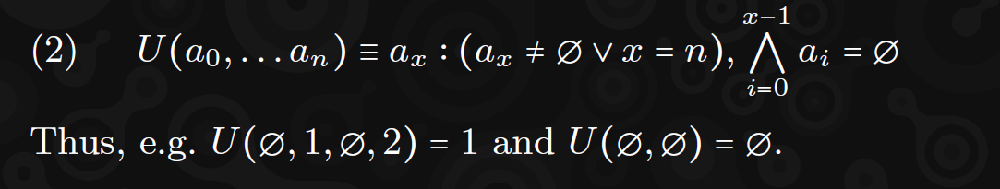

### 3.3. Mengen (Sets)
Wir bezeichnen die Kardinalität einer Menge **𝑠**, die Anzahl ihrer Elemente, mit dem üblichen **∣𝑠∣**. Wir bezeichnen die Mengen-Disjunktheit mit der Relation **⫰**. Formal:

**A ∩ B = ∅ ⇐⇒ A ⫰ B**

Wir verwenden häufig **∅**, um anzuzeigen, dass ein Begriff gültig ohne spezifischen Wert bleibt. Seine Kardinalität wird als Null definiert. Wir definieren die Operation **?** so, dass **𝐴?≡𝐴∪{∅}**, was dieselbe Menge mit der Addition des 
**∅**-Elements anzeigt.

Der Begriff **∇** (Nabla-Operator) wird verwendet, um das unerwartete Scheitern einer Operation oder dass ein Wert ungültig oder unerwartet ist, anzuzeigen. (Wir versuchen, die konventionellere Verwendung von **⊥** zu vermeiden, um Verwechslungen mit dem booleschen Wert falsch zu vermeiden, der in einigen Kontexten als erfolgreiches Ergebnis interpretiert werden könnte.)

### 3.4. Zahlen    
**𝑁** bezeichnet die Menge der natürlichen Zahlen einschließlich Null, während 
**𝑁𝑛** die Menge der natürlichen Zahlen kleiner als **𝑛** bezeichnet. Formal, 
**𝑁={0,1,…}** und **𝑁𝑛={𝑥∣𝑥∈𝑁,𝑥<𝑛}**.
**𝑍** bezeichnet die Menge der ganzen Zahlen. Wir bezeichnen **𝑍𝑎…𝑏** als die Menge der ganzen Zahlen im Intervall **[𝑎,𝑏]**. Formal, **𝑍𝑎…𝑏={𝑥∣𝑥∈𝑍,𝑎≤𝑥<𝑏}**. Z.B. **𝑍2…5={2,3,4}**. Wir bezeichnen die Offset/Länge-Form dieser Menge als **𝑍𝑎⋯+𝑏**, eine Kurzform von **𝑍𝑎…𝑎+𝑏**.

Es kann manchmal nützlich sein, Längen von Sequenzen darzustellen und gleichzeitig ihre Größe zu begrenzen, insbesondere bei der Arbeit mit Oktettsequenzen, die praktisch gespeichert werden müssen. Typischerweise können diese Längen als die Menge **𝑁2^32** definiert werden. Zur Verbesserung der Klarheit bezeichnen wir **𝑁𝐿** als die Menge der Längen von Oktettsequenzen und ist äquivalent zu **𝑁2^32**.

Wir bezeichnen den **%** Operator als den Modulo-Operator, z.B. **5%3=2**. Darüber hinaus können wir gelegentlich ein Divisionsergebnis als Quotienten und Rest mit dem Separator **R** ausdrücken, z.B. **5÷3=1R2**.

### 3.5. Wörterbücher (Dictionaries)

Ein Wörterbuch ist eine möglicherweise partielle Abbildung von einem Bereich in einen Mitbereich, ähnlich einer regulären Funktion. Im Gegensatz zu Funktionen müssen jedoch bei Wörterbüchern die gesamten Paare aufzählbar sein, und wir repräsentieren sie in einer Datenstruktur als die Menge aller 
(key ↦ value)-Paare. (In solchen datenbasierten Abbildungen ist es üblich, die Werte im Bereich als Schlüssel und die Werte im Mitbereich als Wert zu bezeichnen, daher die Benennung.)
Daher definieren wir die Formalisierung **D⟨K → V⟩** als ein Wörterbuch, das vom Bereich **K** zum Bereich **V** abbildet. Wir definieren ein Wörterbuch als Mitglied der Menge aller Wörterbücher **𝐷**und eine Menge von Paaren 
**𝑝=(𝑘↦𝑣)**:

Die Mitglieder eines Wörterbuchs müssen höchstens einen eindeutigen Wert für einen Schlüssel **𝑘** zuordnen:

Diese Behauptung ermöglicht es uns, den Subskript- und Subtraktionsoperator für ein Wörterbuch **𝑑** eindeutig zu definieren:

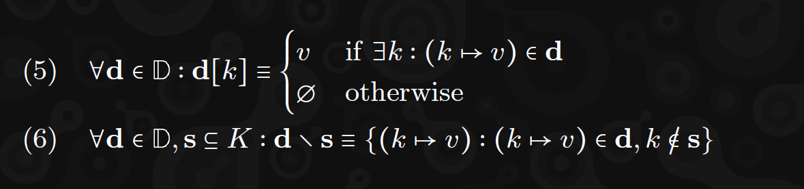

Beachten Sie, dass bei der Verwendung eines Subskripts eine implizite Behauptung besteht, dass der Schlüssel im Wörterbuch existiert. Sollte der Schlüssel nicht existieren, ist das Ergebnis undefiniert und jeder Block, der darauf basiert, muss als ungültig betrachtet werden.

Es ist typischerweise nützlich, die Mengen, aus denen die Schlüssel und Werte stammen können, zu begrenzen. Formal definieren wir ein typisiertes Wörterbuch **D⟨K → V ⟩** als eine Menge von Paaren **𝑝** der Form **(𝑘↦𝑣)**:

Um die aktive Domäne (i.e. Menge der Schlüssel) eines Wörterbuchs **d ∈ D⟨K → V ⟩** zu bezeichnen, verwenden wir 
**K(d) ⊆ K** und für den Bereich (i.e. Menge der Werte), **𝑉(𝑑)⊆𝑉**. Formal:

Beachten Sie, dass da der Mitbereich von **𝑉** eine Menge ist, sollten unterschiedliche Schlüssel mit gleichen Werten im Wörterbuch erscheinen, enthält die Menge nur einen solchen Wert.

### 3.6. Tupel
Tupel sind Gruppen von Werten, wobei jedes Element einer anderen Menge angehören kann. Sie werden durch Klammern gekennzeichnet, z.B. das Tupel **𝑡** der ganzen Zahlen 3 und 5 wird als **𝑡=(3,5)** bezeichnet und gehört zur Menge der ganzzahligen Paare, die manchmal als **𝑁×𝑁** bezeichnet wird, aber in der vorliegenden Arbeit als **(𝑁,𝑁)** bezeichnet wird.

Wir müssen häufig auf ein spezifisches Element innerhalb eines Tupelwertes verweisen und finden es daher praktisch, einen Namen für jedes Element zu deklarieren. Z.B. können wir ein Tupel mit zwei benannten ganzzahligen Komponenten **𝑎** und **𝑏** als **𝑇= (𝑎 ∈ 𝑁, 𝑏 ∈ 𝑁)** bezeichnen. Wir würden ein Element **𝑡 ∈ 𝑇** durch Indizierung seines Namens bezeichnen, also für ein **𝑡=(𝑎:3,𝑏:5)**, **𝑡𝑎=3** und **𝑡𝑏=5**.

### 3.7. Sequenzen

Eine Sequenz ist eine Reihe von Elementen mit einer bestimmten Ordnung, die nicht von ihren Werten abhängt. Die Menge der Sequenzen von Elementen, die alle aus einer Menge **𝑇** stammen, wird mit **𝑇** bezeichnet und definiert eine partielle Abbildung **𝑁 → 𝑇**. Die Menge der Sequenzen, die genau **𝑛** Elemente enthalten, wobei jedes Element Mitglied der Menge **𝑇** ist, kann mit **𝑇𝑛** bezeichnet werden und definiert entsprechend eine vollständige Abbildung **𝑁𝑛 → 𝑇**. Ebenso können Mengen von Sequenzen mit höchstens **𝑛** Elementen und mindestens **𝑛** Elementen mit **𝑇∶𝑛** bzw. **T𝑛∶** bezeichnet werden.

Sequenzen sind indizierbar, sodass ein bestimmtes Element an der Indexposition **𝑖** innerhalb einer Sequenz **𝑠** mit **𝑠[𝑖]** oder, wenn eindeutig, mit **𝑠𝑖** bezeichnet werden kann. Ein Bereich kann durch eine Ellipse dargestellt werden, zum Beispiel: **[0, 1, 2, 3]...2 = [0, 1]** und **[0, 1, 2, 3]1⋅⋅⋅+2 = [1, 2]**. Die Länge einer solchen Sequenz kann mit ∣s∣ bezeichnet werden. Wir bezeichnen die modulo-Indexierung als **𝑠[𝑖]↺** ≡ **𝑠[ 𝑖 % ∣𝑠∣ ]**. Das letzte Element **𝑥** einer Sequenz **𝑠 = [..., 𝑥]** wird durch die Funktion **last(𝑠) ≡ 𝑥** bezeichnet.

#### 3.7.1. Konstruktion

Konstruktion. Wir möchten möglicherweise eine Sequenz in Bezug auf inkrementelle Indizes anderer Werte definieren: ***[x0,x1, ... ]n*** bezeichnet eine Sequenz von ***n*** Werten, beginnend mit ***x0*** und fortgesetzt bis ***xn−1***. Außerdem möchten wir möglicherweise auch eine Sequenz als Elemente definieren, von denen jedes eine Funktion ihres Indexes ***i*** ist; in diesem Fall bezeichnen wir ***[f(i) ∣ i <− Nn] ≡ [f(0), f(1), ..., f(n − 1)]***. Wenn die Reihenfolge der Elemente wichtig ist, verwenden wir **<−** anstelle der ungeordneten Notation ***∈***. Letztere kann auch in Kurzform geschrieben werden ***[f(i <− Nn)]***. Dies gilt für jede Menge, die eine eindeutige Reihenfolge hat, insbesondere für Sequenzen, daher ***[i2 ∣ i <− [1, 2, 3]] = [1, 4, 9]***. Mehrere Sequenzen können kombiniert werden, daher ***[i ⋅ j ∣ i <− [1, 2, 3], j <− [2, 3, 4]] = [2, 6, 12]***.

Wir verwenden die explizite Notation ***f#***, um eine Funktion zu kennzeichnen, die über alle Elemente einer Sequenz abbildet. Angenommen, es gibt eine Funktion ***y = f(x)***:

Sequenzen können aus Mengen oder anderen Sequenzen konstruiert werden, deren Reihenfolge ignoriert werden soll, durch Sequenzordnungsnotation ***[ik^^ i ∈ X]***, die definiert ist, um in der Menge oder Sequenz ihres Arguments zu resultieren, außer dass alle Elemente ***i*** in aufsteigender Reihenfolge des entsprechenden Werts ***ik*** platziert werden.

Der Hauptbestandteil kann ausgelassen werden, in welchem Fall angenommen wird, dass er direkt nach den Elementen geordnet ist; d. h. ***[i ∈ X] ≡ [i|| i ∈ X]. [ik|| i ∈ X]*** tut dasselbe, schließt jedoch alle doppelten Werte von **i** aus. Zum Beispiel, angenommen ***s = [1, 3, 2, 3]***, dann ***[i|| i ∈ s] = [1, 2, 3]*** und ***[−i^^ i ∈ s] = [3, 3, 2, 1].***

Mengen können aus Sequenzen mit der regulären Mengenkonstruktionssyntax konstruiert werden, z. B. angenommen ***s = [1, 2, 3, 1]***, dann wäre ***{a ∣ a ∈ s}*** gleichbedeutend mit ***{1, 2, 3}***. Sequenzen von Werten, die selbst eine definierte Ordnung haben, haben eine implizite Ordnung ähnlich einem regulären Wörterbuch, daher ***[1, 2, 3] < [1, 2, 4]*** und ***[1, 2, 3] < [1, 2, 3, 1]***.

#### 3.7.2. Bearbeitung
Wir definieren den Konkatenationsoperator für Sequenzen ***⌢*** so, dass ***[x0,x1, ... ,y0,y1, ... ] ≡ x ⌢ y***. Für Sequenzen von Sequenzen definieren wir einen unären Alles-konkatenieren-Operator: ***(x⌢) ≡ x0 ⌢ x1 ⌢ ...*** . Weiterhin bezeichnen wir die Konkatenation von Elementen als ***x i ≡ x ⌢ [i]***. Wir bezeichnen die Sequenz, die aus den ersten ***n*** Elementen der Sequenz s besteht, als ***s→n ≡ [s0, s1, ... , sn−1]*** und nur die letzten Elemente als ***s→n***.

Wir definieren ***Tx*** als die Transposition der Sequenz-von-Sequenzen ***x***, vollständig definiert in Gleichung 305. Wir können dies auch auf Sequenzen-von-Tupeln anwenden, um ein Tupel von Sequenzen zu erhalten. Wir bezeichnen die Sequenzsubtraktion mit einer leichten Modifikation des Mengensubtraktionsoperators; speziell wird eine Sequenz ***s*** mit Ausnahme des linken Elements gleich ***v*** als ***s \o {v}*** bezeichnet.

#### 3.7.3. Boolesche Werte.
Bs bezeichnet die Menge der Booleschen Zeichenfolgen der Länge s, also ***Bs = {⊥, ⊺}s***. Beim Umgang mit Booleschen Werten können wir eine implizite Äquivalenzzuordnung zu einem Bit annehmen, wobei ***⊺ = 1*** und ***⊥ = 0***, also ***B◻ = N2◻***. Wir verwenden die Funktion bits ***(Y) ∈ B***, um die Bitsequenz zu bezeichnen, die mit dem am wenigsten signifikanten Bit zuerst geordnet ist und die Oktettsequenz ***Y*** repräsentiert, also bits(***[5, 0]) = [1, 0, 1, 0, 0, ... ]***.

#### 3.7.4. Oktette und Blobs.
***Y*** bezeichnet die Menge der Oktettzeichenfolgen („Blobs“) beliebiger Länge. Wie zu erwarten, bezeichnet ***Yx*** die Menge solcher Sequenzen der Länge ***x***. ***Y$*** bezeichnet die Teilmenge von ***Y***, die ASCII-codierte Zeichenfolgen sind.

Beachten Sie, dass ein Oktett eine implizite und offensichtliche bijektive Beziehung zu natürlichen Zahlen kleiner als 256 hat und wir implizit zwischen Oktettform und Ganzzahlform wechseln können, aber wir behandeln sie nicht als genau äquivalente Entitäten. Insbesondere für den Zweck der Serialisierung wird ein Oktett immer in der Sequenz serialisiert, die nur sich selbst enthält, während eine Ganzzahl als eine Sequenz von potenziell mehreren Oktetten serialisiert werden kann, abhängig von ihrer Größe.

#### 3.7.5. Mischen (Shuffling.)
Wir definieren die Sequenz-Mischfunktion ***F***, ursprünglich eingeführt von Fisher and Yates 1938 , mit einem effizienten In-Place-Algorithmus beschrieben von wikipedia. Diese akzeptiert eine Sequenz und etwas Entropie und gibt eine Sequenz derselben Länge mit denselben Elementen, aber in einer durch die Entropie bestimmten Reihenfolge zurück. Die Entropie kann entweder als eine unbestimmte Sequenz von Ganzzahlen oder als ein Hash bereitgestellt werden. Eine vollständige Definition finden Sie im Anhang E.

### 3.8. Kryptographie
#### 3.8.1. Hashing
***H*** bezeichnet die Menge der 256-Bit-Werte, die typischerweise durch eine kryptografische Funktion erzeugt werden, äquivalent zu ***Y32***, wobei ***H0*** gleich ***[0]32*** ist. Wir nehmen eine Funktion ***H(m ∈ Y) ∈ H*** an, die den 256-Bit-Hash von Blake2b darstellt, der von rfc7693 eingeführt wurde, und eine Funktion ***HK(m ∈ Y) ∈ H*** die den 256-Bit-Hash von Keccak darstellt, wie von bertoni2013keccak vorgeschlagen und von wood2014ethereum genutzt.

Manchmal möchten wir nur die ersten ***x*** Oktette eines Hashes nehmen, in diesem Fall bezeichnen wir ***Hx(m) ∈ Yx*** als die ersten ***x*** Oktette von ***H(m)***. Die Eingaben einer Hashfunktion werden im Allgemeinen als serialisiert mit unserem Codec ***E(x) ∈ Y*** angenommen, jedoch können wir zur Klarheit oder Eindeutigkeit auch die Serialisierung explizit angeben. Ebenso möchten wir eine Sequenz von Oktetten als eine andere Art von Wert interpretieren, wobei die angenommene Decoder-Funktion ***E−1(x ∈ Y)*** verwendet wird. In beiden Fällen können wir die Transformationsfunktion mit der Anzahl der Oktette, die wir für die Oktettsequenz erwarten, subskribieren. Somit würde ***r = E4(x ∈ N) x ∈ N2^32*** und ***r ∈ Y4*** zuweisen, während ***s = E8^−1(y) y ∈ Y8*** und ***s ∈ N2^64*** zuweisen würde.

#### 3.8.2. Signiersysteme (Signing Schemes.)
***Ek⟨m⟩ ⊂ Y64*** ist die Menge der gültigen Ed25519-Signaturen, definiert von rfc8032, die durch Kenntnis eines geheimen Schlüssels erstellt wurden, dessen öffentlicher Schlüssel ***k ∈ Y32*** ist und dessen Nachricht ***m*** ist. Zur besseren Lesbarkeit bezeichnen wir die Menge der gültigen öffentlichen Schlüssel als ***k ∈ HE***.

Wir verwenden ***Y_BLS ⊂ Y_144***, um die Menge der öffentlichen Schlüssel für das BLS-Signaturschema zu bezeichnen, beschrieben von Jofc, auf der Kurve BLS12-381, definiert von BLS12-381.

Wir bezeichnen die Menge der gültigen Bandersnatch-öffentlichen Schlüssel als ***HB***, definiert in Anhang G. ***Fm∈Yk∈HB⟨x ∈ Y⟩ ⊂ Y96 (see orginal paper)*** ist die Menge der gültigen, einfach kontextualisierten Signaturen, die den geheimen Gegenpart zum öffentlichen Schlüssel ***k***, einen Kontext ***x*** und eine Nachricht ***m*** nutzen.

***¯F m∈Y r∈YR⟨x ∈ Y⟩ ⊂ Y_784 (see orginal paper)*** ist hingegen die Menge der gültigen Bandersnatch RingVRF deterministischen, einfach kontextualisierten Wissensnachweise eines Geheimnisses innerhalb einer Menge von Geheimnissen, identifiziert durch eine Wurzel in der Menge der gültigen Wurzeln ***YR ∈ Y_196608***. Wir bezeichnen ***O(s ∈ HB) ∈ YR*** als die spezifische Wurzel der Menge der öffentlichen Schlüssel-Gegenstücke ***s***. Eine Wurzel impliziert eine spezifische Menge von Bandersnatch-Schlüsselpaaren; Kenntnis eines der Geheimnisse würde bedeuten, dass man in der Lage wäre, einen einzigartigen, gültigen und anonymen Wissensnachweis eines einzigartigen Geheimnisses innerhalb der Menge zu erstellen.

Sowohl die Bandersnatch-Signatur als auch der RingVRF-Nachweis implizieren streng, dass ein Mitglied seinen geheimen Schlüssel in Kombination mit sowohl dem Kontext ***x*** als auch der Nachricht m verwendet hat; der Unterschied besteht darin, dass das Mitglied im ersteren Fall identifiziert wird und im letzteren anonym bleibt. Darüber hinaus definieren beide eine ***VRF***-Ausgabe, einen hoch-entropy Hash, der von ***x*** beeinflusst wird, aber nicht von ***m***, formell bezeichnet als ***Y(¯F mr⟨x⟩) ⊂ H und Y(Fmk⟨x⟩) ⊂ H(see orginal paper)***.

Wir definieren die Funktion ***S*** als Signaturfunktion, so dass ***Sk(m) ∈ Fmk⟨[]⟩ ∪ Ek⟨m⟩(see orginal paper)***. Wir behaupten, dass die Fähigkeit, ein Ergebnis für diese Funktion zu berechnen, auf der Kenntnis eines geheimen Schlüssels beruht.

## 4. Übersicht
Wie im Yellow Paper beginnen wir unsere Formalismen, indem wir daran erinnern, dass eine Blockchain als Paarung eines Anfangszustands mit einer Zustandsübergangsfunktion auf Blockebene definiert werden kann. Letztere definiert den nachfolgenden Zustand, gegeben ein Paar aus einem vorherigen Zustand und einem darauf angewendeten Datenblock. Formal sagen wir:

Wobei ***σ*** der vorherige Zustand ist, ***σ′*** der nachfolgende Zustand, ***B*** ein gültiger Block und ***Υ*** unsere Zustandsübergangsfunktion auf Blockebene ist.
Im Großen und Ganzen kann JAM (und tatsächlich Blockchains im Allgemeinen) einfach definiert werden, indem man ***Υ*** und einen Anfangszustand (genesis state) ***σ^0*** spezifiziert.**^7** Wir machen auch einige zusätzliche Annahmen über vereinbartes Wissen: eine allgemein bekannte Uhr und die praktischen Mittel zur Datenfreigabe mit anderen Systemen, die unter denselben Konsensregeln arbeiten. Letztere beiden waren stillschweigende Annahmen im YP.

> **Footnotes:**
>
>**^7** Praktisch gesehen machen Blockchains manchmal Annahmen über einen bestimmten Teil der Teilnehmer, deren Verhalten einfach ehrlich ist und weder nachweislich falsch noch anderweitig wirtschaftlich benachteiligt ist. Obwohl diese Annahme vernünftig sein mag, muss sie dennoch getrennt von den Regeln des Zustandsübergangs angegeben werden.

### 4.1. Block
Zur Unterstützung des Verständnisses und der Definition unseres Protokolls teilen wir so viele unserer Begriffe wie möglich in ihre funktionalen Komponenten auf. Wir beginnen mit dem Block ***B***, der als Header ***H*** und einigen externen, zum System gehörenden Eingabedaten, die als extrinsisch bezeichnet werden, neu formuliert werden kann, ***E***:

Der Header ist eine Sammlung von Metadaten, die sich hauptsächlich auf kryptografische Referenzen zu den Blockchain-Vorfahren sowie die Operanden und das Ergebnis des aktuellen Übergangs beziehen. Als ein a priori bekanntes, unveränderliches Element wird angenommen, dass es während der funktionalen Komponenten des Blockübergangs verfügbar ist. Die extrinsischen Daten werden in ihre verschiedenen Teile aufgeteilt:

- **Tickets (tickets)**: Tickets, die für den Mechanismus verwendet werden, der die Auswahl von Validatoren für die Erlaubnis der Blockerstellung verwaltet. Diese Komponente wird mit ***ET*** bezeichnet.
- **Urteile (judgements)**: Stimmen von Validatoren zu Streitigkeiten, die derzeit zwischen ihnen stattfinden. Dies wird mit ***EJ*** bezeichnet.
- **Präbilder (preimages)**: Statische Daten, die derzeit angefordert werden, um für Arbeitslasten auf Abruf verfügbar zu sein. Dies wird mit ***EP*** bezeichnet.
- **Verfügbarkeit (availability)**: Zusicherungen jedes Validators bezüglich der Eingabedaten der Arbeitslasten, die sie korrekt erhalten und lokal speichern. Dies wird mit ***EA*** bezeichnet.
- **Berichte (reports)**: Berichte über neu abgeschlossene Arbeitslasten, deren Genauigkeit durch spezifische Validatoren garantiert wird. Dies wird mit ***EG*** bezeichnet.

### 4.2. Zustand
Unser Zustand kann logisch in mehrere weitgehend unabhängige Segmente unterteilt werden, was sowohl dazu beitragen kann, visuelle Unordnung in unserer Protokollbeschreibung zu vermeiden, als auch Formalität in Bezug auf Berechnungselemente zu bieten, die gleichzeitig berechnet werden können (d.h. parallelisiert). Wir stellen daher eine Äquivalenz zwischen ***σ*** (sigma) (einem vollständigen Zustand) und einem Tupel von partitionierten Segmenten dieses Zustands fest:

Zusammenfassend ist ***δ*** (delta) der Teil des Zustands, der sich mit Diensten befasst, im JAM analog zu den (Smart Contract) Konten im Yellow Paper, dem einzigen Zustand des Yellow Paper’s Ethereum. Die Identitäten der Dienste, die einen privilegierten Status haben, werden in ***χ*** (chi) verfolgt.

Validatoren, die die Gruppe wirtschaftlicher Akteure sind, die einzigartig privilegiert sind, die JAM-Kette zu erstellen und zu pflegen, werden innerhalb von ***κ*** (kappa) identifiziert, in ***λ*** (lambda) archiviert und aus ***ι*** (iota) in die Warteschlange gestellt. Alle anderen Zustände, die sich auf die Bestimmung dieser Schlüssel beziehen, werden innerhalb von ***γ*** (gama) gehalten. Dies ist eine Abweichung von den stateless Proof-of-Work-Definitionen des Yellow Paper, bei denen diese Gruppe nicht aufgezählt, sondern auf diejenigen beschränkt war, die über ausreichende Rechenleistung verfügten, um eine teilweise Hash-Kollision in der SHA2-256-Kryptografiefunktion zu finden. Ein On-Chain-Entropiepool wird in ***η*** (eta) beibehalten.

Unser Zustand verfolgt auch zwei Aspekte jedes Kerns: ***α*** (alpha), die Autorisierungsanforderung, die die auf diesem Kern durchgeführte Arbeit zum Zeitpunkt der On-Chain-Berichterstattung erfüllen muss, zusammen mit der Warteschlange, die dies ausfüllt, ***φ*** (phi); und ***ρ*** (rho), jeder der aktuell zugewiesenen Berichte (reports)  der Kerne (cores), deren Arbeitspaketverfügbarkeit (work package availability) noch von einer Supermehrheit der Validatoren sichergestellt werden muss.

Schließlich werden die Details der neuesten Blöcke und der Zeit jeweils in ***β*** (beta) und ***τ*** (tau)verfolgt und vergangene Urteile in ***ψ*** (psi).

#### 4.2.1  Zustandsübergangs-Abhängigkeitsgraph
Wie im Yellow Paper spezifizieren wir ***Υ*** (ypsilon) als die Implikation, alle Elemente des nachfolgenden Zustands in Bezug auf den vorherigen Zustand und den Block zu formulieren. Um die Implementierung dieser Berechnung zu parallelisieren, minimieren wir die Tiefe des Abhängigkeitsgraphen, wo immer möglich. Der gesamte Abhängigkeitsgraph wird hier spezifiziert:

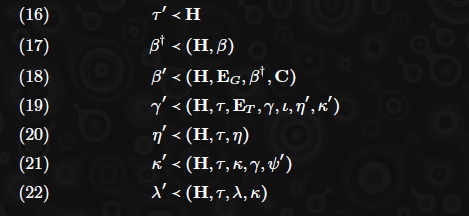

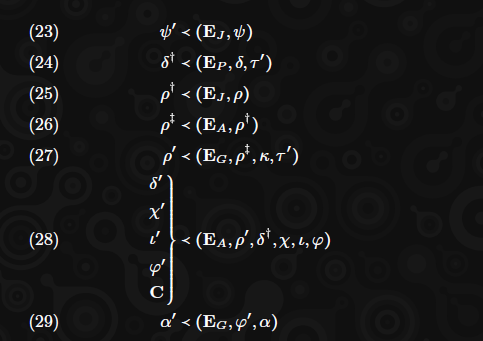

Die einzigen synchronen Verflechtungen sind durch die Zwischenelemente sichtbar, die mit einem Dolch hochgestellt sind und in den Gleichungen 17, 24 und 26 definiert sind. Letztere markieren einen Zusammenführungs- und Verknüpfungspunkt im Abhängigkeitsgraphen und implizieren konkret, dass das Preimage-Lookup-Extrinsic in den Zustand eingefügt werden muss, bevor das Verfügbarkeits-Extrinsic vollständig verarbeitet werden kann und die Arbeitsakkumulation stattfinden kann.

### 4.3. Welche Vergangenheit?

Eine Blockchain ist eine Sequenz von Blöcken, die jeweils kryptografisch auf einen vorherigen Block verweisen, indem sie einen Hash ihres Headers enthalten, der bis zu einem ersten Block zurückreicht, der auf den Genesis-Header verweist. Wir gehen bereits von einem Konsens über diesen Genesis-Header H0 und den Zustand aus, den er darstellt, der bereits als σ0 definiert ist.

Indem wir eine deterministische Funktion zur Ableitung eines einzigen nachfolgenden Zustands für jede (gültige) Kombination aus vorherigem Zustand und Block definieren, sind wir in der Lage, einen eindeutigen kanonischen Zustand für jeden gegebenen Block zu definieren. Wir nennen den Block mit den meisten Vorfahren im Allgemeinen den Head und seinen Zustand den Headzustand. Es ist im Allgemeinen möglich, dass zwei Blöcke gültig sind und dennoch auf den selben vorherigen Block verweisen, was als Fork bezeichnet wird. Dies impliziert die Möglichkeit von zwei verschiedenen Headern, jeder mit seinem eigenen Zustand. Obwohl wir keine Möglichkeit kennen, diese Möglichkeit strikt auszuschließen, müssen wir dennoch versuchen, sie zu minimieren, damit das System nützlich ist. Wir streben daher an sicherzustellen, dass:

- (1) Es im Allgemeinen unwahrscheinlich ist, dass zwei Heads entstehen.
- (2) Wenn zwei Heads entstehen, diese schnell zu einem einzigen Head zusammengeführt werden.
- (3) Es möglich ist, einen Block zu identifizieren, der nicht viel älter ist als der Head, von dem wir äußerst sicher sein können, dass er dauerhaft Teil der Blockchain-Geschichte sein wird. Wenn ein Block als solcher identifiziert wird, nennen wir ihn finalisiert und diese Eigenschaft erstreckt sich natürlich auf alle seine Vorgängerblöcke.

Diese Ziele werden durch eine Kombination aus zwei Konsensmechanismen erreicht: Safrole, der die (nicht notwendigerweise Fork freie) Erweiterung der Blockchain regelt, und Grandpa, der die Finalisierung einer Erweiterung in die kanonische Geschichte regelt. Ersterer liefert Punkt 1, letzterer Punkt 3 und beide sind wichtig für die Erfüllung von Punkt 2. Wir beschreiben diese Teile des Protokolls ausführlich in den Abschnitten 6 bzw. 18.

Während Safrole Forks weitgehend einschränkt (durch Kryptografie, Wirtschaft und gemeinsame Zeit, siehe unten), kann es Zeiten geben, in denen wir absichtlich forken möchten, da wir wissen, dass eine bestimmte Kettenverlängerung zurückgesetzt werden muss. Im regulären Betrieb sollte dies niemals passieren, jedoch können wir die Möglichkeit von bösartigen oder fehlerhaften Knoten nicht ausschließen. Wir definieren daher eine solche Erweiterung als jede, die einen Block enthält, in dem Daten gemeldet werden, die von einem anderen Blockzustand als ungültig markiert wurden (siehe Abschnitt 10, wie dies erfolgt). Wir verlangen weiterhin, dass Grandpa keine Erweiterung finalisiert, die einen solchen Block enthält. Siehe Abschnitt 18 für weitere Informationen.

### 4.4. Zeit
Wir gehen von einem vorbestehenden Konsens über die Zeit aus, insbesondere für die Blockerstellung und -import. Obwohl dies keine Annahme von Polkadot war, existieren pragmatische und belastbare Lösungen, einschließlich des NTP-Protokolls und Netzwerks. Wir nutzen diese Annahme auf nur eine Weise: Wir verlangen, dass Blöcke vorübergehend ungültig sind, wenn ihr Zeitfenster in der Zukunft liegt. Dies wird im Detail in Abschnitt 6 spezifiziert.

Formal definieren wir die Zeit in Sekunden, die seit Beginn der JAM Common Era vergangen sind, 1200 UTC am 1. Januar 2024.**^8** Mittags CET wurde ausgewählt, um sicherzustellen, dass alle bedeutenden Zeitzonen am selben Datum bei jedem exakten 24-Stunden-Intervall ab Beginn der Common Era sind. Formal wird dieser Wert als T bezeichnet.

> **Footnotes:**
>
>**^8** 1.704.110.400 Sekunden nach der Unix-Epoche.

### 4.5. Bester Block
Bester Block. Angesichts der Anerkennung einer Anzahl gültiger Blöcke ist es notwendig zu bestimmen, welcher als der „beste“ Block behandelt werden sollte, was bedeutet, der jüngste Block, von dem wir glauben, dass er letztendlich in allen zukünftigen JAM-Ketten enthalten sein wird. Die einfachste und am wenigsten riskante Methode, dies zu tun, wäre, den GRANDPA-Finalitätsmechanismus zu inspizieren, der in der Lage ist, einen Block bereitzustellen, für den es ein sehr hohes Maß an Vertrauen gibt, dass er ein Vorfahre jedes zukünftigen Kettenkopfs bleibt.

Um jedoch das Risiko zu verringern, dass der resultierende Block letztendlich nicht in der kanonischen Kette enthalten ist, wird GRANDPA typischerweise einen Block zurückgeben, der ein kleines Stück älter ist als der zuletzt erstellte Block. (Existierende Implementierungen deuten darauf hin, dass es sich unter regulärem Betrieb um etwa 1-2 Blöcke in der Vergangenheit handelt.) Es gibt oft Umstände, in denen wir eine geringere Latenz bei dem Risiko wünschen, dass der zurückgegebene Block letztendlich nicht Teil der zukünftigen kanonischen Kette wird. Zum Beispiel könnten wir in der Lage sein, einen Block zu erstellen, und wir müssen entscheiden, was sein Elternteil sein soll. Alternativ könnte es uns wichtig sein, über den aktuellsten Zustand zu spekulieren, um Informationen für eine nachgelagerte Anwendung bereitzustellen, die auf den Zustand von JAM angewiesen ist.

In diesen Fällen definieren wir den besten Block als den Head der besten Kette, die in Abschnitt 18 definiert ist.

### 4.6. Wirtschaft
Die vorliegende Arbeit beschreibt ein kryptoökonomisches System, d.h. eines, das Elemente der Kryptografie, Wirtschaft und Spieltheorie kombiniert, um einen selbstsouveränen digitalen Dienst zu bieten. Um wirtschaftliche Anreize zu kodifizieren und zu manipulieren, definieren wir ein Token, das systemeigen ist und das wir in dieser Arbeit einfach als Tokens bezeichnen.

Ein Wert von Tokens wird im Allgemeinen als Guthaben (balance) bezeichnet, und ein solcher Wert wird als Mitglied der Menge der Guthaben (balance), ***NB***, bezeichnet, die genau der Menge der 64-Bit-unsigned-integers entspricht:

Obwohl für die vorliegende Arbeit unerheblich, gehen wir davon aus, dass es eine standardisierte Bezeichnung für **10^9** Tokens gibt. Dies unterscheidet sich sowohl von Ethereum (das eine Bezeichnung von **10^18** verwendet), Polkadot (das eine Bezeichnung von **10^10** verwendet) als auch von Polkadots experimentellem Cousin Kusama (der **10^12** verwendet).

Die Tatsache, dass Guthaben als 64-Bit-Integer dargestellt werden, impliziert, dass es in JAM niemals mehr als etwa **18×10^9** Tokens (jeweils in Teile von **10^−9** teilbar) geben kann. Wir würden erwarten, dass die Gesamtzahl der jemals ausgegebenen Tokens deutlich geringer sein wird.

Wir gehen außerdem davon aus, dass eine Anzahl konstanter Preise in Form von Tokens bekannt ist. Die spezifischen Werte werden jedoch in nachfolgender Arbeit bestimmt:

- ***BI***: Das zusätzliche Mindestguthaben für ein einzelnes Element innerhalb einer Abbildung.
- ***BL***: Das zusätzliche Mindestguthaben für ein einzelnes Oktett von Daten innerhalb einer Abbildung.
- ***BS***: Das Mindestguthaben für einen Dienst.

### 4.7. Die virtuelle Maschine und Gas.
In der vorliegenden Arbeit nehmen wir die Definition einer Polka Virtual Machine (***PVM***) an. Diese virtuelle Maschine basiert auf der RISC-V-Befehlssatzarchitektur, speziell der RV32EN-Variante, und ist die Grundlage für die Einführung erlaubnisfreier Logik in unsere Zustandsübergangsfunktion.

Die **PVM** ist vergleichbar mit der **EVM**, die im Yellow Paper definiert ist, aber etwas einfacher: Die komplexen Befehle für kryptografische Operationen fehlen ebenso wie diejenigen, die mit Umweltinteraktionen zu tun haben. Insgesamt ist sie weit weniger eigensinnig, da sie ein vorbestehendes, allgemeines Design, RISC-V, verändert und für unsere Bedürfnisse optimiert. Dies bietet uns hervorragende vorhandene Werkzeuge, da **PVM** im Wesentlichen mit RISC-V kompatibel bleibt, einschließlich Unterstützung durch das Compiler-Toolkit LLVM und Sprachen wie Rust und C++. Darüber hinaus macht die Einfachheit des Befehlssatzes, den RISC-V und **PVM** teilen, zusammen mit der Registergröße (32-Bit), der aktiven Anzahl (13) und der Endianness (beschreibt die Reihenfolge, in der Bytes innerhalb eines mehrbytigen Datenelements gespeichert und verarbeitet werden) (little) (Least Significant Bytes, LSB) sie besonders gut geeignet für die Erstellung effizienter Rekompilierer auf gängige Hardwarearchitekturen.

Die **PVM** ist vollständig in Anhang A definiert, aber zur Kontextualisierung werden wir kurz die grundlegende Aufruffunktion ***Ψ*** zusammenfassen, die den resultierenden Zustand einer **PVM**-Instanz berechnet, die mit einigen Registern (***NR13***) und RAM (***M***) initialisiert wurde und bis zu einer bestimmten Menge an Gas (***NG***), einer Anzahl von ungefähr zeitproportionalen Berechnungsschritten, ausgeführt wird:

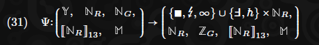

Wir bezeichnen die zeitproportionalen Berechnungsschritte als Gas (ähnlich wie im Yellow Paper) und begrenzen sie auf eine 64-Bit-Menge. Wir können entweder ***NG*** oder ***ZG*** verwenden, um es zu begrenzen, das erste als vorheriges Argument, da es als positiv bekannt ist, das letzte als Ergebnis, bei dem ein negativer Wert den Versuch anzeigt, das Gaslimit zu überschreiten. Im Kontext der **PVM** wird ***ξ ∈ NG*** typischerweise verwendet, um Gas zu bezeichnen.

Es bleibt ein wichtiges Implementierungsdetail sicherzustellen, dass die Zeit, die zur Berechnung der Funktion ***Ψ(..., ξ, ...)*** benötigt wird, ungefähr proportional zum Wert von ***ξ*** (xi) ist, unabhängig von anderen Operanden.

Die **PVM** ist eine sehr einfache RISC-Registermaschine und hat als solche 13 Register, von denen jedes ein 32-Bit-Integer ist, bezeichnet als NR.**^9** Im Kontext der **PVM** wird ***ω ∈ NR13*** typischerweise verwendet, um die Register zu bezeichnen.

> **Footnotes:**
>
>**^9** Dies sind drei weniger als die 16 von RISC-V, jedoch werden von Compilern ausgegebene Programmcode 13 verwendet, da zwei für die Betriebssystemnutzung reserviert sind und der dritte als Null festgelegt ist.

Die **PVM** nimmt einen einfachen seitenweise adressierbaren RAM von 32-Bit an, bei dem jedes Oktett entweder unveränderlich, veränderlich oder unzugänglich sein kann. Die RAM-Definition **M** umfasst zwei Komponenten: einen Wert **V** und den Zugriff **A**. Wenn die Komponente beim Indizieren nicht spezifiziert ist, kann die Wertkomponente angenommen werden. Im Kontext der virtuellen Maschine wird ***μ ∈ M*** typischerweise verwendet, um RAM zu bezeichnen.

Wir definieren zwei Indexmengen für den RAM ***μ: Vμ*** ist die Menge der Indizes, die gelesen werden können; und ***V^∗ μ** ist die Menge der Indizes, die beschrieben werden können.

Der Aufruf der **PVM** hat einen Beendigungsgrund als erstes Element im resultierenden Tupel. Es ist entweder:

- Reguläre Programmbeendigung durch einen expliziten Halt-Befehl, **∎**.
- Unregelmäßige Programmbeendigung durch außergewöhnliche Umstände, **☇**.
- Erschöpfung des Gases, **∞**.
- Ein Seitenfehler (Versuch, auf eine Adresse im RAM zuzugreifen, die nicht zugänglich ist), **F**(umgekertes F). Dies umfasst die fehlerhafte Adresse.
- Ein Versuch, einen Host-Call fortzusetzen, ̵**h** . Dies ermöglicht die Fortschreibung und Integration einer kontextabhängigen Zustandsmaschine über die reguläre **PVM** hinaus.

Die vollständige Definition folgt in Anhang A.

### 4.8. Epochen und Slots.
Im Gegensatz zum YP Ethereum mit seinem Proof-of-Work-Konsenssystem definiert JAM einen Proof-of-Authority-Konsensmechanismus, wobei die autorisierten Validatoren durch eine Menge öffentlicher Schlüssel identifiziert werden, die durch einen Staking-Mechanismus innerhalb eines von JAM gehosteten Systems entschieden werden. Das Staking-System liegt außerhalb des Umfangs dieser Arbeit; stattdessen gibt es eine API, die genutzt werden kann, um diese Schlüssel zu aktualisieren, und wir gehen davon aus, dass die notwendige Logik für das Staking-System eingeführt wird und diese API nach Bedarf verwendet.

Der Safrole-Mechanismus unterteilt die Zeit nach der Genesis in Epochen mit fester Länge, wobei jede Epoche in ***E = 600*** Timeslots mit einer einheitlichen Länge von ***P = 6*** Sekunden unterteilt ist, was einer Epochenperiode von ***E⋅P = 3600*** Sekunden oder einer Stunde entspricht. Diese sechssekündige Slotperiode stellt die Mindestzeit zwischen JAM-Blöcken dar, und durch Safrole zielen wir darauf ab, Forks sowohl aufgrund von Konkurrenz innerhalb eines Slots (wo zwei gültige Blöcke innerhalb desselben sechssekündigen Zeitraums produziert werden können) als auch aufgrund von Konkurrenz über mehrere Slots hinweg (wo zwei gültige Blöcke in verschiedenen Timeslots, aber mit demselben Elternblock produziert werden) streng zu minimieren.

Formal verwenden wir zur Identifizierung eines Timeslot-Indexes einen 32-Bit-Integer, der die Anzahl der sechssekündigen Timeslots seit der JAM Common Era angibt. Für die Verwendung in diesem Kontext führen wir die Menge ***NT*** ein:

Dies impliziert, dass die Lebensdauer des vorgeschlagenen Protokolls bis Mitte August des Jahres 2840 reicht, was mit dem aktuellen Verlauf der Menschheit reichlich bemessen sein sollte.

### 4.9. Das Kernmodell und die Services
Während im Ethereum Yellow Paper bei der Definition der Zustandsmaschine, die unter allen Netzwerkteilnehmern im Konsens gehalten wird, davon ausgegangen wird, dass alle Maschinen den vollständigen Netzwerkzustand aufrechterhalten und zu dessen Vergrößerung beitragen – oder zumindest hoffen, dies zu tun – und alle Berechnungen auswerten, verfolgen wir in JAM einen anderen Ansatz. Dieser „jeder macht alles“-Ansatz könnte als On-Chain-Konsensmodell bezeichnet werden. Es ist leider nicht skalierbar, da das Netzwerk nur so viel Logik im Konsens verarbeiten kann, wie es hoffen kann, dass ein einzelner Knoten innerhalb eines gegebenen Zeitraums selbst ausführen kann.

#### 4.9.1. In-core-Konsens.
In der vorliegenden Arbeit erreichen wir die Skalierbarkeit der ausgeführten Arbeit durch die Einführung eines zweiten Modells für solche Berechnungen, das wir das In-Core-Konsensmodell nennen. In diesem Modell ist unter normalen Umständen nur ein Teil des Netzwerks tatsächlich dafür verantwortlich, eine bestimmte Berechnung auszuführen und die Verfügbarkeit der Eingabedaten, auf die es angewiesen ist, für andere sicherzustellen. Durch diesen Ansatz und die Annahme eines gewissen Maßes an paralleler Berechnung innerhalb der Validatorknoten des Netzwerks können wir die Menge der im Konsens durchgeführten Berechnungen proportional zur Größe des Netzwerks und nicht zur Rechenleistung eines einzelnen Geräts skalieren. In der vorliegenden Arbeit erwarten wir, dass das Netzwerk in der Lage ist, mehr als das 300-fache der Menge an In-Core-Berechnungen durchzuführen, die von einer einzelnen Maschine, die die virtuelle Maschine mit voller Geschwindigkeit ausführt, durchgeführt werden könnte.

Da der In-Core-Konsens nicht von allen Knoten im Netzwerk evaluiert oder verifiziert wird, müssen wir andere Wege finden, um ausreichend Vertrauen in die Richtigkeit der Berechnungsergebnisse zu gewinnen und sicherzustellen, dass die zur Bestimmung dieser Ergebnisse verwendeten Daten für einen praktischen Zeitraum verfügbar sind. Dies erreichen wir durch ein kryptoökonomisches Spiel in drei Stufen, genannt **Garantieren (guaranteeing,)**, **Sicherstellen (assuring,)**, **Auditing (auditing)** und gegebenenfalls **Urteilen (judging)**. Diese Stufen heften jeweils erhebliche wirtschaftliche Kosten an die Ungültigkeit einer vorgeschlagenen Berechnung; dann ein ausreichendes Maß an Vertrauen, dass die Eingaben der Berechnung für einen bestimmten Zeitraum verfügbar sein werden; und schließlich ein ausreichendes Maß an Vertrauen, dass die Gültigkeit der Berechnung (und damit die Durchsetzung der ersten Garantie) von einer Partei überprüft wird, von der wir erwarten können, dass sie ehrlich ist.

Alle im In-Core durchgeführten Ausführungen müssen von jedem Knoten reproduzierbar sein, der mit dem Teil der Kette synchronisiert ist, der finalisiert wurde. Die im In-Core durchgeführten Ausführungen sind daher so stateless wie möglich gestaltet. Die Anforderungen dafür umfassen nur den Verfeinerungscode (refinement code) des Dienstes, den Code des Autorisierers und alle während der Ausführung durchgeführten Preimage-Lookups.

Wenn ein Work Report On-Chain präsentiert wird, wird ein spezifischer Block identifiziert, der als Lookup-Anker bekannt ist. Korrektes Verhalten erfordert, dass dieser Block in der finalisierten Kette und hinreichend aktuell sein muss, beide Eigenschaften, die bewiesen werden können und daher innerhalb eines Konsensprotokolls akzeptabel sind.

Wir beschreiben diese Pipeline im Detail in den relevanten Abschnitten später.

#### 4.9.2 On Services und Accounts
Im YP Ethereum gibt es zwei Arten von Konten: Vertragskonten (deren Aktionen deterministisch basierend auf dem dem Konto zugeordneten Code und Zustand definiert sind) und einfache Konten, die als Gateways für Daten dienen, um in den Weltzustand zu gelangen und durch das Wissen um einen geheimen Schlüssel kontrolliert werden. In JAM sind alle Konten Dienstkonten. Wie Ethereums Vertragskonten haben sie ein zugehöriges Guthaben, einige Codes und Zustände. Da sie nicht durch einen geheimen Schlüssel kontrolliert werden, benötigen sie keine Nonce.

Es stellt sich dann die Frage: Wie können externe Daten in den Weltzustand von JAM eingespeist werden? Und wie erfolgt die gesamte Zahlung, wenn nicht durch Abzug der Kontosalden derjenigen, die Transaktionen unterzeichnen? Die Antwort auf die erste Frage liegt in der Tatsache, dass unsere Dienstdefinition tatsächlich mehrere Code-Einstiegspunkte umfasst, einer betrifft die Verfeinerung und der andere die Akkumulation. Ersterer fungiert als eine Art leistungsstarker stateless Prozessor, der beliebige Eingabedaten akzeptieren und in eine viel kleinere Menge an Ausgabedaten destillieren kann. Der letztere Code ist zustandsorientierter und bietet Zugriff auf bestimmte On-Chain-Funktionalitäten, einschließlich der Möglichkeit, Guthaben zu übertragen und die Ausführung von Code in anderen Diensten zu veranlassen. Da er zustandsorientiert ist, könnte man sagen, dass er eher dem Code eines Ethereum-Vertragskontos entspricht.

Um zu verstehen, wie JAM seinen Dienstcode aufteilt, muss man das grundlegende Konzept von JAM bezüglich Allgemeingültigkeit und Skalierbarkeit verstehen. Alle extrinsischen Daten zu JAM werden in den Verfeinerungscode eines Dienstes eingespeist. Dieser Code wird nicht On-Chain ausgeführt, sondern soll In-Core ausgeführt werden. Während der Akkumulatorcode denselben Skalierungsbeschränkungen wie die Vertragskonten von Ethereum unterliegt, wird der Verfeinerungscode Off-Chain ausgeführt und unterliegt keinen solchen Beschränkungen, was es JAM-Diensten ermöglicht, sowohl in der Größe ihrer Eingaben als auch in der Komplexität ihrer Berechnungen dramatisch zu skalieren.

Während Verfeinerung und Akkumulation in Konsensumgebungen unterschiedlicher Natur stattfinden, werden beide von den Mitgliedern derselben Validatorengruppe ausgeführt. Das JAM-Protokoll stellt durch seine Belohnungen und Strafen sicher, dass der In-Core ausgeführte Code ein vergleichbares Maß an kryptoökonomischer Sicherheit wie der On-Chain ausgeführte Code hat, wobei der Hauptunterschied zwischen ihnen die Skalierbarkeit gegenüber der Synchronität ist.

Was die Zahlungsabwicklung betrifft, so führt JAM einen neuen Abstraktionsmechanismus ein, der auf Polkadots Agile Coretime basiert. Im Ethereum-Transaktionsmodell ist der Mechanismus der Kontoautorisierung etwas mit dem Mechanismus des Kaufs von Blockspace kombiniert, beide verlassen sich auf eine kryptografische Signatur, um ein einzelnes „Transaktor“-Konto zu identifizieren. In JAM sind diese getrennt, und es gibt kein solches Konzept eines „Transaktors“.

Anstelle von Ethereums Gas-Modell zum Kauf und zur Messung von Blockspace hat JAM das Konzept der Coretime, die vorgekauft und einem Autorisierungsagenten zugewiesen wird. Coretime ist insofern analog zu Gas, als es die zugrunde liegende Ressource ist, die bei der Nutzung von JAM verbraucht wird. Ihre Beschaffung liegt außerhalb des Umfangs dieser Arbeit und wird voraussichtlich von einer System-Parachain verwaltet, die innerhalb eines Parachain-Dienstes betrieben wird und mit einer Anzahl von Kernen für das Ausführen solcher Systemdienste ausgestattet ist. Der Autorisierungsagent ermöglicht externen Akteuren, Eingaben in einen Dienst zu liefern, ohne sich notwendigerweise identifizieren zu müssen, wie es bei Ethereums Transaktionssignaturen der Fall ist. Sie werden ausführlich in Abschnitt 8 besprochen.

## 5. Header
Zuerst müssen wir den Header in Bezug auf seine Komponenten definieren. Der Header umfasst einen Eltern-Hash und den Wurzelhash des vorherigen Zustands (***Hp*** und ***Hr***), einen extrinsischen Hash ***Hx***, einen Timeslot-Index ***Ht***, die Epoche, Gewinn-Tickets und Urteilsmarker ***He***, ***Hw*** und ***Hj***, einen Bandersnatch-Blockautorschlüssel ***Hk*** und zwei Bandersnatch-Signaturen; die entropieerzeugende VRF-Signatur ***Hv*** und ein Block-Siegel ***Hs***. Header können mit und ohne die letztgenannte Siegelkomponente in eine Oktettsequenz serialisiert werden, unter Verwendung von ***E*** bzw. ***EU***. Formal:

Blöcke, die nach dieser Regel als ungültig betrachtet werden, können mit fortschreitender Zeit ***T*** gültig werden.
Die Blockchain ist eine Sequenz von Blöcken, die jeweils kryptografisch auf einen vorherigen Block verweisen, indem sie einen Hash enthalten, der aus dem Header des Elternblocks abgeleitet ist, bis hin zu einem ersten Block, der auf den Genesis-Header verweist. Wir gehen bereits von einem Konsens über diesen Genesis-Header ***H0*** und den von ihm repräsentierten Zustand ***σ0*** aus.
Mit Ausnahme des Genesis-Headers haben alle Block-Header ***H*** einen zugehörigen Eltern-Header, dessen Hash ***Hp*** ist. Wir bezeichnen den Eltern-Header ***H = P(H)***:

***P*** wird somit als die Abbildung von einem Block-Header auf seinen Eltern-Block-Header definiert. Mit ***P*** können wir die Menge der Vorfahren-Header ***A*** definieren:

Wir verlangen nur, dass Implementierungen die Header der Vorfahren speichern, die in den letzten ***L = 24*** Stunden vor jedem Block ***B*** erstellt wurden, den sie validieren möchten.
Der extrinsische Hash ist der Hash der extrinsischen Daten des Blocks. Gegeben sei ein Block ***B = (H, E)***, dann formal:

Ein Block kann nur als gültig angesehen werden, wenn der Timeslot-Index ***Ht*** in der Vergangenheit liegt. Er ist immer streng größer als der seines Elternteils. Formal:

Die Wurzel des Elternzustands ***Hr*** ist die Wurzel eines Merkle-Tries, der durch die Abbildung der Merkle-Wurzel des vorherigen Zustands gebildet wird, die definitionsgemäß auch der nachfolgende Zustand des Elternblocks ist. Dies ist eine Abweichung sowohl von Polkadot als auch vom Ethereums Yellow Paper, in denen der Header eines Blocks die Merkle-Wurzel des nachfolgenden Zustands enthält. Wir tun dies, um die Pipeline der Blockberechnung und insbesondere die Merklization zu erleichtern.

Wir nehmen an, dass die Zustands-Merklization-Funktion ***MS*** in der Lage ist, unseren Zustand ***σ*** in eine 32-Oktett-Verpflichtung(comitment) zu transformieren. Siehe Anhang D für eine vollständige Definition dieser beiden Funktionen.
Alle Blöcke haben einen zugehörigen öffentlichen Schlüssel zur Identifizierung des Autors des Blocks. Wir identifizieren dies als einen Index in die aktuelle Validatormenge ***κ***. Wir bezeichnen den ***Bandersnatch***-Schlüssel des Autors als ***Ha***, weisen jedoch darauf hin, dass dies lediglich eine Äquivalenz ist und nicht als Teil des Headers serialisiert wird.

### 5.1. Die Epoche und Gewinn-Tickets-Marker
Wenn nicht **∅**, dann gibt der Epoch-Marker den Schlüssel und die Entropie an, die für die folgende Epoche relevant sind, falls der Ticket-Wettbewerb nicht angemessen abgeschlossen wird (ein sehr unerwarteter Fall). Ebenso liefert der Gewinn-Tickets-Marker, falls nicht **∅**, die Serie von 600 Slot-Versiegelungstickets für die nächste Epoche (siehe nächsten Abschnitt):

Die Begriffe werden vollständig in Abschnitt 6.6 definiert.

## 6. Blockproduktion und Kettenwachstum

Wie bereits erwähnt, ist JAM um einen hybriden Konsensmechanismus herum aufgebaut, der dem Babe/Grandpa-Hybrid von Polkadot ähnelt. Der Blockproduktionsmechanismus von JAM, genannt Safrole, ist nach dem neuartigen Sassafras-Produktionsmechanismus benannt, von dem er eine vereinfachte Variante ist. Safrole ist ein zustandsbehaftetes System, das weitaus komplexer ist als der im YP beschriebene Nakamoto-Konsens.

Das Hauptziel eines Blockproduktions-Konsensmechanismus besteht darin, die Rate zu begrenzen, mit der neue Blöcke erstellt werden können, und idealerweise die Möglichkeit von "Forks" auszuschließen: mehrere Blöcke mit gleicher Anzahl von Vorfahren.

Um dies zu erreichen, begrenzt Safrole den möglichen Autor eines Blocks innerhalb eines bestimmten sechssekündigen Timeslots auf einen einzigen Schlüsselinhaber aus einer vordefinierten Gruppe von Validatoren. Darüber hinaus bleibt unter normalen Betriebsbedingungen die Identität des Schlüsselinhabers eines zukünftigen Timeslots weitgehend anonym. Als Nebeneffekt seiner Funktionsweise können wir einen hochwertigen Entropiepool erzeugen, der von anderen Teilen des Protokolls genutzt werden kann und für darauf laufende Dienste zugänglich ist.

Aufgrund seiner eng gefassten Rolle ist der Kern des Zustands von Safrole, γ, unabhängig vom Rest des Protokolls. Es interagiert mit anderen Teilen des Protokolls durch ι und κ, die jeweiligen Gruppen von zukünftigen und aktiven Validatorkeys; τ, dem Timeslot des neuesten Blocks; und η, dem Entropieakkumulator.

Das Safrole-Protokoll generiert einmal pro Epoche eine Sequenz von E Siegel-keys, einen für jeden potenziellen Block innerhalb einer ganzen Epoche. Jeder Blockheader enthält seinen Timeslot-Index Ht (die Anzahl der sechssekündigen Perioden seit Beginn der JAM Common Era) und eine gültige Siegelsignatur Hs, signiert vom Siegel-Schlüssel, der dem Timeslot in der oben genannten Sequenz entspricht. Jeder Siegel-Schlüssel ist in der Tat ein Pseudonym für einen Validator, dem das Privileg zugestanden wurde, einen Block im entsprechenden Timeslot zu erstellen.

Um diese Sequenz von Siegel-Schlüsseln zu erzeugen und insbesondere, um dies zu tun, ohne die Zuordnungsrelation zwischen ihnen und der Validatoren-Gruppe öffentlich zu machen, verwenden wir eine neuartige kryptografische Struktur, bekannt als RingVRF, unter Verwendung der Bandersnatch-Kurve. Bandersnatch RingVRF ermöglicht den Nachweis, dass der Autor einen Schlüssel innerhalb einer Gruppe kontrolliert (in unserem Fall Validatoren), und liefert zweitens eine Ausgabe, einen unbeeinflussbaren deterministischen Hash, der uns eine sichere verifizierbare zufällige Funktion (VRF) bietet und als Mittel zur Bestimmung dient, welche Validatoren in welchen Slots autorisieren können.

### 6.1. Zeitmessung
Hier definiert ***τ*** den Slot-Index des neuesten Blocks, den wir auf den Slot-Index wie im Header des Blocks definiert überführen:

Wir verfolgen den Slot-Index im Zustand als ***τ***, um sowohl eine neue Epoche leicht identifizieren als auch den Slot bestimmen zu können, in dem der vorherige Block erstellt wurde. Wir bezeichnen ***e*** als den Epochenindex des vorherigen Blocks und ***m*** als den Slot-Phasenindex innerhalb dieser Epoche, während ***e′*** und ***m′*** die entsprechenden Werte für den aktuellen Block sind:

### 6.2. Safrole Grundzustand
Wir unterteilen ***γ*** in eine Anzahl von Komponenten:

***γz*** ist die Wurzel der Epoche, eine Bandersnatch-Ring-Wurzel, die mit einem Bandersnatch-Schlüssel jedes Validators der nächsten Epoche zusammengesetzt ist, definiert in ***γk*** (selbst im nächsten Abschnitt definiert).

Schließlich ist ***γa*** der Ticket-Akkumulator, eine Serie von höchstbewerteten Ticket-Identifikatoren, die für die nächste Epoche verwendet werden. ***γs*** ist die Slot-Sealer-Serie der aktuellen Epoche, die entweder eine vollständige Ergänzung von ***E*** Tickets oder, im Falle eines Fallback-Modus, eine Serie von ***E*** ***Bandersnatch***-Schlüsseln ist:

Hier wird ***C*** verwendet, um die Menge der Tickets zu bezeichnen, eine Kombination aus einem verifizierbar zufälligen Ticket-Identifikator ***y*** und dem Eintragsindex ***r***:

Wie in Abschnitt 6.4 beschrieben, verlangt Safrole, dass jeder Blockheader ***H*** ein gültiges Siegel ***Hs*** enthält, das eine ***Bandersnatch***-Signatur für einen öffentlichen Schlüssel am entsprechenden Index ***m*** der aktuellen Epoche ist, die im Zustand als ***γs*** vorhanden ist.

### 6.3. Schlüsselrotation

Zusätzlich zur aktiven Gruppe von Validatorkeys ***κ*** und der Staging-Gruppe ***ι*** behalten wir intern im Safrole-Zustand eine ausstehende Gruppe ***γk***. Die aktive Gruppe ist die Menge der Schlüssel, die die Knoten identifizieren, die derzeit das Privileg haben, Blöcke zu erstellen und die Validierungsprozesse durchzuführen, während die ausstehende Gruppe ***γk***, die zu Beginn jeder Epoche auf ***ι*** zurückgesetzt wird, die Menge der Schlüssel ist, die in der nächsten Epoche aktiv sein werden und die die ***Bandersnatch***-Ringwurzel bestimmen, die Tickets in den Siegel-Schlüssel-Wettbewerb für die nächste Epoche autorisiert.

Wir müssen ***K*** einführen, die Menge der Validator-Schlüssel-Tupel. Dies ist eine Kombination aus kryptografischen öffentlichen Schlüsseln für Bandersnatch- und Ed25519-Kryptografie und einem dritten Metadaten-Schlüssel, der eine opake Oktettsequenz ist, aber zur Spezifizierung praktischer Identifikatoren für den Validator verwendet wird, nicht zuletzt einer Hardware-Adresse.

Die Menge der Validatorkeys selbst entspricht der Menge der 336-Oktett-Sequenzen. Aus Gründen der Klarheit unterteilen wir die Sequenz jedoch in vier leicht benennbare Komponenten. Für jeden Validatorkey ***v*** wird der Bandersnatch-Schlüssel als ***vb*** bezeichnet und entspricht den ersten 32 Oktetten; der Ed25519-Schlüssel, ***ve***, ist die zweiten 32 Oktette; der BLS-Schlüssel, vBLS, ist den folgenden 144 Oktetten entsprechend, und schließlich sind die Metadaten ***vm*** die letzten 128 Oktette. Formal:

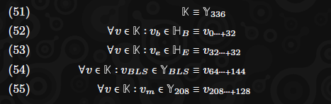

Mit einer neuen Epoche unter regulären Bedingungen werden Validatorkeys rotiert und die Bandersnatch-Schlüssel-Wurzel der Epoche in ***γ′z*** aktualisiert:

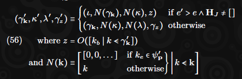

Beachten Sie, dass die nachfolgende aktive Validatorkey-Gruppe ***κ′*** so definiert ist, dass Schlüssel, die zur historischen Bestrafungsgruppe ***ψ′p*** gehören, durch einen Nullschlüssel ersetzt werden, der nur Nullen enthält. Der Ursprung dieser Bestrafungsgruppe wird in Abschnitt 10 erläutert.

### 6.4. Versiegelung und Entropieakkumulation
Der Header muss ein gültiges Siegel und eine gültige VRF-Ausgabe enthalten. Dies sind zwei Signaturen, die beide den aktuellen Siegel-Schlüssel des Slots verwenden; die Nachrichtendaten des ersteren ist die Serialisierung des Headers ohne die Siegelkomponente ***Hs***, während letztere als bias-resistente Entropiequelle verwendet wird und daher ihre Nachricht bereits festgelegt sein muss: Wir verwenden die Entropie, die sich aus der VRF der Siegelsignatur ergibt. Formal:

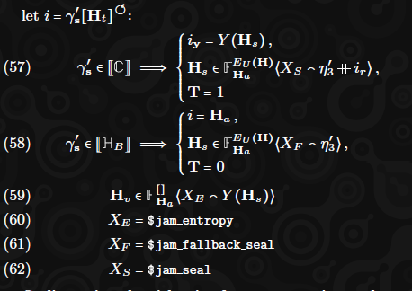

Das Versiegeln mit dem Ticket bietet eine höhere Sicherheit, und wir nutzen dieses Wissen bei der Bestimmung eines Kandidatenblocks zur Erweiterung der Kette, wie in Abschnitt 18 detailliert beschrieben. Wir stellen also fest, dass der Block unter regulärer Sicherheit mit dem booleschen Marker ***T*** versiegelt wurde. Wir definieren dies nur zur Vereinfachung der späteren Spezifikation.

Zusätzlich zum Entropieakkumulator ***η0*** behalten wir drei weitere historische Werte des Akkumulators zum Zeitpunkt der drei zuletzt beendeten Epochen, ***η1***, ***η2*** und ***η3***. Der zweitälteste davon, ***η2***, wird verwendet, um sicherzustellen, dass zukünftige Entropie unbeeinflusst bleibt (siehe Gleichung 63) und um die Seal-Key-Generierungsfunktion mit Zufälligkeit zu versehen (siehe Gleichung 66). Der älteste wird verwendet, um diese Zufälligkeit bei der Überprüfung des Siegels oben neu zu erzeugen.

***η0*** definiert den Zustand des Zufallsakkumulators, dem die nachweislich zufällige Ausgabe der VRF, die Signatur über einen unbeeinflussbaren Input, bei jedem Block hinzugefügt wird. ***η1*** und ***η2** behalten währenddessen den Zustand dieses Akkumulators am Ende der beiden zuletzt beendeten Epochen bei.

Bei einem Epochenübergang (identifiziert durch die Bedingung ***e′ > e***) rotieren wir daher den Akkumulatorwert in die Geschichte ***η1***, ***η2*** und ***η3***:

### 6.5. Die Slot-Schlüssel-Sequenz
Die nachfolgende Slot-Schlüssel-Sequenz ***γ′s*** ist eine von drei Ausdrücken, abhängig von den Umständen des Blocks. Wenn der Block nicht der erste in einer Epoche ist, bleibt er unverändert gegenüber dem vorherigen ***γs***. Wenn der Block die nächste Epoche signalisiert (durch Epochenindex) und der Slot des vorherigen Blocks sich in der Schlussphase der vorherigen Epoche befand, nimmt er den Wert des vorherigen Ticket-Akkumulators ***γ′a*** an. Andernfalls nimmt er den Wert der Fallback-Schlüssel-Sequenz an. Formal:

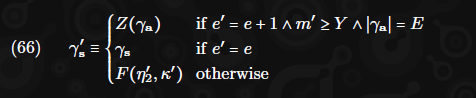

Hier verwenden wir ***Z*** als Inside-Out-Sequenzierungsfunktion, die wie folgt definiert ist:

Schließlich ist ***F*** die Rückfall-Schlüssel-Sequenz-Funktion, die eine Epoche von Validator Bandersnatch-Schlüsseln (***HBE***) zufällig aus der Validator-Key-Gruppe ***k*** unter Verwendung der On-Chain gesammelten Entropie ***r*** auswählt:

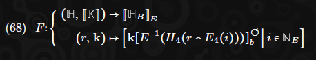

### 6.6. Die Marker
Die Epoche und Gewinn-Tickets-Marker sind Informationen, die im Header platziert werden, um den notwendigen Datenverkehr zur Bestimmung der Validatorkeys einer beliebigen Epoche zu minimieren. Sie sind besonders nützlich für Knoten, die nicht den gesamten Zustand für einen bestimmten Block synchronisieren, da sie die sichere Nachverfolgung von Änderungen an den Validatorkey-Gruppen nur mit der Header-Kette erleichtern.

Wie bereits erwähnt, ist der Epoch-Marker He im Header entweder leer oder, wenn der Block der erste in einer neuen Epoche ist, ein Tupel aus der Epochen-Zufälligkeit und einer Sequenz von Bandersnatch-Schlüsseln, die die Bandersnatch-Validatorkeys (***kb***) für die nächste Epoche definieren. Formal:

Der Gewinn-Tickets-Marker ***Hw*** ist entweder leer oder, wenn der Block der erste nach dem Ende der Einreichungsfrist für Tickets ist und der Ticket-Akkumulator gesättigt ist, dann die endgültige Sequenz von Ticket-Identifikatoren. Formal:

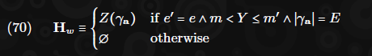

Beachten Sie, dass dies nicht honoriert wird, wenn die nächste Epoche mit einem Urteil in ihren extrinsischen Daten beginnt.

### 6.7. Die Extrinsischen Daten und Tickets
Die extrinsischen **ET** sind eine Sequenz von Nachweisen gültiger Tickets; ein Ticket impliziert einen Eintrag in unserem epochalen „Wettbewerb“, um zu bestimmen, welche Validatoren das Privileg haben, einen Block für jeden Timeslot in der folgenden Epoche zu erstellen. Tickets geben einen temporären Schlüssel und einen Eintragsindex an, die beide wählbar sind, zusammen mit einem Nachweis der Gültigkeit des Tickets. Der Nachweis impliziert eine Ticket-Identität, eine hoch-entropische unbeeinflussbare 32-Oktett-Sequenz, die sowohl als Punktzahl im oben genannten Wettbewerb als auch als Eingabe in die On-Chain VRF verwendet wird.

Gegen Ende der Epoche (d.h. ***Y*** Slots ab dem Beginn) wird dieser Wettbewerb geschlossen, was bedeutet, dass aufeinanderfolgende Blöcke innerhalb derselben Epoche keine Tickets extrinsisch enthalten dürfen. Zu diesem Zeitpunkt wird die Siegel-Schlüssel-Sequenz der folgenden Epoche festgelegt.

Wir definieren das Extrinsic als eine Sequenz von Nachweisen gültiger Tickets, von denen jedes ein Tupel aus einem Eintragsindex (eine natürliche Zahl kleiner als ***N***) und einem Nachweis der Gültigkeit des Tickets ist. Formal:

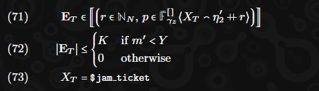

Wir definieren ***n*** als die Menge neuer Tickets, wobei die Ticket-Identität, ein Hash, als die Ausgangskomponente des Bandersnatch RingVRF-Nachweises definiert ist:

Die über die Extrinsic eingereichten Tickets müssen bereits in der Reihenfolge ihrer implizierten Identität angeordnet worden sein. Doppelte Identitäten sind niemals erlaubt, damit ein Validator nicht dasselbe Ticket mehrfach einreichen kann:

Der neue Ticket-Akkumulator ***γ′a*** wird konstruiert, indem neue Tickets in den vorherigen Akkumulatorwert (oder die leere Sequenz, wenn es sich um eine neue Epoche handelt) eingefügt werden:

Die maximale Größe des Ticket-Akkumulators ist ***E***. Bei jedem Block wird der Akkumulator zu den niedrigsten Elementen der sortierten Vereinigung von Tickets aus dem vorherigen Akkumulator ***γa*** und den eingereichten Tickets. Es ist ungültig, nutzlose Tickets in den Extrinsic einzuschließen, daher müssen alle eingereichten Tickets in ihrem nachfolgenden Ticket-Akkumulator existieren. Formal:

Beachten Sie, dass im Falle eines leeren Extrinsic ***ET = []***, wie durch ***m′ ≥ Y*** impliziert, ***γ′a = γa***.

## 7. Kürzliche Historie
Wir speichern Informationen über die letzten **H** Blöcke im Zustand. Dies wird verwendet, um die Möglichkeit auszuschließen, dass doppelte oder veraltete Arbeitsberichte eingereicht werden.

Für jeden kürzlich blockieren wir seinen Header-Hash, seine State-Root, sein Akkumulationsergebnis **MMR** und den Hash jedes Arbeitsberichts, der darin erstellt wurde, wobei die Gesamtanzahl der Kerne (cores), ***C = 341**, nicht überschritten wird.
Während der Akkumulationsphase wird ein Wert mit der partiellen Transition dieses Zustands bereitgestellt, der das Update für die neu bekannten Wurzeln des übergeordneten Blocks enthält:

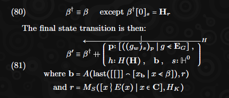

So erweitern wir die jüngste Historie mit dem Header-Hash des neuen Blocks, der Akkumulationsergebnis-Merkelbaumwurzel und der Menge der darin erstellten Arbeitsberichte. Beachten Sie, dass die Akkumulationsergebnisbaumwurzel ***r*** aus ***C*** (definiert in Abschnitt 12) unter Verwendung der grundlegenden binären Merklisierung Funktion ***MS*** (definiert im Anhang F) abgeleitet und unter Verwendung der ***MMR***-Anhängenfunktion ***A*** (definiert in Anhang F.2) angehängt wird, um eine Merkle-Bergkette zu bilden.
Die Zustandsbaumwurzel wird als null Hash, ***H0***, betrachtet, was zwar am Endzustand des Blocks ***β′*** ungenau ist, aber dennoch sicher ist, da ***β′*** nicht verwendet wird, außer um den nächsten Block ***β′′*** zu definieren, der einen korrigierten Wert für diesen enthält.

## 8. Autorisierung
Wir haben das Modell der Arbeitspakete und Dienstleistungen bereits in Abschnitt 4.9 besprochen, aber noch nicht genau erklärt, wie eine bestimmte Kernzeitressource (core time ressource) einem Arbeitspaket und dessen zugehörigem Dienst zugewiesen werden kann. Im YP-Ethereum-Modell wird die zugrunde liegende Ressource, Gas, beim On-Chain-Einführungspunkt beschafft, und der Käufer ist immer der gleiche Akteur, der die Daten erstellt, die die zu erledigende Arbeit beschreiben (d.h. die Transaktion). Im Gegensatz dazu wird im Polkadot-Modell die zugrunde liegende Ressource, ein Parachain-Slot, typischerweise für 24 Monate gegen eine beträchtliche Einzahlung beschafft, und der Beschaffer, in der Regel ein Parachain-Team, hat oft keine direkte Beziehung zum Autor der zu erledigenden Arbeit (d.h. ein Parachain-Block).

Auf einem Prinzip der Flexibilität möchten wir, dass JAM eine Reihe von Interaktionsmustern sowohl im Ethereum- als auch im Polkadot-Stil unterstützt. Um dies zu erreichen, führen wir das Autorisierungssystem ein, ein Mittel zur Entkopplung der Nutzungsabsicht für eine bestimmte Kernzeit von der Spezifikation und Einreichung einer bestimmten Arbeitslast, die darauf ausgeführt werden soll. Dadurch können wir den Kauf und die Zuweisung von Kernzeit von der spezifischen Bestimmung der darauf zu erledigenden Arbeit trennen und so sowohl Ethereum- als auch Polkadot-Interaktionsmuster unterstützen.

### 8.1. Authorizers und Authorisierungen
Das Autorisierungssystem umfasst zwei Schlüsselkonzepte: Authorizers und Authorisierungen. Eine Autorisierung ist einfach ein Stück undurchsichtiger Daten, das mit einem Arbeitspaket enthalten ist. Ein Authorizer hingegen ist ein Stück vorkonfigurierter Logik, das eine Autorisierung als zusätzlichen Parameter akzeptiert und bei Ausführung innerhalb einer VM mit vorgegebenen Rechenlimits eine boolesche Ausgabe liefert, die die Richtigkeit der Autorisierung anzeigt.

Autorisierungen werden als Hash ihrer Logik (angegeben als VM-Code) und ihrer Vorkonfiguration identifiziert. Der Prozess, durch den Arbeitspakete als autorisiert (oder nicht) bestimmt werden, ist nicht die Kompetenz der On-Chain-Logik und erfolgt vollständig intern und wird daher in Abschnitt 13.3 besprochen. Die On-Chain-Logik muss jedoch jede Gruppe von Authorizers identifizieren, die jedem Kern zugewiesen sind, um zu überprüfen, ob ein Arbeitspaket berechtigt ist, diese Ressource zu nutzen. Dieses Subsystem werden wir nun definieren.

### 8.1. Pool und Warteschlange
Wir definieren die Gruppe der für einen bestimmten Kern ***c*** zulässigen Authorizers als den Authorizer-Pool ***α[c]***. Um diesen Wert zu erhalten, wird für jeden Kern ein weiterer Teil des Zustands verfolgt: die aktuelle Authorizer-Warteschlange ***φ[c]*** des Kerns, aus der wir Werte ziehen, um den Pool zu füllen. Formal:

Hinweis: Der Zustandsteil ***φ*** darf nur durch einen exogenen Aufruf geändert werden, der von der Akkumulationslogik eines entsprechend privilegierten Dienstes gemacht wird.
Die Zustandstransition eines Blocks beinhaltet das Einfügen einer neuen Autorisierung in den Pool aus der Warteschlange:

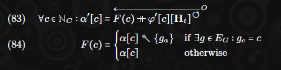

Da ***α′*** von ***φ′*** abhängt, muss dieser Schritt praktisch nach der Akkumulation berechnet werden, der Phase, in der ***φ′*** definiert wird.

## 9. Service Accounts
Wie bereits erwähnt, ist ein Service in JAM in gewisser Weise analog zu einem Smart Contract in Ethereum, da er unter anderem eine Codekomponente, eine Speichereinheit und ein Guthaben umfasst. Im Gegensatz zu Ethereum ist der Code jedoch auf zwei isolierte Einstiegspunkte aufgeteilt, die jeweils ihre eigenen Umgebungsbedingungen haben; der eine, "refinement", ist im Wesentlichen zustandslos und erfolgt intern, der andere, "accumulation", ist zustandsbehaftet und erfolgt on-chain. Letzterer wird nun im Fokus stehen.
Servicekonten werden im Zustand unter ***δ*** gehalten, einer partiellen Abbildung von einer Servicekennung ***NS*** in ein Tupel benannter Elemente, die die für das JAM-Protokoll relevanten Attribute des Services spezifizieren.
Formal:

Das Servicekonto wird als Tupel des Speicherdictionaries ***s***, der Preimage-Lookup-Dictionaries ***p*** und ***l***, des Code-Hashes ***c*** und des Guthabens ***b*** sowie der beiden Code-Gaslimits ***g*** und ***m*** definiert. Formal:

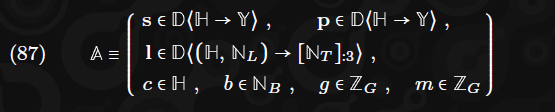

Somit würde das Guthaben des Services mit dem Index ***s*** als ***δ[s]b*** und das Speicherelement des Schlüssels ***k ∈ H*** für diesen Service als ***δ[s]s [k]*** bezeichnet werden.

### 9.1. Code und Gas.
Der Code c eines Servicekontos wird durch einen Hash repräsentiert, der, wenn der Service funktionsfähig sein soll, in seinem Preimage-Lookup vorhanden sein muss (siehe Abschnitt 9.2). Wir definieren somit den tatsächlichen Code ***c***:

Es gibt drei Einstiegspunkte im Code:

- 0 **refine**: Verfeinerung, intern ausgeführt und zustandslos.**^10**
- 1 **accumulate**: Akkumulation, on-chain ausgeführt und zustandsbehaftet.
- 2 **on transfer**: Transfer-Handler, on-chain ausgeführt und zustandsbehaftet.

> **Footnotes:**
>
>**^10** Technisch gesehen gibt es eine kleine Annahme eines Zustands, nämlich dass eine einigermaßen aktuelle Instanz der Präbilder jedes Dienstes vorhanden ist. Die Einzelheiten dazu werden in Abschnitt 13.3 besprochen.

Während der erste, intern ausgeführte Punkt in Abschnitt 13.3 detaillierter beschrieben wird, werden die beiden anderen in diesem Abschnitt definiert.
Wie in Anhang A angegeben, wird die Ausführungszeit in der JAM-Virtual-Machine deterministisch in Gaseinheiten gemessen, die als 64-Bit-Integer formal als ***ZG*** bezeichnet werden. Es gibt zwei Limits, die im Konto angegeben sind: ***g***, das Mindestgas, das erforderlich ist, um den Akkumulations-Einstiegspunkt des Servicecodes auszuführen, und ***m***, das Minimum, das für den Transfer-Einstiegspunkt erforderlich ist.

### 9.2. Preimage-Lookups 
Zusätzlich zur Speicherung von Daten in beliebigen Schlüssel/Wert-Paaren, die nur on-chain verfügbar sind, kann ein Konto auch Daten anfordern, die auch intern verfügbar gemacht werden sollen, und somit der Refine-Logik des Servicecodes zugänglich sind. Der Zustand, der diese Funktion betrifft, wird unter den ***p***- und ***l***-Komponenten des Services gehalten.
Es gibt mehrere Unterschiede zwischen Preimage-Lookups und Speicher. Erstens agieren Preimage-Lookups als eine Abbildung von einem Hash zu seinem Preimage, während allgemeiner Speicher beliebige Schlüssel zu Werten abbildet. Zweitens werden Preimage-Daten extrinsisch bereitgestellt, während Speicherdaten als Teil der Akkumulation des Services entstehen. Drittens können Preimage-Daten, einmal bereitgestellt, nicht frei entfernt werden; stattdessen durchlaufen sie einen Prozess, bei dem sie als nicht verfügbar markiert werden und erst nach einer gewissen Zeit aus dem Zustand entfernt werden dürfen. Dies stellt sicher, dass historische Informationen über ihre Existenz erhalten bleiben. Letzteres ist besonders wichtig, da Preimage-Daten zur internen Abfrage durch die Refine-Logik des Servicecodes entworfen wurden, und daher ist es wichtig, dass die historische Verfügbarkeit des Preimages bekannt ist.
Wir beginnen mit der Neugestaltung des Teils des Zustands, der unser Daten-Lookup-System betrifft. Der Zweck dieses Systems besteht darin, eine Möglichkeit zu bieten, statische Daten on-chain zu speichern, sodass sie später innerhalb der Ausführung eines beliebigen Servicecodes verfügbar gemacht werden können, als Funktion, die nur den Hash der Daten und deren Länge in Oktetten akzeptiert.
Während der on-chain Ausführung der Akkumulationsfunktion ist dies trivial zu erreichen, da es einen Zustand gibt, den alle Validatoren, die den Block verifizieren, notwendigerweise vollständig kennen, nämlich ***σ***. Für die interne Ausführung von Refine gibt es jedoch keinen solchen Zustand, der allen Validatoren inhärent verfügbar ist; wir benennen daher einen historischen Zustand, den Lookup-Anker, der kürzlich als finalisiert betrachtet werden muss, bevor das Arbeitsergebnis akkumuliert wird, und somit diese Garantie bietet.
Indem wir historische Informationen über seine Verfügbarkeit beibehalten, sind wir zuversichtlich, dass jeder Validator mit einer kürzlich finalisierten Ansicht der Kette bestimmen kann, ob ein bestimmtes Preimage zu irgendeinem Zeitpunkt innerhalb des Zeitraums, in dem eine Überprüfung stattfinden kann, verfügbar war. Dies stellt sicher, dass die Urteile deterministisch sind, auch ohne Konsens über den Kettenzustand.
Zusammengefasst, wir müssen in der Lage sein, eine historische Lookup-Funktion ***Λ*** zu definieren, die bestimmt, ob das Preimage eines bestimmten Hashs ***h*** zu einem bestimmten Zeitpunkt ***t*** für einen bestimmten Service-Account ***a*** verfügbar war und, falls ja, sein Preimage bereitstellt:

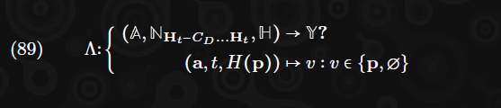

Diese Funktion wird kurz unten in Gleichung 91 definiert.
Das Preimage-Lookup für einen Service mit dem Index s wird als ***δ[s]p*** bezeichnet und ist ein Dictionary, das einen Hash zu seinem entsprechenden Preimage abbildet. Zusätzlich gibt es Metadaten, die mit dem Lookup verbunden sind, bezeichnet als ***δ[s]l***, ein Dictionary, das einen Hash und eine vorausgesetzte Länge in historische Informationen abbildet.

#### 9.2.1. Invarianten
Der Zustand des Lookup-Systems erfüllt natürlicherweise eine Reihe von Invarianten. Erstens muss jeder Preimage-Wert seinem Hash entsprechen, wie in Gleichung 90 dargestellt. Zweitens impliziert das Vorhandensein eines Preimage-Wertes im Zustand, dass sein Hash und Längenpaar einen zugehörigen Status haben, ebenfalls in Gleichung 90 dargestellt. Formal:

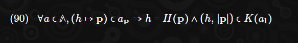

#### 9.2.2. Semantik
Die historische Statuskomponente h ∈ [NT]∶3 ist eine Sequenz von bis zu drei Zeitschlitzen, und die Kardinalität dieser Sequenz impliziert einen von vier Modi:

- ***h = []***: Das Preimage wird angefordert, wurde aber noch nicht bereitgestellt.
- ***h ∈ NT1***: Das Preimage ist verfügbar und war es seit Zeitpunkt ***h0***.
- ***h ∈ NT2***: Das zuvor verfügbare Preimage ist seit Zeitpunkt ***h1*** nicht mehr verfügbar. Es war von Zeitpunkt ***h0*** bis ***h1*** verfügbar.
- ***h ∈ NT3***: Das Preimage ist verfügbar und war es seit Zeitpunkt ***h2***. Es war zuvor von Zeitpunkt h0 bis ***h1*** verfügbar.
Die historische Lookup-Funktion ***Λ*** kann nun wie folgt definiert werden:

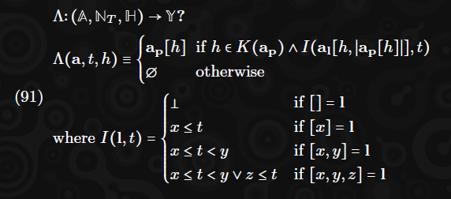

### 9.3. Kontofußabdruck und Schwellenwertguthaben (Account Footprint and Threshold Balance.)
Wir definieren die abhängigen Werte ***i*** und ***l*** als den Speicherfußabdruck des Services, speziell die Anzahl der Elemente im Speicher und die Gesamtzahl der verwendeten Oktette im Speicher. Diese werden ausschließlich anhand der Speicherkarte eines Services definiert, und es muss angenommen werden, dass sich diese ändern, wann immer der Speicher eines Services geändert wird.

Des Weiteren, wie wir in der Kontoserialisierungsfunktion in Abschnitt C sehen werden, wird erwartet, dass diese explizit innerhalb der Merklisierten Zustandsdaten gefunden werden. Aus diesem Grund machen wir ihre Menge explizit.

Wir können dann einen zweiten abhängigen Term ***t*** definieren, das minimale oder Schwellenwertguthaben, das für ein gegebenes Servicekonto in Bezug auf seinen Speicherfußabdruck erforderlich ist.

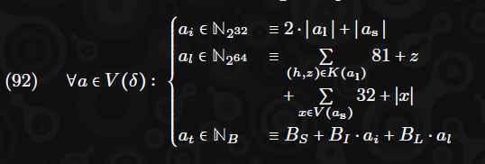

### 9.4. Serviceprivilegien
Bis zu drei Services können als privilegiert anerkannt werden. Der Zustandsteil, in dem dies gehalten wird, wird als ***χ*** bezeichnet und hat drei Komponenten, jeweils einen Service-Index. ***m*** ist der Index des Managerservices, des Services, der in der Lage ist, eine Änderung von ***χ*** von Block zu Block zu bewirken. ***a*** und ***v*** sind jeweils die Indizes von Services, die in der Lage sind, ***φ*** und ***ι*** von Block zu Block zu ändern. Formal:

## 10. Urteile (judgements)
JAM bietet eine Möglichkeit, eine Abstimmung unter allen Validatoren über die Gültigkeit eines Arbeitsberichts, einer im Rahmen von JAM geleisteten Arbeitseinheit, aufzuzeichnen (für nähere Informationen zur Natur eines Arbeitsberichts siehe Abschnitt 11). Eine solche Abstimmung wird in der Praxis nicht oft (wenn überhaupt) erwartet, jedoch ist sie eine wichtige Sicherheitsmaßnahme, die es ermöglicht, problematische Schlüssel kurzfristig aus dem Validatorenset zu entfernen, wenn ein Konsens über deren Fehlfunktion besteht. Sie hilft auch dabei, die Fähigkeit zu koordinieren, nicht finalisierte Kettenverlängerungen rückgängig zu machen und durch eine Verlängerung zu ersetzen, die keinen ungültigen Arbeitsbericht enthält.
Im Allgemeinen werden Urteilsdaten als Ergebnis eines Streits zwischen Validatoren entstehen, ein off-chain Prozess, der in Abschnitt 10 beschrieben wird. Ein Urteil gegen einen Bericht impliziert, dass die Kette auf unmittelbar vor der Akkumulation dieses Berichts zurückgesetzt wird. Das Urteil on-chain zu stellen, hat den Effekt, seine Akkumulation zu annullieren. Die spezifische Strategie zur Kettenauswahl wird vollständig in Abschnitt 18 beschrieben.
Falls eine ausreichende Anzahl von Validator-Knoten ein Urteil in ***EJ*** abgeben, wird ein indizierter Bericht dieses Urteils on-chain gestellt (in ***ψ***, dem Zustandsteil, der Streiturteile behandelt).
Ein persistenter on-chain Bericht ist in mehrfacher Hinsicht hilfreich. Erstens bietet er eine sehr einfache Möglichkeit, die Umstände zu erkennen, unter denen Maßnahmen gegen einen Validator ergriffen werden müssen, durch eine höhere Ebene der Validatorauswahl-Logik. Sollte JAM für ein öffentliches Netzwerk wie Polkadot verwendet werden, würde dies das Streichen des Einsatzes des fehlbaren Validators auf der Staking-Parachain bedeuten.
Wie erwähnt, ist es wichtig, Berichte mit hoher Sicherheit auf Ungültigkeit zu erfassen, um sicherzustellen, dass diese Berichte nicht erneut eingereicht werden dürfen. Umgekehrt stellt die Erfassung von Berichten, die als gültig befunden wurden, sicher, dass in der Zukunft der Kette keine weiteren Streitigkeiten erhoben werden können.

### 10.1. Zustand (State)
Der Urteilszustand umfasst drei Elemente: ein Allow-Set (***ψa***), ein Ban-Set (***ψb***) und ein Punish-Set (***ψp***). Das Allow-Set enthält die Hashes aller Arbeitsberichte, die bestritten und als genau beurteilt wurden. Das Ban-Set enthält die Hashes aller Arbeitsberichte, die bestritten wurden und deren Genauigkeit nicht mit Sicherheit bestätigt werden konnte. Das Punish-Set ist eine Menge von Schlüsseln von Bandersnatch-Schlüsseln, die garantiert einen Bericht unterstützt haben, der mit Sicherheit als ungültig befunden wurde.

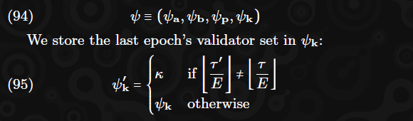

### 10.2. Extrinsisch (Extrinsic)
Das Urteilsextrinsische, ***EJ***, kann ein oder mehrere Urteile als eine Zusammenstellung von Signaturen enthalten, die von genau zwei Dritteln plus eins entweder des aktiven Validatorensets (d.h. der Ed25519-Schlüssel von ***κ***) oder des Validatorensets der vorherigen Epoche (d.h. die Schlüssel von ***ψk***) stammen:

Alle Signaturen müssen in Bezug auf eines der beiden erlaubten Validatorenschlüssel-Sets gültig sein. Beachten Sie, dass die Schlüssel-Sets der beiden Epochen nicht gemischt werden dürfen! Formal:

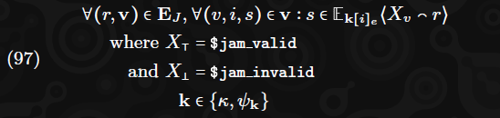

Urteile müssen nach Berichtshash sortiert werden und es dürfen keine doppelten Berichtshashes innerhalb des Extrinsischen oder unter allen vergangenen berichteten Hashes vorhanden sein. Formal:

Die Stimmen aller Urteile müssen nach Validatorindex sortiert werden und es dürfen keine doppelten Indizes vorhanden sein. Formal:

Wir definieren ***J*** als die Sequenz der in den Extrinsischen eingeführten Urteile (und entsprechend sortiert), mit der Sequenz der Signaturen, die durch die Summe der Stimmen über die Signaturen ersetzt wird. Wir verlangen, dass diese Summe genau null, zwei Drittel plus eins oder ein Drittel plus eins des Validatorensets ist, was jeweils darauf hinweist, dass wir sicher sind, dass der Bericht gültig ist, sicher, dass er ungültig ist, oder dass uns die Sicherheit in beiden Fällen fehlt. Diese Anforderung mag willkürlich erscheinen, aber dies sind die Entscheidungsschwellen für unsere drei möglichen Aktionen und sind akzeptabel, da die Sicherheitsannahmen die Anforderung umfassen, dass mindestens zwei Drittel plus ein Validator aktiv sind (stewart2018efficient diskutiert die Sicherheitsimplikationen ausführlich).
Formal:

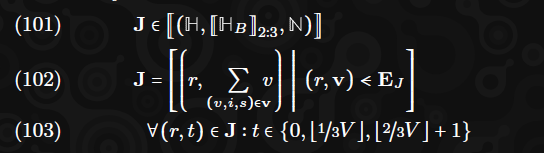

Beachten Sie, dass ***t*** die Schwelle der Urteile ist, dass der Bericht gültig ist, berechnet durch Summieren von Booleschen Werten in ihrer impliziten Äquivalenz zu Binärziffern der Menge ***N2***.
Wir löschen alle Arbeitsberichte, die als ungültig beurteilt wurden, aus ihrem Kern:

Das Allow-Set nimmt die Hashes aller Berichte auf, die wir als gültig beurteilen. Das Ban-Set nimmt alle anderen beurteilten Berichtshashes auf. Schließlich akkumuliert das Punish-Set die Garantieschlüssel aller Berichte, die als ungültig beurteilt wurden:

Beachten Sie, dass das erweiterte Punish-Set verwendet wird, um ***κ′*** zu bestimmen, um alle Validatorschlüssel, die in der Punish-Liste erscheinen, zu nullifizieren.

### 10.3. Header
Der Urteilsmarker muss genau die Sequenz der Berichtshashes enthalten, die nicht als eindeutig gültig beurteilt wurden (d.h. entweder umstritten oder ungültig). Formal:

## 11. Berichterstattung und Sicherung  (Reporting and Assurance)
Berichterstattung und Sicherung sind die beiden On-Chain-Prozesse, die wir verwenden, um die Ergebnisse der internen Berechnung in den Servicezustand-Singleton, ***δ***, zu übertragen. Ein Arbeitspaket, das mehrere Arbeitselemente umfasst, wird von Validatoren, die als Bürgen agieren, in den entsprechenden Arbeitsbericht umgewandelt, der ebenfalls mehrere Arbeitsausgaben umfasst und dann On-Chain innerhalb der Garantieextrinsik präsentiert wird. Zu diesem Zeitpunkt wird das Arbeitspaket in zahlreiche Segmente aufgeteilt und jedes Segment an den zugehörigen Validator verteilt, der dann seine Verfügbarkeit durch eine On-Chain-Sicherung bestätigt. Nach entweder ausreichenden Sicherungen oder einem Timeout (je nachdem, was zuerst eintritt), wird der Arbeitsbericht als verfügbar betrachtet und die Arbeitsergebnisse verändern den Zustand des zugehörigen Dienstes durch Akkumulation, die in Abschnitt 12 behandelt wird.

Aus der Perspektive des Arbeitsberichts erfolgt daher die Garantie zuerst und die Sicherung danach. Aus der Perspektive der Zustandstransition eines Blocks ist es jedoch am besten, die Sicherungen zuerst zu verarbeiten, da jeder Kern zu einem Zeitpunkt nur einen einzigen Arbeitsbericht haben kann, dessen Paket verfügbar wird. Daher werden wir zunächst die Transition behandeln, die sich aus der Verarbeitung der Verfügbarkeitssicherungen ergibt, gefolgt von den Arbeitsberichtsgarantien. Diese Synchronität kann formal durch die Anforderung eines Zwischenzustands ***ρ(+)*** gesehen werden, der später in Gleichung 136 verwendet wird.

### 11.1. Zustand (State)
Der Zustand des Berichterstattungs- und Verfügbarkeitsteils des Protokolls ist größtenteils in ***ρ*** enthalten, das die Arbeitsberichte verfolgt, die gemeldet, aber noch nicht akkumuliert wurden, sowie die Identitäten der Bürgen, die sie gemeldet haben, und die Zeit, zu der sie gemeldet wurden. Wie bereits erwähnt, darf zu einem bestimmten Zeitpunkt nur ein Bericht einem Kern zugewiesen werden. Formal:

Wie üblich werden Zwischen- und nachfolgende Werte ***(ρ(+)***, ***ρ(++)***, ***ρ′***) unter den gleichen Einschränkungen wie der vorherige Wert gehalten.

#### 11.1.1 Arbeitsbericht (Work Report)
Ein Arbeitsbericht, aus der Menge ***W***, wird als ein Tupel aus Autorisierungshash ***a*** und Ausgabe ***o***, dem Verfeinerungskontext ***x***, der Paketspezifikation ***s*** und den Ergebnissen der Auswertung jedes Elements im Paket ***r*** definiert, das immer mindestens ein Element und höchstens ***I*** Elemente umfassen darf. Formal:

Die Gesamtgröße eines Arbeitsberichts darf ***WR*** Bytes nicht überschreiten:

#### 11.1.2 Verfeinerungskontext (Refinement Context)
Ein Verfeinerungskontext, bezeichnet durch die Menge ***X***, beschreibt den Kontext der Kette zu dem Zeitpunkt, an dem das entsprechende Arbeitspaket des Berichts ausgewertet wurde. Er identifiziert zwei historische Blöcke, den Anker, den Header-Hash ***a*** zusammen mit seinem zugehörigen nachfolgenden Zustand-Root ***s*** und dem nachfolgenden Beefy-Root ***b***; und den Lookup-Anker, den Header-Hash ***l*** und den Zeitschlitz ***t***. Schließlich identifiziert er den Hash eines optionalen vorausgesetzten Arbeitspakets ***p***. Formal:

#### 11.1.3 Verfügbarkeit (Availability.)
Wir definieren die Menge der Verfügbarkeitsspezifikationen, S, als das Tupel aus dem hash h und der Länge l des überprüfbaren Arbeitspakets zusammen mit einem Erasure-Root u und einem Segment-Root e. Arbeitsergebnisse umfassen die Verfügbarkeitsspezifikation für die Kodierung des entsprechenden Arbeitspakets. Formal:

Das Erasure-Root (***u***) ist der Root eines binären Merkle-Baums, der als Verpflichtung zu allen im Audit ***DA*** und im Imports ***DA*** gespeicherten Datenblöcken in Bezug auf diesen Arbeitsbericht (und die Auswirkungen seines entsprechenden Arbeitspakets) dient. Es wird von Sicherstellern verwendet, um die Korrektheit der verteilten Daten zu überprüfen, die von Prüfern sichergestellt wurden. Es wird in Abschnitt 13 ausführlich besprochen.
Das Segment-Root (***e***) ist der Root eines konstant tiefen, linksgerichteten und null-hash-gefüllten binären Merkle-Baums, der sich zu den Hashes jedes exportierten Segments jedes Arbeitselements verpflichtet. Diese werden von Bürgen verwendet, um die Korrektheit aller rekonstruierten Segmente zu überprüfen, die sie zur Bewertung eines späteren Arbeitspakets importieren sollen. Es wird ebenfalls in Abschnitt 13 besprochen.

#### 11.1.4 Arbeitsergebnis (Work Result)
Wir kommen schließlich dazu, ein Arbeitsergebnis, ***L***, zu definieren, welches das Datenleitungswerkzeug ist, durch das der Zustand der Dienste durch die innerhalb eines Arbeitspakets durchgeführte Berechnung geändert werden kann.

Arbeitsergebnisse sind ein Tupel, das mehrere Elemente umfasst. Erstens ***s***, der Index des Dienstes, dessen Zustand geändert werden soll und dessen Refinement-Code bereits ausgeführt wurde. Wir fügen den Hash des Codes des Dienstes zum Zeitpunkt der Berichterstattung hinzu, ***c***, der gemäß Gleichung ***146*** genau vorhergesagt werden muss.
Als nächstes folgt der Hash der Nutzlast (***l***) innerhalb des Arbeitselements, das in der Refinement-Phase ausgeführt wurde, um dieses Ergebnis zu erzielen. Dies hat keine unmittelbare Relevanz, wird aber der Akkumulationslogik des Dienstes zur Verfügung gestellt. Anschließend folgt das Gas-Priorisierungsverhältnis ***g***, das bei der Bestimmung verwendet wird, wie viel Gas für die Ausführung dieses Elements akkumuliert werden soll.
Schließlich gibt es die Ausgabe oder den Fehler der Codeausführung ***o***, der entweder eine Oktettfolge ist, falls erfolgreich, oder ein Mitglied der Menge J, falls nicht. Letztere Menge ist als die Menge möglicher Fehler definiert, formal:

Die ersten beiden sind spezielle Werte bezüglich der Ausführung der virtuellen Maschine, ***∞*** bedeutet einen Out-of-Gas-Fehler und ***☇*** bedeutet einen unerwarteten Programmabbruch. Die verbleibenden zwei zeigen an, dass der Code des Dienstes im nachfolgenden Zustand des Lookup-Anker-Blocks entweder nicht verfügbar war oder die maximale erlaubte Größe ***S*** überschritt.

### 11.2. Paketverfügbarkeitssicherungen (Package Availability Assurances)
Wir definieren zuerst ***ρ(++)***, den Zwischenzustand, der als nächstes in Abschnitt 11.4 verwendet wird, sowie ***R***, die Menge der verfügbaren Arbeitsberichte, die später in Abschnitt 12 verwendet werden. Beide erfordern die Integration von Informationen aus den Sicherungsextrinsik ***EA***.

#### 11.2.1 Die Sicherungsextrinsik (The Assurances Extrinsic.)
Die Sicherungsextrinsik ist eine Folge von Sicherungswerten, höchstens einer pro Validator. Jede Sicherung ist eine Folge von Binärwerten (d.h. einer Bitfolge), jeweils eine pro Kern, zusammen mit einer Signatur und dem Index des Validators, der sichert. Ein Wert von 1 (oder ***⊺***, wenn als Boolean interpretiert) an einem beliebigen Index impliziert, dass der Validator versichert, dass er zur Verfügbarkeit beiträgt.**^11** Formal:

> **Footnotes:**
>
>**^11** Dies ist eine „weiche“ Implikation, da es keine Konsequenzen in der Blockchain gibt, wenn unehrlich berichtet wird. Für weitere Informationen zu dieser Implikation siehe Abschnitt 15.

Die Sicherungen müssen alle am übergeordneten Block verankert und nach Validatorindex geordnet sein:

Die Signatur muss von einem öffentlichen Schlüssel des Validators stammen, der sichert, und dessen Nachricht die Serialisierung des übergeordneten Hashes ***Hp*** und der oben genannten Bitfolge ist:

Ein Bit darf nur gesetzt werden, wenn der entsprechende Kern einen Bericht anhängig hat, dessen Verfügbarkeit sichergestellt wird:

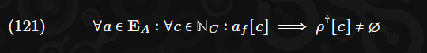

#### 11.2.2 Verfügbare Berichte (Available Reports)
Ein Arbeitsbericht wird als verfügbar angesehen, wenn und nur wenn eine klare 2/3-Mehrheit der Validatoren das Setzen seines Kerns innerhalb der Sicherungsextrinsik des Blocks markiert haben. Formal definieren wir die Reihe der verfügbaren Arbeitsberichte ***R*** wie folgt:

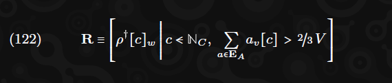

Dieser Wert wird in der Definition von sowohl ***δ′*** als auch ***ρ(++)*** verwendet, die wir als gleichwertig zu ***ρ(+)*** definieren, außer dass Elemente entfernt werden, die jetzt verfügbar sind:

### 11.3. Bürgschaftszuteilungen (Guarantor Assignments.) 
Jeder Block hat einen bestimmten Kern, dem eine bestimmte Anzahl von Validatoren zugewiesen ist, die Arbeitsberichte dafür garantieren. Bei ***V = 1.023*** Validatoren und ***C = 341*** Kernen ergibt dies genau ***V/C = 3*** Validatoren pro Kern. Die Ed25519-Schlüssel dieser Validatoren werden durch ***G*** bezeichnet:

Wir bestimmen den Kern, dem ein bestimmter Validator zugewiesen wird, durch eine Zufallsmischung mit epochaler Entropie und einer periodischen Rotation, um die Sicherheit und Lebendigkeit des Netzwerks zu gewährleisten. Wir verwenden ***η2*** für die epochale Entropie anstelle von ***η1***, um die Möglichkeit einer Gabelvergrößerung zu vermeiden, bei der Unsicherheit über den Kettenzustand am Ende einer Epoche zwei etablierte Gabeln entstehen lassen könnte, bevor sie sich natürlich auflöst. Wir definieren die Permutationsfunktion ***P***, die Rotationsfunktion ***R*** und schließlich die Bürgschaftszuteilungen ***G*** wie folgt:

Wir definieren auch ***G∗***, was dem Wert ***G*** entspricht, wie er unter der vorherigen Rotation gewesen wäre:

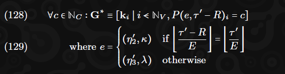

### 11.4. Arbeitsberichtsgarantien (Work Report Guarantees.)
Wir beginnen mit der Definition der Garantieextrinsik, ***EG***, einer Reihe von Garantien, höchstens eine für jeden Kern, jede davon ein Tupel aus einem Kernindex, einem Arbeitsbericht, einer Berechtigung a und dem entsprechenden Zeitschlitz ***t***. Formal:

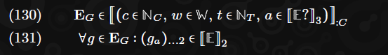

Die Berechtigung ist selbst eine Folge von drei Tupeln aus einer Signatur und einem Validator-Index ***E***. Nur das letzte Element darf legitimerweise ***∅*** sein.
Der Kernindex jeder Garantie muss in aufsteigender Reihenfolge sein:

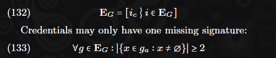

Die Signatur muss von einem öffentlichen Schlüssel des Validators stammen, der in der Berechtigung identifiziert ist, und dessen Nachricht die Serialisierung des Kernindex und des Arbeitsberichts ist. Die signierenden Validatoren müssen dem betreffenden Kern entweder in diesem Block ***G*** zugewiesen sein, wenn der Zeitschlitz für die Garantie in derselben Rotation wie der Zeitschlitz dieses Blocks liegt, oder im jüngsten vorherigen Satz von Zuweisungen, ***G∗***:

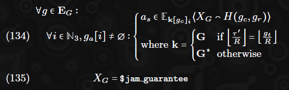

Es dürfen keine Berichte auf Kernen platziert werden, die einen Bericht anhängig haben, dessen Verfügbarkeit noch nicht sichergestellt ist, es sei denn, er ist abgelaufen. Im letzteren Fall müssen ***U = 5*** Zeitschlitze nach dem Erstellen des Berichts vergangen sein. Ein Bericht ist ungültig, wenn der Autorisierungshash nicht im Autorisierungspool des Kerns vorhanden ist, auf dem die Arbeit gemeldet wird. Formal:

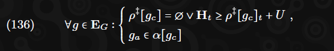

Wir bezeichnen w als die Menge der Arbeitsberichte im aktuellen Extrinsik ***E***:

Wir geben den maximalen Gesamterfordernis an Akkumulationsgas an, den ein Arbeitsbericht implizieren darf, als ***GA*** an, und verlangen, dass die Summe aller Mindestgasanforderungen der Dienste nicht größer als dieser Wert ist:

#### 11.4.1 Kontextuelle Gültigkeit der Berichte (Contextual Validity of Reports)
Der Einfachheit halber definieren wir zwei Äquivalenzen ***x*** und ***p***, die jeweils die Menge aller Kontexte und Arbeitspakethashes innerhalb des Extrinsiks darstellen:

Es dürfen keine doppelten Arbeitspakethashes vorhanden sein (d.h. zwei Arbeitsberichte desselben Pakets). Daher verlangen wir, dass die Kardinalität von ***p*** der Länge der Arbeitsberichtsequenz ***w*** entspricht:

Wir verlangen, dass der Ankerblock innerhalb der letzten ***H*** Blöcke liegt und dass seine Details korrekt sind, indem wir sicherstellen, dass er in unseren neuesten Blöcken ***β*** erscheint:

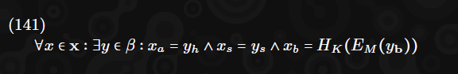

Wir verlangen, dass jeder Lookup-Ankerblock innerhalb der letzten ***L*** Zeitschlitze liegt:

Wir verlangen auch, dass wir einen Datensatz darüber haben; dies ist eine der wenigen Bedingungen, die nicht rein durch den On-Chain-Zustand überprüft werden können und durch das Beibehalten der letzten ***L*** Header als Ahnenmenge ***A*** überprüft werden müssen. Da es durch die Header-Kette bestimmt wird, ist es immer noch deterministisch und berechenbar. Formal:

Wir verlangen, dass das Arbeitspaket des Berichts nicht das Arbeitspaket eines anderen Berichts ist, der in der Vergangenheit erstellt wurde. Da das Arbeitspaket den Ankerblock impliziert und der Ankerblock auf die neuesten Blöcke beschränkt ist, müssen wir nur sicherstellen, dass das Arbeitspaket nicht in unserer jüngsten Geschichte erscheint:

Wir verlangen, dass das vorausgesetzte Arbeitspaket, falls vorhanden, entweder im Extrinsik oder in unserer jüngsten Geschichte vorhanden ist:

Wir verlangen, dass alle Arbeitsergebnisse im Extrinsik den korrekten Codehash für ihren entsprechenden Dienst vorhergesagt haben:

### 11.5. Übergang für Berichte (Transitioning for Reports.)
Wir definieren ***ρ′*** als äquivalent zu ***ρ(++)***, außer in Fällen, in denen der Extrinsik einen Eintrag ersetzt hat. Falls ein Eintrag ersetzt wird, enthält der neue Wert die aktuelle Zeit ***τ′***, sodass der Wert unabhängig von seiner Verfügbarkeit ersetzt werden kann, sobald genügend Zeit verstrichen ist (siehe Gleichung 136).

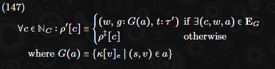

Dies schließt den Abschnitt über Berichterstattung und Sicherung ab. Wir haben nun eine vollständige Definition von ***ρ′*** zusammen mit ***R***, die in Abschnitt 12 verwendet werden, welcher den Zustandsteil beschreibt, der eintritt, sobald ein Arbeitsbericht garantiert und verfügbar gemacht wird.

## 12. Akkumulation (Accumulation)
Die Akkumulation kann als eine Funktion definiert werden, deren Argumente ***R*** und ***δ*** zusammen mit ausgewählten Teilen des (manchmal teilweise übergangenen) Zustands sind und die den nachfolgenden Dienstzustand ***δ′*** zusammen mit zusätzlichen Zustandselementen ***ι′***, ***φ′*** und ***χ′*** ergibt.
Das Prinzip der Akkumulation ist tatsächlich ganz einfach: Wir möchten lediglich die Akkumulationslogik des Dienstcodes jedes Dienstes ausführen, der mindestens eine Arbeitsausgabe hat, und ihm die Arbeitsausgaben und nützliche Kontextinformationen übergeben. Es gibt jedoch drei Hauptkomplikationen. Erstens müssen wir die Ausführungsumgebung dieser Logik definieren, insbesondere die für sie verfügbaren Hostfunktionen. Zweitens müssen wir die Menge des Gases festlegen, die für die Ausführung jedes Dienstes zulässig ist. Schließlich müssen wir die Natur der Übertragungen innerhalb der Akkumulation bestimmen, was, wie wir sehen werden, zur Notwendigkeit eines zweiten Einstiegspunkts, "on-transfer", führt.

### 12.1. Preimage-Integration
Vor der Akkumulation müssen wir zuerst alle im Lookup-Extrinsik bereitgestellten Preimages integrieren. Das Lookup-Extrinsik ist eine Folge von Paaren aus Dienstindizes und Daten. Diese Paare müssen geordnet und ohne Duplikate sein (Gleichung 149 erfordert dies). Die Daten müssen von einem Dienst angefordert worden sein, aber noch nicht bereitgestellt worden sein. Formal:

### 12.2. Gasabrechnung (Gas Accounting)
Wir definieren ***S***, die Menge aller Dienste, die in diesem Block akkumuliert werden; das sind alle Dienste, die mindestens eine Arbeitsausgabe innerhalb von ***R*** haben, zusammen mit allen privilegierten Diensten, ***χ***. Formal:

Wir berechnen das Gas, das jedem Dienst zugewiesen wird, als die Summe des Anteils jeder Arbeitsausgabe des Dienstes am wahlfreien Akkumulationsgas seines Berichts zusammen mit der Zwischensumme der Mindestgasanforderungen:

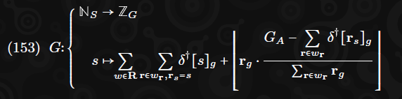

### 12.3. Vorbereitung (Wrangling)
Wir definieren schließlich die Ergebnisse, die als Operand in die Akkumulationsfunktion für jeden Dienst in ***S*** eingegeben werden. Dies ist eine Folge von Operandentupeln ***O***, eine Folge für jeden Dienst in ***S***. Jede Folge enthält ein Element pro Arbeitsausgabe (oder Fehler), die für diesen Dienst akkumuliert werden soll, zusammen mit dem Nutzlast-Hash, dem Paket-Hash und der Autorisierungsausgabe der Arbeitsausgabe. Die Tupel sind in der gleichen Reihenfolge angeordnet, in der sie in ***R*** erscheinen. Formal:

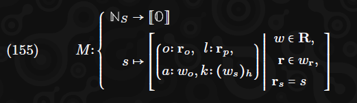

### 12.4. Aufruf (Invocation)
In diesem Abschnitt definieren wir ***A***, die Funktion, die die Akkumulation eines einzelnen Dienstes durchführt. Formal gesprochen nimmt ***A*** die Omnipräsenz des Zeitschlitzes ***Ht*** und einiger vorheriger Zustandskomponenten ***δ(+)***, ***ν***, ***Rd*** an und nimmt als spezifische Argumente den Dienstindex ***s ∈ S*** (aus dem es die aufbereiteten Ergebnisse ***M(s)*** und das Gaslimit ***G(s)*** ableiten kann) und liefert Werte für ***δ(+)[s]*** und Staging-Zuweisungen in ***φ***, ***ι*** zusammen mit einer Reihe von Lookup-Anfragen/Vergessen, einer Reihe von verzögerten Übertragungen und ***C***, das eine Abbildung vom Dienstindex zu den Beefy-Verpflichtungshashes darstellt.
Wir bezeichnen zuerst die Menge der verzögerten Übertragungen als ***T***, wobei eine Übertragung eine Memo-Komponente m von 64 Oktetten sowie den Dienstindex des Absenders ***s***, den Dienstindex des Empfängers ***d***, die zu übertragende Token-Menge ***a*** und das Gaslimit ***g*** für die Übertragung umfasst. Formal:

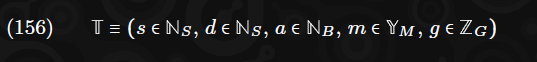

Wir können dann A definieren, die Abbildung vom Index der akkumulierten Dienste zu den verschiedenen Komponenten, in denen wir unseren nachfolgenden Zustand definieren werden:

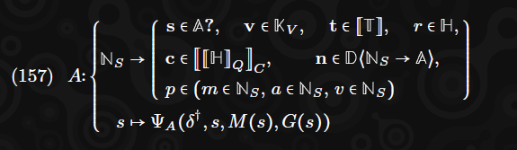

Wie klar zu sehen ist, kombiniert unsere Akkumulationsabbildung A Teile des vorherigen Zustands zu Argumenten für einen Aufruf der virtuellen Maschine. Insbesondere die Dienstkonten ***δ(+)*** zusammen mit dem Index des betreffenden Dienstes s und seinen aufbereiteten Refinement-Ergebnissen ***M(s)*** und Gaslimit ***G(s)*** werden arrangiert, um die Argumente für ***ΨA*** zu erstellen, das selbst einen Aufruf der virtuellen Maschine gemäß Anhang B.4 verwendet.
Die Beefy-Verpflichtungsabbildung ist eine Funktion, die alle akkumulierten Dienste auf ihr Akkumulationsergebnis (den ***r***-Komponente des Ergebnisses von ***A***) abbildet. Dies wird zur Bestimmung der Akkumulations-Ergebnis-Baumwurzel für den aktuellen Block verwendet, nützlich für das Beefy-Protokoll:

Angesichts unserer Abbildung ***A***, die vollständig aus den VM-Aufrufen jedes akkumulierten Dienstes ***S*** berechnet werden kann, können wir den nachfolgenden Zustand ***δ′***, ***χ′***, ***φ′*** und ***ι′*** als das Ergebnis der Integration von ***A*** in unseren Zustand definieren.

#### 12.4.1. Privilegierte Übergänge (Privileged Transitions)
Die Staging-Kernzuweisungen und die Validator-Schlüssel sowie das privilegierte Dienstset werden jeweils basierend auf den Auswirkungen der Akkumulation der drei privilegierten Dienste geändert:

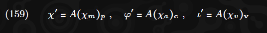

#### 12.4.2. Dienstkontoübergänge (Service Account Transitions)
Schließlich integrieren wir alle Änderungen an den Dienstkonten in den Zustand.
Wir stellen fest, dass alle neu hinzugefügten Dienstindizes, definiert als ***K(A(s)n)*** für jeden akkumulierten Dienst ***s***, nicht mit den Indizes vorhandener oder neu hinzugefügter Dienste kollidieren dürfen. Dies sollte nie passieren, da neue Indizes explizit ausgewählt werden, um solche Konflikte zu vermeiden. Sollte es jedoch in seltenen Fällen passieren, wäre der Block ungültig. Formal:

Wir definieren zuerst ***δ(++)***, einen Zwischenzustand nach der Hauptakkumulation, aber bevor die Übertragungen gutgeschrieben und verarbeitet wurden:

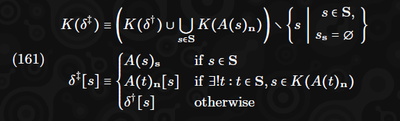

Wir bezeichnen ***R(s)*** als die Sequenz der Übertragungen, die von einem bestimmten Dienst mit dem Index s empfangen wurden, in der Reihenfolge, in der sie von Diensten mit aufsteigendem Index gesendet wurden. (Wenn ein Dienst s keine Übertragungen erhalten hat oder einfach nicht existiert, wäre ***R(s)*** gültig als leere Sequenz definiert.) Formal:

Der nachfolgende Zustand ***δ′*** kann dann als der Zwischenzustand mit allen angewendeten verzögerten Übertragungen definiert werden:

Beachten Sie, dass ***ΨT*** in Anhang B.5 definiert ist, sodass es zu ***δ(++)[d]*** führt, d.h. keine Änderung des Zwischenzustands des Kontos, wenn ***R(d) = []***, d.h. wenn das Konto keine Übertragungen erhalten hat.

## 13. Arbeitspakete und Arbeitsberichte (Work Packages and Work Reports)
### 13.1. Ehrliches Verhalten (Honest Behavior)
Bisher haben wir spezifiziert, wie Blöcke für eine korrekt übergehende JAM-Blockchain erkannt werden. Durch die Definition der Zustandstransitionsfunktion und einer Merklization-Funktion für den Zustand haben wir auch definiert, wie ein gültiger Header erkannt wird. Obwohl es nicht besonders schwierig ist zu verstehen, wie ein neuer Block erstellt werden kann, wenn ein Knoten einen Schlüssel kontrolliert, der die Erstellung der beiden Signaturen im Header ermöglicht, und um die anderen Headerfelder auszufüllen, bleibt der Inhalt der Extrinsik unklar.

Wir definieren nicht nur korrektes Verhalten durch die Erstellung korrekter Blöcke, sondern auch ehrliches Verhalten, das die Teilnahme des Knotens an mehreren Off-Chain-Aktivitäten umfasst. Dies hat analoge Aspekte innerhalb von YP Ethereum, obwohl es in diesem Dokument nicht so explizit erwähnt wird: Die Erstellung von Blöcken sowie das Weitergeben und Einfügen von Transaktionen in diese Blöcke würden alle als Off-Chain-Aktivitäten gelten, für die ehrliches Verhalten hilfreich ist. Im Fall von JAM ist ehrliches Verhalten gut definiert und wird von mindestens **2/3** der Validatoren erwartet.

Über die Produktion von Blöcken hinaus umfasst das incentivierte ehrliche Verhalten:

- Das Garantieren und Melden von Arbeitspaketen sowie das Chunking und die Verteilung sowohl der Chunks als auch des Arbeitspakets selbst, wie in Abschnitt 14 besprochen.
- Die Sicherstellung der Verfügbarkeit von Arbeitspaketen nach Erhalt ihrer Daten.
- Die Bestimmung, welche Arbeitsberichte geprüft werden sollen, deren Abruf und Prüfung sowie die Erstellung und Verteilung von Urteilen basierend auf dem Ergebnis der Prüfung.
- Das Einreichen der korrekten Menge an Arbeit, die von anderen Validatoren gesehen wurde, wie in Abschnitt 19 besprochen.

### 13.2. Segmente und das Manifest 
Unsere grundlegende Erasure-Coding-Segmentgröße beträgt **WC = 684 Oktette**, abgeleitet aus dem Wunsch, auch dann rekonstruieren zu können, wenn fast zwei Drittel unserer **1023** Teilnehmer böswillig oder handlungsunfähig sind, dem 16-Bit-Galois-Feld, auf dem der Erasure-Code basiert, und dem Wunsch, Daten von nahe an, aber nicht weniger als, **4 KB** effizient zu unterstützen.

Arbeitspakete sind im Allgemeinen klein, um sicherzustellen, dass Bürgen nicht viel Bandbreite investieren müssen, um herauszufinden, ob sie für ihre Bewertung in einen Arbeitsbericht bezahlt werden können. Anstatt viele Daten inline zu haben, verweisen sie stattdessen auf Daten durch Commitments. Die einfachsten Commitments sind extrinsische Daten.

Extrinsische Daten sind Blobs, die zusammen mit dem Arbeitspaket selbst allgemein vom Arbeitspaket-Ersteller in das System eingeführt werden. Sie werden der Refine-Logik als Argument zugänglich gemacht. Wir verpflichten uns zu ihnen, indem wir jeden ihrer Hashes im Arbeitspaket einschließen.

Arbeitspakete haben zwei andere Arten externer Daten, die mit ihnen verbunden sind: Ein kryptografisches Commitment zu jedem importierten Segment und schließlich die Anzahl der exportierten Segmente.

#### 13.2.1. Segmente, Importe und Exporte
Die Fähigkeit, große Mengen an Daten von einem Arbeitspaket zu einem nachfolgenden Arbeitspaket zu kommunizieren, ist ein Schlüsselmerkmal des JAM-Verfügbarkeitssystems. Ein exportiertes Segment, definiert als die Menge ***G***, ist eine Oktettsequenz fester Länge **WSWC = 4104**. Es ist das kleinste Datum, das einzeln aus dem oder in das langfristige Imports DA während der Refine-Funktion eines Arbeitspakets importiert oder exportiert werden kann. Da es ein genaues Vielfaches der Erasure-Coding-Stückgröße ist, wird sichergestellt, dass die Datensegmente des Arbeitspakets effizient im DA-System platziert werden können.

Exportierte Segmente sind Daten, die durch die Ausführung der Refine-Logik generiert werden und somit ein Nebeneffekt der Umwandlung des Arbeitspakets in einen Arbeitsbericht sind. Da ihre Daten deterministisch basierend auf der Ausführung der Refine-Logik sind, benötigen wir kein besonderes Commitment zu ihnen im Arbeitspaket, außer zu wissen, wie viele mit jedem Refine-Aufruf verbunden sind, damit wir einen genauen Index bereitstellen können.

Importierte Segmente hingegen sind Segmente, die von vorherigen Arbeitspaketen exportiert wurden. Um sie leicht abrufen und überprüfen zu können, werden sie nicht durch Hash, sondern durch den Root eines Merkle-Baums referenziert, der alle anderen zum Zeitpunkt eingeführten Segmente einschließt, zusammen mit einem Index in diese Sequenz. Dies ermöglicht die Erstellung von Korrektheitsbegründungen, die gespeichert, zusammen mit den abgerufenen Daten eingefügt und überprüft werden können. Dies wird im nächsten Abschnitt ausführlich beschrieben.

#### 13.2.2. Datenerfassung und Begründung (Data Collection and Justification.)
Es ist die Aufgabe eines Bürgen, alle importierten Segmente durch das Abrufen der erasure-codierten Chunks dieser Segmente von genügend einzigartigen Validatoren wiederherzustellen. Allein die Wiederherstellung reicht nicht aus, da eine Datenkorruption auftreten würde, wenn ein oder mehrere Validatoren einen falschen Chunk bereitstellen. Aus diesem Grund stellen wir sicher, dass die Spezifikation des Importsegments (ein Merkle-Root und ein Index in den Baum) eine Art kryptografisches Commitment ist, das durch eine Begründung nachweisen kann, dass ein bestimmtes Segment tatsächlich korrekt ist.

Begründungsdaten müssen jedem Knoten während der potenziellen Anforderung seines Segments zur Verfügung stehen. Bei etwa 350 Byte zur Begründung eines einzelnen Segments sind die Begründungsdaten zu umfangreich, als dass alle Validatoren alle Daten speichern könnten. Daher verwenden wir das gleiche allgemeine Verfügbarkeitsframework für die Bereitstellung von Begründungsmetadaten wie für die Daten selbst.

Der Bürge kann diesen Beweis nutzen, um sich selbst zu bestätigen, dass er seine Zeit nicht mit falschem Verhalten verschwendet. Wir zwingen Prüfer nicht dazu, denselben Prozess durchzugehen. Stattdessen erstellen Bürgen ein überprüfbares Arbeitspaket und platzieren dies im Audit-DA-System. Dies ist das ursprüngliche Arbeitspaket, seine extrinsischen Daten, seine importierten Daten und ein prägnanter Korrektheitsnachweis dieser importierten Daten. Diese Taktik dupliziert routinemäßig Daten zwischen dem Imports-DA und dem Audits-DA, ist jedoch akzeptabel, um die Bandbreitenkosten für Prüfer zu reduzieren, die die Korrektheit so kostengünstig wie möglich nachweisen müssen, da das Prüfen im Durchschnitt 30 Mal für jedes Arbeitspaket erfolgt, während die Garantie nur zwei- oder dreimal erfolgt.

### 13.3. Pakete und Elemente (Packages and Items)
Wir beginnen mit der Definition eines Arbeitspakets, der Menge ***P***, und seiner konstituierenden Arbeitselemente, der Menge ***I***. Ein Arbeitspaket umfasst einen einfachen Blob, der als Autorisierungstoken ***j*** fungiert, den Index des Dienstes, der den Autorisierungscode hostet, ***h***, einen Autorisierungscode-Hash ***c*** und einen Parametrisierungs-Blob ***p***, einen Kontext ***x*** und eine Sequenz von Arbeitselementen ***i***:

Ein Arbeitselement umfasst: ***s***, den Bezeichner des Dienstes, auf den es sich bezieht, den Code-Hash des Dienstes zum Zeitpunkt der Berichterstattung ***c*** (dessen Preimage aus der Perspektive des Lookup-Ankerblocks verfügbar sein muss), einen Nutzlast-Blob ***y***, ein Gaslimit ***g*** und die drei Elemente seines Manifests, eine Sequenz importierter Datensegmente ***i***, identifiziert durch den Root des Segmentbaums und einen Index darin, ***x***, eine Sequenz von Hashes der Datensegmente, die in diesem Block eingeführt werden sollen (und die wir annehmen, dass der Validator sie kennt) und ***e***, die Anzahl der von diesem Arbeitselement exportierten Datensegmente:

Wir begrenzen die Gesamtanzahl der exportierten Elemente auf **WM = 211**. Wir setzen auch das gleiche Limit für die Gesamtanzahl der importierten Elemente:

Wir gehen davon aus, dass das Preimage zu jedem extrinsischen Hash in jedem Arbeitselement dem Bürgen bekannt ist. Im Allgemeinen werden diese Daten dem Bürgen zusammen mit dem Arbeitspaket übermittelt.

Wir begrenzen die kodierte Größe eines Arbeitspakets plus die Gesamtgröße der implizierten Import- und Extrinsikelemente auf **12 MB**, um einen Datendurchsatz von etwa **2 MB/s/Kern** zu ermöglichen:

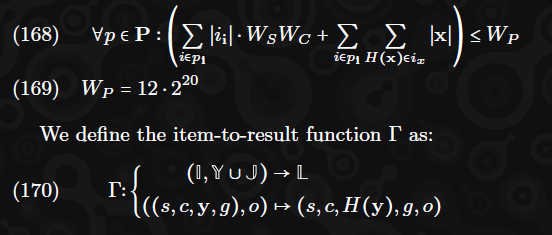

Wir definieren den implizierten Autorisierer des Arbeitspakets als ***pa***, den Hash der Verkettung des Autorisierungscodes und der Parametrisierung. Wir definieren den Autorisierungscode als ***pc*** und verlangen, dass er zum Zeitpunkt des Lookup-Ankerblocks im historischen Lookup des Dienstes ***h*** verfügbar ist. Formal:

(Λ ist die historische Lookup-Funktion, die in Gleichung 91 definiert ist.)

#### 13.3.1. Exportieren
Jedes Arbeitselement eines Arbeitspakets kann Segmente exportieren, und ein Segment-Root wird im Arbeitsbericht platziert, der diese commitet, in der Reihenfolge entsprechend dem Arbeitselement, das exportiert. Es wird als der Root eines binären Merkle-Baums konstanter Tiefe gebildet, wie in Gleichung 292 definiert:
Bürgen müssen zwei Datensätze erasure-codieren und verteilen: einen Blob, das überprüfbare Arbeitspaket, das das kodierte Arbeitspaket, extrinsische Daten und selbstbegründende importierte Segmente enthält, welches im kurzlebigen Audit-DA-Store platziert wird, und einen zweiten Satz exportierter Segmentdaten zusammen mit den Metadaten der Paged-Proofs. Elemente im ersten Store sind kurzlebig; Assurer sollen sie nur bis zur Finalisierung des Blocks aufbewahren, der das Arbeitsergebnis enthält. Elemente im zweiten Store hingegen sind langlebig und sollen mindestens **28** Tage (**672** vollständige Epochen) nach der Berichterstattung des Arbeitsberichts aufbewahrt werden.

Wir definieren die Paged-Proofs-Funktion ***P***, die eine Reihe exportierter Segmente ***s*** akzeptiert und eine Reihe zusätzlicher Segmente definiert, die über Erasure-Coding und Verteilung in das Imports-DA-System eingebracht werden. Die Funktion bewertet Seiten von Hashes zusammen mit Subtree-Proofs, sodass Korrektheitsbegründungen basierend auf einem Segment-Root daraus erstellt werden können:

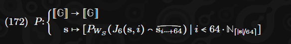

Hinweis: Falls ***∣s∣*** kein Vielfaches von 64 ist, wird der Term ***si⋅⋅⋅+64*** korrekt auf weniger als **64** Elemente verweisen, wenn es sich um die letzte Seite handelt.

### 13.4. Berechnung der Arbeitsergebnisse (Computation of Work Results)
Wir kommen nun zur Funktion ***Ξ***, die die Arbeitsergebnisse berechnet. Diese bildet die Grundlage für die Nutzung der Kerne in JAM. Sie akzeptiert ein Arbeitspaket ***p*** für einen benannten Kern ***c*** und resultiert entweder in einem Fehler ***∇*** oder im Arbeitsergebnis und einer Reihe exportierter Segmente. Diese Funktion ist deterministisch und erfordert nur, dass sie innerhalb von acht Epochen nach einem kürzlich finalisierten Block ausgewertet wird, dank der historischen Lookup-Funktionalität. Sie kann somit problemlos von jedem Knoten innerhalb der Prüfungsperiode ausgewertet werden, auch unter Berücksichtigung der Praktikabilität einer unvollkommenen Synchronisierung.

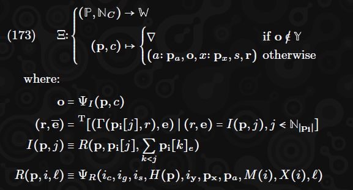

Die hier gegebene Definition ist in mehrere Funktionen unterteilt, um die Lesbarkeit zu erleichtern. Der erste eingeführte Begriff, ***o***, ist die Autorisierungsausgabe, das Ergebnis der Is-Authorized-Funktion. Der zweite Begriff, (***r***, ***e***), ist die Sequenz der Ergebnisse für jedes der Arbeitselemente im Arbeitspaket zusammen mit allen von jedem Arbeitselement exportierten Segmenten.

Die dritte und vierte Definition sind Hilfsbegriffe dafür, wobei die dritte eine geordnete Akkumulation (d.h. Zähler) durchführt, um sicherzustellen, dass die Refine-Funktion Zugang zur Gesamtzahl der Exporte aus dem Arbeitspaket bis zum aktuellen Arbeitselement hat. Der vierte Begriff, ***R***, ist im Wesentlichen ein Aufruf der Refine-Funktion, der die relevanten Daten aus dem Arbeitspaket und dem Arbeitselement zusammenführt.

Die obigen Definitionen basieren auf zwei Funktionen, ***M*** und ***X***, die jeweils die Importsegmentdaten und die extrinsischen Daten für ein Arbeitselementargument ***i*** definieren:

In der Zwischenzeit ist ***s*** als die Datenspezifikation des Pakets definiert, wobei die "segments-root"-Funktion ***A*** und ***M***, die Imports-Lookup-Funktion, sowie ***X***, die extrinsische Daten-Lookup-Funktion, verwendet werden:

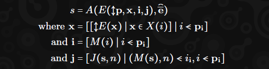

Obwohl ***M*** und ***j*** beide unter Verwendung des Begriffs ***s*** (die vollständige Menge der Segmente, die zusammen mit jedem zu importierenden Segment bereitgestellt werden) formuliert werden, wird dieser Wert im Allgemeinen nicht benötigt, da die Begründung durch einen einzigen paged-proof abgeleitet werden kann. Dies reduziert das schlimmste Fall-Datenabrufen für einen Bürgen auf zwei Segmente für jedes zu importierende Segment. Falls zusammenhängend exportierte Segmente importiert werden (was wir als eine ziemlich häufige Situation annehmen können), sollte eine einzige Proof-Seite ausreichen, um viele importierte Segmente zu begründen.

Die Is-Authorized-Logik wird zuerst ausgeführt, um sicherzustellen, dass das Arbeitspaket die benötigte Kernzeit rechtfertigt. Danach sollte der Bürge sicherstellen, dass alle Segmentbaum-Wurzeln, die Importsegment-Commitments bilden, bekannt sind und nicht abgelaufen sind. Schließlich sollte der Bürge sicherstellen, dass er alle Preimage-Daten abrufen kann, die als Commitments extrinsischer Segmente referenziert werden.

Sobald dies erledigt ist, müssen importierte Segmente rekonstruiert werden. Dieser Prozess kann tatsächlich lazy erfolgen, da die Refine-Funktion die Daten erst benötigt, wenn der Import-Host-Call erfolgt. Das Abrufen impliziert im Allgemeinen, dass für jedes importierte Segment erasure-codierte Chunks von genügend einzigartigen Validatoren (**342**, einschließlich des Bürgen) abgerufen werden, wie im Anhang ***H*** ausführlicher beschrieben wird. (Da wir systematisches Erasure-Coding spezifizieren, ist seine Rekonstruktion trivial, falls die korrekten **342** Validatoren ansprechbar sind.) Chunks müssen sowohl für die Daten selbst als auch für die Begründungsmetadaten abgerufen werden, die es uns ermöglichen, sicherzustellen, dass die Daten korrekt sind.

Validatoren, in ihrer Rolle als Verfügbarkeitsprüfer, sollten solche Chunks entsprechend dem Index des Segmentbaums indexieren, dessen Rekonstruktion sie erleichtern. Da die Daten für Segment-Chunks so klein sind (12 Byte), sollten feste Kommunikationskosten auf ein Minimum reduziert werden. Ein gutes Netzwerkprotokoll (derzeit nicht im Umfang enthalten) ermöglicht es den Bürgen, nur die Segmentbaum-Wurzel und den Index zusammen mit einem Booleschen Wert anzugeben, um anzugeben, ob der Proof-Chunk bereitgestellt werden muss. Da wir annehmen, dass mindestens **341** andere Validatoren online und wohlwollend sind, können wir davon ausgehen, dass der Bürge ***i*** und ***j*** oben mit Zuversicht berechnen kann, basierend auf der allgemeinen Verfügbarkeit von Daten, die mit e♣ commitet wurden, was unten spezifiziert ist.

Wir definieren die Segment-Root-Funktion, die zum Committen der exportierten Segmente verwendet wird. Die Sequenz ist einfach die Untersequenz von jedem Arbeitselement, die in der Reihenfolge der genannten Arbeitselemente miteinander verkettet ist.
Wir definieren die Verfügbarkeits-Spezifizierungsfunktion ***A***, die eine Verfügbarkeits-Spezifizierung aus einer Oktettsequenz des audit-freundlichen Arbeitspaket-Bundles erstellt (bestehend aus dem Arbeitspaket selbst, den extrinsischen Daten und den verketteten Importsegmenten zusammen mit ihren Korrektheitsnachweisen) und einer Sequenz von Segmenten für jedes im Manifest erwähnte exportierte Segment:

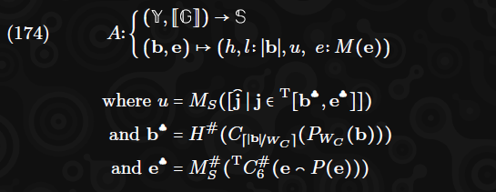

Die Paged-Proofs-Funktion ***P,*** die zuvor in Gleichung 172 definiert wurde, akzeptiert eine Sequenz von Segmenten und gibt eine Sequenz von Paged-Proofs zurück, die ausreicht, um die Korrektheit jedes Segments zu begründen. Es gibt genau **⌈1/64⌉** Paged-Proof-Segmente, die als Anzahl der gelieferten Segmente, jede bestehend aus einer Seite von 64 Hashes von Segmenten, zusammen mit einem Merkle-Proof von der Wurzel zum Teilbaum-Root, der diese 64 Segmente enthält.
Die Funktionen ***M*** und ***MS*** sind die Fixed-Depth- und Simple-Binary-Merkle-Root-Funktionen, die in den Gleichungen 292 und 291 definiert sind. Die Funktion ***C*** ist die Erasure-Coding-Funktion, die im Anhang H definiert ist.
Und ***P*** ist die Null-Padding-Funktion, um ein Oktett-Array auf ein Vielfaches von ***n*** in der Länge zu bringen:

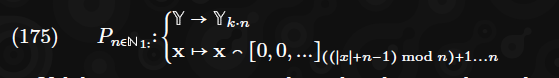

Validatoren werden dazu angehalten, jeden neu erasure-codierten Daten-Chunk an den entsprechenden Validator zu verteilen, da sie nicht für das Garantieren bezahlt werden, es sei denn, ein Arbeitsbericht wird von einer Supermehrheit der Validatoren als verfügbar betrachtet. Angesichts unseres Arbeitspakets ***p*** sollten wir daher den entsprechenden Arbeitspaket-Bundle-Chunk und exportierte Segment-Chunks an jeden Validator senden, dessen Schlüssel zusammen mit ähnlich entsprechenden Chunks für importierte, extrinsische und exportierte Segmente vorliegen, sodass jeder Validator die Vollständigkeit gemäß dem Erasure-Root des Arbeitsberichts rechtfertigen kann. Im Falle eines bevorstehenden Epochenwechsels können sie auch die erwartete Belohnung maximieren, indem sie an den neuen Validatorensatz verteilen.
Wir werden diese Funktion in den nächsten Abschnitten für das Garantieren, Prüfen und Beurteilen nutzen.

## 14. Garantieren (Guaranteeing)
Das Garantieren von Arbeitspaketen umfasst die Erstellung und Verteilung eines entsprechenden Arbeitsberichts, der bestimmte Bedingungen erfüllen muss. Zusammen mit dem Bericht wird eine Signatur benötigt, die das Engagement des Validators für dessen Korrektheit demonstriert. Mit zwei Bürgschaftssignaturen kann der Arbeitsbericht an den nächsten JAM-Chain-Blockautor verteilt werden, um im ***EG*** verwendet zu werden, was zu einer Belohnung für die Bürgen führt.

Wir gehen davon aus, dass in einem öffentlichen System Validatoren schwer bestraft werden, wenn sie Fehlfunktionen aufweisen und sich zu einem Bericht verpflichten, der das Ergebnis von ***Ξ***, angewendet auf ein Arbeitspaket, nicht getreu darstellt. Der gesamte Prozess umfasst:

- (1) Bewertung der Autorisierung des Arbeitspakets und Abgleich mit dem Autorisierungspool im neuesten JAM-Chain-Zustand.
- (2) Erstellung und Veröffentlichung eines Arbeitspaketberichts.
- (3) Aufteilung des Arbeitspakets und seiner extrinsischen und exportierten Daten gemäß dem Erasure-Code.
- (4) Verteilung der vorgenannten Chunks über den Validatorensatz.
- (5) Bereitstellung des Arbeitspakets, der extrinsischen und exportierten Daten auf Anfrage für andere Validatoren, um eine optimale Netzwerkleistung zu gewährleisten.

Für jedes Arbeitspaket ***p***, das wir erhalten, können wir den entsprechenden Arbeitsbericht für den Kern ***c*** bestimmen, dem wir zugewiesen sind. Wenn der JAM-Chain-Zustand benötigt wird, verwenden wir immer den Zustand des neuesten Blocks.

Für jeden Bürgen mit dem Index ***v***, der dem Kern ***c*** und einem Arbeitspaket ***p*** zugewiesen ist, definieren wir den Arbeitsbericht ***r*** einfach als:

Solche Bürgen können das Payload (***s***, ***v***) sicher erstellen und verteilen. Die Komponente ***s*** kann gemäß Gleichung 134 erstellt werden; speziell ist es eine Signatur mit dem registrierten Ed25519-Schlüssel des Validators auf einem Payload l:

Um den Gewinn zu maximieren, sollte der Bürge sicherstellen, dass das Arbeitsergebnis alle Erwartungen erfüllt, die während der Garantiextrinsik gemäß Abschnitt 11.4 festgelegt sind. Dies umfasst die kontextuelle Gültigkeit, die Aufnahme der Autorisierung in den Autorisierungspool und die Sicherstellung, dass das Gesamtgas höchstens ***GA*** beträgt. Das Nicht-Erfüllen dieser Bedingungen führt nicht zu einer Bestrafung, verhindert jedoch, dass der Blockautor das Paket einbezieht, und verringert somit die Belohnungen.

Fortgeschrittene Knoten können die Wahrscheinlichkeit maximieren, dass ihre Berichte in die Blockchain aufgenommen werden, indem sie versuchen, den Zustand der Kette zu dem Zeitpunkt vorherzusagen, zu dem der Bericht den Blockautor erreicht. Einfache Knoten können einfach den aktuellen Kettenkopf verwenden, wenn sie den Arbeitsbericht überprüfen. Um die Arbeit zu minimieren, sollten Knoten alle diese Bewertungen vor der Auswertung der ***ΨR***-Funktion durchführen, um die Arbeitsergebnisse des Berichts zu berechnen.

Sobald ein Arbeitspaket als vernünftig zu garantieren bewertet wurde, sollten die Bürgen die Chance maximieren, dass ihre Arbeit nicht verschwendet wird, indem sie versuchen, einen Konsens über den Kern zu bilden. Dazu sollten sie das Arbeitspaket an alle anderen Bürgen im gleichen Kern senden, von denen sie glauben, dass sie es noch nicht kennen.

Um die Arbeit für die Blockautoren zu minimieren und somit die erwarteten Gewinne zu maximieren, sollten die Bürgen versuchen, die nächste Garantiextrinsik ihres Kerns aus dem Arbeitsbericht, dem Kernindex und einer Reihe von Attestationen, einschließlich ihrer eigenen und so vieler anderer wie möglich, zu erstellen.

Um die Wahrscheinlichkeit zu minimieren, dass Blockautoren den Bürgen wegen Anti-Spam-Maßnahmen ignorieren, sollten die Bürgen durchschnittlich nicht mehr als zwei Arbeitsberichte pro Zeitschlitz signieren.

## 15. Verfügbarkeitsgarantie (Availability Assurance)

Validatoren sollten eine unterschriebene Erklärung, eine sogenannte Garantie, abgeben, wenn sie im Besitz aller zugehörigen erasure-codierten Chunks für einen bestimmten Arbeitsbericht sind, der derzeit auf Verfügbarkeit wartet. Um eine Garantie für einen Arbeitsbericht zu erhalten, muss ein Validator vier Datenklassen besitzen:
Erstens, ihren erasure-codierten Chunk für diesen Bericht. Die Gültigkeit dieses Chunks kann durch die Erasure-Root des Arbeitspakets des Arbeitsberichts und einen Merkle-Beweis der Einbeziehung an der richtigen Stelle leicht nachgewiesen werden. Der Beweis sollte vom Bürgen bereitgestellt werden. Der Chunk sollte **28** Tage lang aufbewahrt und auf Anfrage jedem Validator zur Verfügung gestellt werden.

Zweitens, die beiden Manifeste für die beiden Klassen von Datenelementen: erforderlich und bereitgestellt. Diese haben Commitments als binäre Merkle-Wurzeln im Arbeitsbericht. Sie müssen zusammen mit den folgenden Daten bereitgestellt werden, sind jedoch nur zur Überprüfung ihrer Gültigkeit und Vollständigkeit erforderlich und müssen nicht aufbewahrt werden, nachdem der Arbeitsbericht als geprüft betrachtet wird. Bis dahin sollten sie auf Anfrage den Validatoren zur Verfügung gestellt werden.

Drittens sollte der Validator bereits ihren entsprechenden erasure-codierten Chunk für jedes der im erforderlichen Manifest aufgeführten Elemente besitzen. Diese Chunks können auf ähnliche Weise wie für das Arbeitspaket nachgewiesen werden, mit einem Merkle-Beweis auf der Wurzel, die im Manifest enthalten ist.**^12** Alle solchen Elemente dürfen nicht vor weiteren **4.800** Zeitschlitzen zur Löschung vorgesehen sein. (Wenn sie es sind, sollte der Arbeitsbericht nicht als verfügbar betrachtet werden.)

> **Footnotes:**
>
>**^12** Falls es scheint, dass das eigene Verfügbarkeitssystem für die letzten 28 Tage von Blöcken unvollständig ist, werden hilfreiche Validatoren sich bemühen, ihren Chunk zu rekonstruieren, indem sie Anfragen an andere Validatoren stellen.

Schließlich sollte der Validator den entsprechenden erasure-codierten Chunk für jedes der im bereitgestellten Manifest aufgeführten Elemente besitzen. Ähnlich wie der Chunk des Arbeitspakets sollten diese **28** Tage lang aufbewahrt und auf Anfrage jedem Validator zur Verfügung gestellt werden.

## 16. (Auditing and Judging)
Das Überprüfungs- und Beurteilungssystem ist theoretisch äquivalent zu dem in Elves, eingeführt von Stewart (2018). Für eine vollständige Sicherheitsanalyse des Mechanismus siehe diese Arbeit. Es gibt einen Unterschied in der Terminologie, wobei die Begriffe "Backing" und "Approval" dort unseren Begriffen "Garantieren" und "Überprüfen" entsprechen.

### 16.1. Übersicht

Der Überprüfungsprozess erfordert, dass jeder Knoten zufällig, aber deterministisch eine Menge von Arbeitsberichten aus jedem JAM-Chain-Block, in dem der Arbeitsbericht verfügbar wird (d.h. aus ***R***), abruft, bewertet und ein Urteil darüber abgibt. Vor jeder Bewertung erklärt und beweist ein Knoten seine Anforderung. Zu bestimmten gemeinsamen Zeitpunkten danach kann die Menge der Arbeitsberichte, die ein Knoten aus jedem Block's ***R*** bewerten muss, vergrößert werden, wenn eine deklarierte Absicht nicht innerhalb einer angemessenen Zeit durch ein positives Urteil bestätigt wird oder im Falle eines negativen Urteils. Diese Vergrößerungsereignisse werden "Tranches" genannt.

Wenn alle deklarierten Absichten für einen Arbeitsbericht zu einem bestimmten Zeitpunkt durch ein positives Urteil bestätigt werden, gilt der Arbeitsbericht als überprüft. Sobald alle neu verfügbaren Arbeitsberichte eines Blocks überprüft sind, betrachten wir den Block als überprüft. Eine Voraussetzung für die Finalisierung eines Blocks durch einen Knoten ist, dass er den Block als überprüft ansieht. Beachten Sie, dass es letztendlich einen Konsens darüber geben wird, ob ein Block überprüft ist, dieser Konsens jedoch möglicherweise nicht zum Zeitpunkt der Finalisierung des Blocks besteht. Dies beeinträchtigt nicht die krypto-ökonomischen Garantien dieses Systems.

Im regulären Betrieb wird letztendlich kein negatives Urteil für einen Arbeitsbericht gefunden, und es gibt keine direkten Konsequenzen der Überprüfungsstufe. Im unwahrscheinlichen Fall, dass ein negatives Urteil gefunden wird, passiert eines von mehreren Dingen; wenn es immer noch mehr als **2/3V** positive Urteile gibt, können Validatoren, die negative Urteile ausstellen, für Zeitverschwendung bestraft werden. Wenn es mehr als **1/3V** negative Urteile gibt, wird der Block, der den Arbeitsbericht enthält, auf die Bannliste gesetzt. Er und alle seine Nachkommen werden ignoriert und dürfen nicht weiter aufgebaut werden. In allen Fällen, sobald genügend Stimmen vorliegen, kann ein Urteilsextrinsik von einem Blockautor erstellt und on-chain platziert werden, um das Ergebnis zu kennzeichnen. Details hierzu finden Sie in Abschnitt 10.

Alle Ankündigungen und Urteile werden allen Validatoren zusammen mit Metadaten, die das signierte Material beschreiben, veröffentlicht. Beim Erhalt dieser Daten wird von den Validatoren erwartet, dass sie ihre Perspektive entsprechend aktualisieren (später definiert als ***J*** und ***A***).

### 16.2. Datenerfassung (Data Fetching)

Für jeden zu überprüfenden Arbeitsbericht verwenden wir seinen Erasure-Root, um erasure-codierte Chunks von genügend Assurern anzufordern. Von jedem Assurer holen wir drei Elemente (die mit einem guten Netzwerkprotokoll unter einer einzigen Anfrage erfolgen sollten), die den Super-Chunks des Arbeitspakets, den selbstbegründenden Import-Super-Chunks und den extrinsischen Segment-Super-Chunks entsprechen.

Wir können die Rekonstruktion des Arbeitspakets validieren, indem wir sicherstellen, dass sein Hash dem Hash entspricht, der als Teil der Arbeitspaket-Spezifikation im Arbeitsbericht enthalten ist. Wir können die extrinsischen Segmente validieren, indem wir sicherstellen, dass ihre Hashes jeweils denjenigen entsprechen, die im entsprechenden Arbeitselement zu finden sind.

Schließlich können wir jedes importierte Segment validieren, da eine Begründung den verketteten Segmenten folgen muss, was es ermöglicht, zu überprüfen, dass der Hash jedes Segments im referenzierenden Merkle-Root und Index des entsprechenden Arbeitselements enthalten ist.

Exportierte Segmente müssen nicht auf die gleiche Weise rekonstruiert werden, sondern sollten auf die gleiche Weise wie beim Garantieren bestimmt werden, d.h. durch die Ausführung der Refine-Logik.

Alle Elemente im Arbeitspaket-Spezifikationsfeld des Arbeitsberichts sollten aus diesen nun als korrekt bekannten Daten neu berechnet und verifiziert werden, indem im Wesentlichen die Schritte der Bürgen nachgezeichnet und deren Korrektheit sichergestellt wird.

### 16.3. Auswahl von Berichten (Selection of Reports)
Jeder Validator soll Überprüfungsaufgaben für jeden gültigen Block übernehmen, den er erhält. Da wir uns nun in der Off-Chain-Logik befinden und keinen Konsens voraussetzen können, betrachten wir uns fortan als einen spezifischen Validator mit dem Index ***v*** und nehmen an, dass wir uns auf einen Block ***B*** konzentrieren, wobei andere Begriffe entsprechend übereinstimmen. Somit ist ***σ′*** der nachfolgende Zustand dieses Blocks, ***H*** ist sein Header usw. Praktisch müssen alle Überlegungen für alle Blöcke repliziert werden und Überlegungen zu mehreren Blöcken können gleichzeitig im Gange sein.

Wir definieren die Sequenz von Arbeitsberichten, die wir möglicherweise überprüfen müssen, als ***Q***, eine Sequenz mit einer Länge, die der Anzahl der Kerne entspricht und als Abbildung vom Kernindex auf einen anstehenden Arbeitsbericht dient, der gerade verfügbar geworden ist, oder ***∅***, wenn kein Bericht im Kern verfügbar wurde. Formal:

Wir definieren unsere initiale Überprüfungstranche in Bezug auf eine überprüfbare Zufallsgröße ***s0***, die speziell dafür erstellt wurde:

Wir können dann ***a0*** als die nicht-leeren Elemente definieren, die durch eine überprüfbare zufällige Auswahl von zehn Kernen überprüft werden sollen:

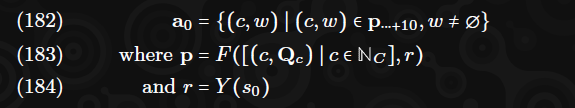

Alle ***A = 8*** Sekunden nach einem neuen Zeitschlitz beginnt eine neue Tranche, und wir können feststellen, dass zusätzliche Kerne eine Überprüfung von uns benötigen. Solche Elemente werden als ***an*** definiert, wobei ***n*** die aktuelle Tranche ist. Formal:

Neue Tranchen können Elemente aus ***Q***v enthalten, die aus einem von zwei Gründen stammen: entweder wurde ein negatives Urteil empfangen oder die Anzahl der Urteile aus der vorherigen Tranche ist geringer als die Anzahl der Ankündigungen aus dieser Tranche. Im ersten Fall ist der Validator immer verpflichtet, ein Urteil über den Arbeitsbericht abzugeben.

In allen Fällen veröffentlichen wir eine signierte Erklärung darüber, welche der Kerne wir unserer Meinung nach überprüfen müssen (eine Ankündigung) zusammen mit einem Beweis der VRF-Signatur, um sie auszuwählen, und die Ankündigungen der anderen Validatoren aus der vorherigen Tranche, die nicht mit einem Urteil übereinstimmen, damit alle anderen Validatoren die Ankündigung überprüfen können. Die Veröffentlichung einer Ankündigung sollte als Vertrag zur Durchführung der Überprüfung angesehen werden, unabhängig von zukünftigen Informationen.

Formal stellen wir sicher, dass die Ankündigungserklärung für jede Tranche ***n*** veröffentlicht und an alle anderen Validatoren zusammen mit unserem Validator-Index ***v***, dem Beweis sn und allen signierten Daten verteilt wird. Die Ankündigungserklärungen der Validatoren müssen in der Menge sein:

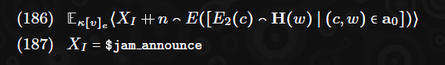

Wir definieren ***An*** als unsere Wahrnehmung, welcher Validator jeden der Arbeitsberichte (identifiziert durch ihren zugehörigen Kern) in Tranche ***n*** überprüfen muss. Dies ergibt sich aus den Ankündigungen der anderen Validatoren (oben definiert). Es kann nicht korrekt bewertet werden, bis ***n*** aktuell ist. Wir haben absolute Kenntnis über unsere eigenen Überprüfungsanforderungen.

Wir definieren weiter ***J⊺*** und ***J(+)*** als die Validator-Indizes, von denen wir wissen, dass sie jeweils positive bzw. negative Urteile abgegeben haben, die von jedem Arbeitsberichtskern abgebildet wurden. Uns ist es egal, aus welcher Tranche ein Urteil stammt.

Wir können an für Tranchen jenseits der ersten auf der Grundlage der Anzahl der Validatoren definieren, von denen wir wissen, dass sie eine Überprüfung durchführen müssen, von denen wir jedoch noch kein Urteil gesehen haben. Es ist möglich, dass das späte Eintreffen von Informationen an ändert und Knoten sollten dies neu bewerten und entsprechend handeln, falls dies passiert.

Wir können an daher jenseits der initialen Tranche durch eine neue **VRF** definieren, die auf die Menge der Nicht-Erscheinungs-Validatoren wirkt.

Wir definieren unseren Bias-Faktor ***F = 2***, was die erwartete Anzahl von Validatoren ist, die ein Urteil für einen Arbeitsbericht abgeben müssen, wenn ein einzelner Nicht-Erscheinen in der vorherigen Tranche auftritt. Modellierungen von Stewart (2018) zeigen, dass dies optimal ist.

Spätere Überprüfungen müssen ähnlich wie die erste angekündigt werden. Wenn die Überprüfungsanforderungen beim Erhalt neuer Informationen (d.h. die Rückkehr eines positiven Urteils für einen vorherigen Nicht-Erscheinen) sinken, werden alle bereits angekündigten Überprüfungen abgeschlossen und Urteile veröffentlicht. Wenn die Überprüfungsanforderungen beim Erhalt neuer Informationen (d.h. eine zusätzliche Ankündigung ohne begleitendes Urteil) steigen, kündigen wir die zusätzlichen Überprüfungen an, die wir durchführen werden.

Mit zunehmender Zeit und an wird unsere Prüfungsverantwortung bekannt und definiert. Wir müssen versuchen, alle Arbeitspakete und ihre erforderlichen Daten zu rekonstruieren, die jedem Arbeitsbericht entsprechen, den wir überprüfen müssen. Dies kann durch Anfordern erasure-codierter Chunks von einem Drittel der Validatoren erfolgen. Es kann auch durch Anfragen an eine kooperative Drittpartei (z.B. einen ursprünglichen Bürgen) für die Preimages abgekürzt werden.

Für jeden solchen Arbeitsbericht ***w*** können wir sicher sein, dass wir ein Kandidaten-Arbeitspaket-Encoding ***F(w)*** abrufen können, das entweder durch die Rekonstruktion erasure-codierter Chunks, die durch die Merkle-Root des Erasure-Codings verifiziert wurden, oder alternativ durch das Preimage des Arbeitspaket-Hashes stammt. Wir dekodieren diesen Kandidaten-Blob in ein Arbeitspaket.

Zusätzlich zum Arbeitspaket gehen wir davon aus, dass wir alle zugehörigen Manifestdaten durch Anfordern und Rekonstruieren erasure-codierter Chunks von einem Drittel der Validatoren auf die gleiche Weise wie oben beschrieben abrufen können.

Wir versuchen dann, den Bericht auf dem Kern zu reproduzieren, um en zu geben, eine Abbildung von Kernen zu Bewertungen:

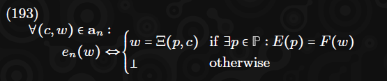

Beachten Sie, dass ein Dekodierungsfehler einen ungültigen Arbeitsbericht impliziert.

Aus dieser Abbildung gibt der Validator eine Reihe von Urteilen ab:

Alle Urteile ***j∗*** sollten anderen Validatoren veröffentlicht werden, damit sie ihre Sichtweise von ***J*** aufbauen können und im Falle eines negativen Urteils einen Extrinsik für ***EJ*** bilden können.

Wir betrachten einen Arbeitsbericht unter zwei Umständen als überprüft. Entweder, wenn er keine negativen Urteile hat und es eine Tranche gibt, in der wir ein positives Urteil von allen Validatoren sehen, von denen wir glauben, dass sie ihn überprüfen müssen; oder wenn wir positive Urteile von mehr als zwei Dritteln des Validatorensatzes sehen.

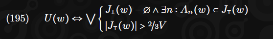

Unser Block ***B*** kann als überprüft betrachtet werden, ein Zustand, der als ***U*** bezeichnet wird, wenn alle verfügbaren Arbeitsberichte als überprüft gelten. Formal:

Für jeden Block müssen wir ihn als überprüft beurteilen (d.h. ***U = ⊺***), bevor wir für den Block stimmen, um in Grandpa finalisiert zu werden. Weitere Informationen hierzu finden Sie in Abschnitt 18.

Darüber hinaus ignorieren wir gezielt Ketten, die die Akkumulation eines Berichts enthalten, den wir wissen, dass mindestens ein Drittel der Validatoren als ungültig beurteilen. Alle Ketten, die einen solchen Block enthalten, sind nicht für die Erstellung geeignet. Der beste Block, d.h. der, auf dem wir neue Blöcke aufbauen, ist die Kette mit den meisten regulären Safrole-Blöcken, die keinen solchen ignorierten Block enthält. Implementierungstechnisch kann dies eine Rückkehr zu einem früheren Kopf oder einer alternativen Gabel erfordern.

Als Blockautor schließen wir einen Urteilsextrinsik ein, der Urteilssignaturen sammelt und sie on-chain meldet. Im Falle eines ungültigen Urteils (d.h. eines Urteils, das nicht zwei Drittel plus eins der Urteile zur Bestätigung der Gültigkeit umfasst), wird dieser Extrinsik in einen Block eingeführt, in dem die Akkumulation des ungültigen Arbeitsberichts kurz bevorsteht. Der ungültige Urteilsextrinsik entfernt ihn aus den anstehenden Arbeitsberichten, ***ρ***. Weitere Details hierzu finden Sie in Abschnitt 10.

## 17. Beefy-Verteilung (Beefy Distribution)
Für jeden finalisierten Block ***B***, den ein Validator importiert, soll dieser Validator eine BLS-Signatur auf der Kurve BLS12-381 erstellen, wie von BLS12-381 definiert, und den Keccak-Hash des jüngsten Beefy-MMR des Blocks bestätigen. Diese Signatur sollte veröffentlicht und frei verteilt werden, zusammen mit dem signierten Material. Diese Signaturen können aggregiert werden, um prägnante Finalitätsnachweise für Drittsysteme bereitzustellen. Der Signier- und Aggregationsmechanismus wird vollständig von cryptoeprint:2022/1611 definiert.

Formal, sei ***Fv*** das signierte Commitment des Validators mit dem Index ***v***, das veröffentlicht wird:

## 18. Grandpa und die beste Kette (Grandpa and the Best Chain)
Knoten nehmen am Grandpa-Protokoll teil, wie von Stewart 2020 definiert.
Wir definieren den neuesten finalisierten Block als ***B♮***. Alle damit verbundenen Begriffe bezüglich Block und Zustand sind entsprechend hochgestellt. Wir betrachten den besten Block, ***B♭***, als denjenigen, der aus der Menge akzeptabler Blöcke nach den folgenden Kriterien ausgewählt wird:

Hat den finalisierten Block als Vorfahren.
Enthält keine unfinalisierten Blöcke, bei denen wir eine Equivokation (zwei gültige Blöcke zum selben Zeitpunkt) sehen.
Wird als überprüft betrachtet.
Formal:

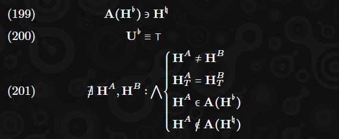

Von diesen akzeptablen Blöcken sollte derjenige ausgewählt werden, der die meisten Vorfahrenblöcke enthält, deren Autor ein Siegel-Schlüsselticket anstelle eines Fallback-Schlüssels verwendet hat, und somit die Kette, auf der der Teilnehmer Grandpa-Stimmen abgeben sollte.

Formal, wir streben an, ***B♭*** auszuwählen, um den Wert ***m*** zu maximieren, wobei:

## 19. Bewertungen und Belohnungen

Die JAM-Kette vergibt nicht explizit Belohnungen – dies überlassen wir dem Staking-Subsystem (eine System-Parachain – gebührenfrei gehostet – in der aktuellen Vorstellung eines öffentlichen JAM-Netzwerks). Es ist jedoch wichtig, dass die JAM-Kette, ähnlich wie bei der Bestrafungsinformation für Validatoren, die Bereitstellung von Leistungsinformationen an das Staking-Subsystem erleichtert, damit darauf reagiert werden kann.

Solche Leistungsinformationen können nicht alle Aspekte der Validator-Aktivitäten direkt abdecken; während Blockproduktion, Bürgermeldungen und Verfügbarkeitsgarantien leicht on-chain verfolgt werden können, können Grandpa-, Beefy- und Prüfungsaktivitäten dies nicht. In letzterem Fall wird dies stattdessen durch die Abstimmungsaktivität der Validatoren verfolgt: Validatoren stimmen über ihre Einschätzung der Bemühungen der anderen ab und ein Median kann als die Wahrheit für jeden einzelnen Validator akzeptiert werden. Mit der Annahme von 50% ehrlichen Validatoren bietet dies ein angemessenes Mittel, um diese Informationen zu orakeln.

## 20. Diskussion
### 20.1 Technische Merkmale

Insgesamt, mit unserem angegebenen Ziel von **1.023** Validatoren und drei Validatoren pro Kern, sowie der Anforderung, dass jeder Validator im Durchschnitt zehn Audits pro Zeitschlitz durchführt, und somit **30** Audits pro Arbeitsbericht, ist JAM in der Lage, **341** Arbeitspakete pro Zeitschlitz vertrauenslos zu verarbeiten und zu integrieren.

Wir gehen davon aus, dass die Hardware der Knoten ein moderner **16-Kern-CPU** mit **64 GB RAM**, **1 TB** Sekundärspeicher und **0,5 Gbit/s** Netzwerkkapazität ist. Unsere Leistungsmodelle gehen von einer ungefähren Aufteilung der CPU-Zeit wie folgt aus:

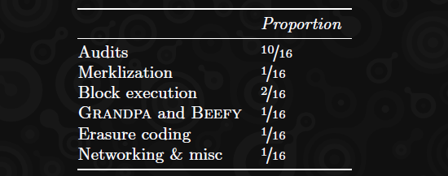

Schätzungen für den Netzwerkbandbreitenbedarf sind wie folgt:

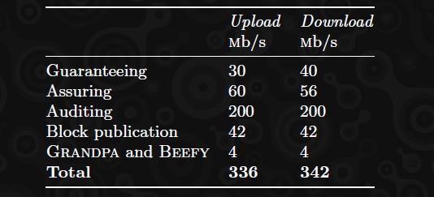

Eine Verbindung, die **500 Mbit/s** aufrechterhalten kann, sollte genügend Fehlertoleranz und Spielraum bieten, um andere Validatoren sowie einige öffentliche Verbindungen zu bedienen, obwohl die Spitzenlast bei der Blockveröffentlichung impliziert, dass Validatoren sicherstellen sollten, dass die Spitzenbandbreite höher ist.

Unter diesen Bedingungen erwarten wir eine gesamte netzwerkbereitgestellte Datenverfügbarkeit von **2 PB**, wobei jeder Knoten maximal **6 TB** für Verfügbarkeitsspeicher bereitstellt. Schätzungen für den Speicherbedarf sind wie folgt:

Als grobe Richtlinie hat jede Parachain einen durchschnittlichen Speicherbedarf von etwa **2 MB** in der Polkadot-Relay-Chain; ein **40-GB-Zustand** würde es ermöglichen, die Informationen von **20.000 Parachains** im Zustand zu behalten.

Die „virtuelle Hardware“ eines JAM-Kerns ist im Wesentlichen ein regulärer CPU-Kern, der mit etwa **25%** bis **50%** der regulären Geschwindigkeit für den gesamten sechs Sekunden dauernden Abschnitt ausgeführt wird und durchschnittlich **2,5 MB/s** für allgemeine Ein-/Ausgabe ziehen und bereitstellen kann und bis zu **2 GB RAM** nutzen kann. Die Ein-/Ausgabe umfasst alle vertrauenslosen Lesevorgänge aus dem JAM-Chain-Zustand, wenn auch in der jüngeren Vergangenheit. Diese virtuelle Hardware bietet auch unbegrenzte Lesevorgänge aus einer semi-statischen Preimage-Lookup-Datenbank.

Jedes Arbeitspaket kann diese Hardware belegen und beliebigen Code darauf in sechs Sekunden langen Segmenten ausführen, um ein Ergebnis von maximal **90 KB** zu erzeugen. Dieses Arbeitsergebnis hat dann Anspruch auf **10 ms** auf derselben Maschine, diesmal ohne „externe“ Ein-/Ausgabe außer dem genannten Ergebnis, aber mit vollem und unmittelbarem Zugriff auf den JAM-Chain-Zustand und kann die Dienste, zu denen die Ergebnisse gehören, ändern.

### 20.2. Leistungsdarstellung
In Bezug auf die reine Rechenleistung kann die JAM-Maschinenarchitektur extrem hohe Ebenen homogener vertrauensloser Berechnungen liefern. Das Kernmodell von JAM ist jedoch eine klassische parallelisierte Rechenarchitektur, und damit Lösungen die Architektur gut nutzen können, müssen sie bis zu einem gewissen Grad damit gestaltet werden. Daher ist es sehr schwierig, direkte Vergleiche mit bestehenden Systemen anzustellen, bis solche Anwendungsfälle mit ähnlicher Semantik auf JAM erscheinen. Dennoch können wir mit einigen Annahmen grobe Vergleiche anstellen.

#### 20.2.1. Vergleich mit Polkadot
Vor der asynchronen Unterstützung validiert Polkadot etwa **50** Parachains, wobei jede etwa **250 ms** nativer Berechnung (d.h. eine halbe Sekunde Wasm-Ausführungszeit bei etwa 50% Overhead) und **5 MB** Ein-/Ausgabe für alle zwölf Sekunden Echtzeit benötigt. Dies entspricht einer aggregierten Rechenleistung von etwa Parität mit einem nativen CPU-Kern und einer gesamten verteilten Verfügbarkeit von etwa **20 MB/s**. Die Akkumulation liegt außerhalb der Fähigkeiten von Polkadot und ist daher nicht vergleichbar.

Nach der asynchronen Unterstützung und der Schätzung, dass Polkadot derzeit in der Lage ist, maximal **80** Parachains zu validieren, die jeweils eine Sekunde nativer Berechnung in sechs Sekunden durchführen, erhöht sich die aggregierte Leistung auf etwa 13x nativer CPU und die verteilte Verfügbarkeit auf etwa **67 MB/s**.

Zum Vergleich: In unseren Basis-Modellen sollte JAM in der Lage sein, etwa **85x** die Rechenlast eines einzelnen nativen CPU-Kerns und eine verteilte Verfügbarkeit von **852 MB/s** zu erreichen.

#### 20.2.2. Einfache Überweisungen (Simple Transfers)
Wir könnten auch versuchen, eine einfache Transaktionen-pro-Sekunde-Anzahl zu modellieren, wobei jede Transaktion eine Signaturüberprüfung und die Änderung von zwei Kontoständen erfordert. Da es jedoch bis zur klaren Gestaltung noch einige Annahmen gibt, müssen wir einige Annahmen machen. Unser naivstes Modell wäre, die JAM-Kerne (d.h. die Verfeinerung) einfach zur Transaktionsüberprüfung und Kontosuche zu verwenden. Die JAM-Kette würde dann die Salden in ihrem Zustand halten und ändern. Dies würde wahrscheinlich keine großartige Leistung erbringen, da fast alle erforderlichen Ein-/Ausgaben synchron wären, aber es kann als Grundlage dienen.

Ein **15-MB**-Arbeitspaket kann etwa **125k** Transaktionen mit **128 Byte** pro Transaktion halten. Ein **90-KB**-Arbeitsergebnis könnte jedoch nur etwa **11k** Kontoupdates kodieren, wenn jedes Update als Paar aus einem **4-Byte-Kontoindex** und einem **4-Byte-Saldo** angegeben wird, was zu einem Limit von **5,5k** Transaktionen pro Paket führt, oder insgesamt **312k TPS**. Es ist möglich, dass die acht Bytes typischerweise um ein oder zwei Bytes komprimiert werden könnten, was den maximalen Durchsatz etwas erhöhen würde. Unsere Erwartungen sind, dass Zustandsaktualisierungen mit hoch parallelisierter Merklisierung mit etwa **500k** bis **1 Million** Lese-/Schreibvorgängen pro Sekunde durchgeführt werden können, was etwa **250k-350k TPS** impliziert, je nachdem, was sich als Engpass herausstellt.

Ein raffinierteres Modell wäre, die JAM-Kerne sowohl für Saldenaktualisierungen als auch für die Transaktionsüberprüfung zu verwenden. Wir müssten annehmen, dass der Zustand und die Transaktionen, die auf sie wirken, zwischen Arbeitspaketen mit einer gewissen Effizienz partitioniert werden können und dass die **15 MB** des Arbeitspakets zwischen Transaktionsdaten und Zustandsnachweisdaten aufgeteilt würden. Unsere Basis-Modelle sagen voraus, dass ein **4-Milliarden-32-Bit-Kontosystem**, das in **210** Konten/Seite und **128 Byte** pro Transaktion unterteilt ist, bei Annahme, dass nur etwa 1% der orakelten Konten nützlich sind, durchschnittlich über **1,7 MTPS** erreichen könnte, abhängig von der Partitionierung und den Nutzungseigenschaften. Die Partitionierung könnte mit einer festen Fragmentierung (im Wesentlichen Sharding des Zustands), einem rotierenden Partitionierungsmuster oder einer dynamischen Partitionierung (die eine spezialisierte Sequenzierung erfordern würde) durchgeführt werden.

Interessanterweise erwarten wir, dass keines der Modelle bei der Berechnung einen Engpass darstellt, was bedeutet, dass Transaktionen wesentlich ausgefeilter sein könnten, möglicherweise mit flexiblerer Kryptografie oder Smart-Contract-Funktionalität, ohne dass dies einen signifikanten Einfluss auf die Leistung hat.

#### 20.2.3. Rechendurchsatz (Computation Throughput)
Die TPS-Metrik eignet sich nicht gut zur Messung der Rechenleistung verteilter Systeme, daher wenden wir uns nun einem etwas stärker auf die Berechnung fokussierten Benchmark zu: dem **EVM**. Das grundlegende YP-Ethereum-Netzwerk, das sich dem Jahrzehnt nähert, ist wahrscheinlich das bekannteste Beispiel für dezentrale Berechnungen allgemeiner Art und dient als vernünftiger Maßstab. Es kann eine Berechnungs- und E/A-Rate von **1,25 Millionen Gas/Sekunde** aufrechterhalten, mit einer Spitzenleistung von doppelt so viel. Die **EVM**-Gas-Metrik wurde entwickelt, um eine zeitproportionale Metrik zur Vorhersage und Begrenzung der Programmausführung zu sein.

Der Versuch, einen konkreten Vergleich zur **PVM**-Leistung zu ziehen, ist nicht trivial und notwendigerweise subjektiv, aufgrund der Unterschiede zwischen den beiden Plattformen einschließlich Wortgröße, Endianness, Stack/Register-Architektur und Speichermodell. Wir werden jedoch versuchen, einen vernünftigen Wertebereich zu bestimmen.

**EVM**-Gas übersetzt sich nicht direkt in native Ausführung, da es auch Zustandslesungen und -schreibungen sowie Transaktionseingabedaten kombiniert, was impliziert, dass es eine Kombination von bis zu 595 Speicherlesungen, **57** Speicherschreibungen und **1,25 Millionen Gas** sowie **78 KB** Eingabedaten pro Sekunde verarbeiten kann, indem eines gegen das andere ausgetauscht wird.**^13** Wir können keine Analyse der typischen Aufteilung zwischen Speicher-E/A und reiner Berechnung finden, daher machen wir eine sehr konservative Schätzung und nehmen an, dass es alle vier durchführt. In Wirklichkeit würden wir erwarten, dass es im Durchschnitt **1/4** von jedem ausführt.

Unsere Experimente **^14** zeigen, dass wir auf moderner, hochleistungsfähiger Verbrauchshardware mit einer modernen **EVM**-Implementierung irgendwo zwischen **100** und **500** **Gas/µs** Durchsatz bei reinen Rechenlasten erwarten können (wir haben speziell Odd-Product, Triangle-Number und mehrere Implementierungen der Fibonacci-Berechnung verwendet). Um einen konservativen Vergleich zur **PVM** zu ziehen, schlagen wir vor, den **EVM**-Code in **PVM**-Code zu transkompilieren und ihn dann unter dem Polkavm-Prototyp erneut auszuführen.**^15**

Um eine vernünftige Untergrenze für ****EVM**-Gas/µs** zu schätzen, beispielsweise für Workloads, die mehr Speicher- und E/A-Lasten haben, schauen wir uns reale, erlaubnisfreie Einsätze der **EVM** an und sehen, dass das Moonbeam-Netzwerk nach Korrektur der Verlangsamung durch die Ausführung innerhalb der neu kompilierten WebAssembly-Plattform auf der etwas konservativen Polkadot-Hardwareplattform einen Durchsatz von etwa 100 Gas/µs impliziert. Daher behaupten wir, dass in Bezug auf die Berechnung **1 µs **EVM**-Gas** etwa **100-500** Gas auf moderner hochleistungsfähiger Verbrauchshardware entspricht.**^16**

Benchmarking- und Regressionstests zeigen, dass der Prototyp-**PVM**-Engine einen festen Vorverarbeitungsaufwand von etwa **5 ns/Byte** Programmcode hat und für rechenintensive Aufgaben zumindest einen marginalen Faktor von **1,6-2%** im Vergleich zur **EVM**-Ausführung aufweist, was eine asymptotische Beschleunigung von etwa **50-60x** impliziert. Bei Maschinencode von **1 MB Größe**, der voraussichtlich etwa eine Sekunde zur Berechnung benötigt, werden die Kompilierungskosten nur 0,5% der Gesamtzeit betragen.**^17**

Für Code, der nicht von Natur aus für die 256-Bit-**EVM**-ISA geeignet ist, würden wir erheblich verbesserte relative Ausführungszeiten auf der **PVM** erwarten, obwohl mehr Arbeit erforderlich ist, um sicherzustellen, dass diese Beschleunigungen allgemein anwendbar sind.

> **Footnotes:**
>
>**^13** Die neuesten "Proto-Danksharding"-Änderungen ermöglichen es, 87,3 kb/s an festgelegten Daten zu akzeptieren, obwohl diese nicht direkt im Zustand verfügbar sind. Daher schließen wir es aus dieser Darstellung aus, obwohl die Einbeziehung in die Eingabedaten die Ergebnisse nur geringfügig ändern würde.
>
>**^14** Dies ist ausführlich beschrieben unter https://hackmd.io/@XXX9CM1uSSCWVNFRYaSB5g/HJarTUhJA und soll aktualisiert werden, sobald wir mehr Informationen erhalten.
>
>**^15** Es ist konservativ, da wir nicht berücksichtigen, dass der Quellcode ursprünglich in **EVM**-Code kompiliert wurde und somit der **PVM**-Maschinencode architektonische Artefakte replizieren wird und daher sehr wahrscheinlich pessimistisch ist. Ein Beispiel: Alle arithmetischen Operationen in **EVM** sind 256-Bit und 32-Bit native **PVM** wird gezwungen, dies zu honorieren, auch wenn der Quellcode tatsächlich nur 32-Bit-Werte benötigt.
>
>**^16** Wir spekulieren, dass die erhebliche Spanne möglicherweise teilweise durch die großen architektonischen Unterschiede zwischen der **EVM**-ISA und typischer moderner Hardware verursacht wird.
>
>**^17** Ein Beispiel: Unser Odd-Product-Benchmark, eine sehr reine Rechenaufgabe, benötigt 58 Sekunden auf **EVM** und 1,04 Sekunden innerhalb unseres **PVM**-Prototyps, einschließlich aller Vorverarbeitung.

Wenn wir erlauben, dass die Vorverarbeitung denselben Anteil an der Ausführung einnimmt wie die marginalen Kosten (aufgrund eines beispielsweise extrem großen, aber kurz laufenden Programms) und dass die **PVM**-Messung eine Sicherheitsüberlastung von **2x** zur Ausführungsgeschwindigkeit impliziert, können wir erwarten, dass ein JAM-Kern in der Lage ist, das Äquivalent von etwa **1.500 **EVM**-Gas/µs** zu verarbeiten. Aufgrund der Grobheit unserer Analyse könnten wir vernünftigerweise vorhersagen, dass es irgendwo innerhalb eines Faktors von drei in beide Richtungen liegt – also **500-5.000 **EVM**-Gas/µs**.

JAM-Kerne sind jeweils in der Lage, **2,5 MB/s** Bandbreite zu erreichen, was jegliche Zustands-E/A und Daten, die neu eingeführt werden müssen (z.B. Transaktionen), umfassen muss. Während Schreibvorgänge vergleichsweise wenig Kosten für den Kern verursachen, da nur das Hashing erforderlich ist, um eine endgültige aktualisierte Merkle-Root zu bestimmen, müssen Lesevorgänge nachgewiesen werden, wobei jeder etwa **640 Byte** Beweisdaten kostet, wenn man konservativ von einem Binär-Merkle-Trie mit einer Million Einträgen ausgeht. Dies würde zu einem Maximum von knapp **4.000** Lesevorgängen/Sekunde/Kern führen, wobei die genaue Menge davon abhängt, wie viel der Bandbreite für neu eingeführte Eingabedaten verwendet wird.

Alles in allem können die Zahlen von JAM, mit Ausnahme der Akkumulation, die zusätzlichen Durchsatz hinzufügen könnte, mit **341** multipliziert werden (mit dem Vorbehalt, dass die Berechnungen der einzelnen Knoten nicht die der anderen stören können, außer durch Zustandsorakalisierung und Akkumulation). Im Gegensatz zu Roll-up-Chain-Designs wie Polkadot und Ethereum muss kein persistent fragmentierter Zustand vorhanden sein. Der Zustand von Smart Contracts kann in einem kohärenten Format auf der JAM-Kette gehalten werden, solange alle Updates über die **15 KB/Kern/Sek**-Arbeitsergebnisse vorgenommen werden, die nur die Hashes der geänderten Zustandswurzeln der Verträge enthalten müssen.

Was wir sehen können, ist, dass das insgesamt vorhergesagte Leistungsprofil von JAM impliziert, dass es vergleichbar mit vielen Tausenden der grundlegenden Ethereum-L1-Kette sein könnte. Der große Faktor hier ist im Wesentlichen auf drei Dinge zurückzuführen: räumlicher Parallelismus, da JAM mehrere hundert Kerne unter seinem Sicherheitsapparat hosten kann; zeitlicher Parallelismus, da JAM eine kontinuierliche Ausführung für seine Kerne anstrebt und einen Großteil der Berechnungen zwischen Blöcken pipelinet, um eine konstante, optimale Arbeitslast zu gewährleisten; und Plattformoptimierung durch die Verwendung eines VM- und Gas-Modells, das eng zu modernen Hardwarearchitekturen passt.

Es muss jedoch verstanden werden, dass dies nur eine vorläufige und grobe Schätzung ist. Sie dient nur dem Zweck, die Leistung von JAM in greifbaren Begriffen auszudrücken und ist nicht als Mittel zum Vergleich mit einer „voll entwickelten“ Ethereum/L2-Ökosystem-Kombination gedacht. Insbesondere berücksichtigt es nicht:

- dass diese Zahlen auf der realen Leistung von Ethereum und der Leistungsmodellierung von JAM basieren (obwohl unsere Modelle auf der realen Leistung der Komponenten basieren);
- jegliche L2-Skalierung, die mit JAM oder Ethereum möglich sein könnte;
- die Zustandspartitionierung, die die Verwendung von JAM implizieren würde;
- das noch nicht festgelegte Gas-Modell für die **PVM**;
- dass **PVM**/**EVM**-Vergleiche notwendigerweise ungenau sind;
- (+) alle Zahlen für Ethereum L1 stammen aus derselben Quelle: im Durchschnitt wird jede Zahl nur **1/4** dieses Maximums sein.
- (++) die Zustandslesungen und Eingabedatenzahlen für JAM stammen aus derselben Quelle: im Durchschnitt wird jede Zahl nur **1/2** dieses Maximums sein.
Wir überlassen es zukünftigen Arbeiten, eine empirische Leistungsanalyse und einen Vergleich zwischen JAM und dem Aggregat eines hypothetischen Ethereum-Ökosystems durchzuführen, das eine maximale Menge an L2-Bereitstellungen zusammen mit vollständigem Dank-Sharding und allen anderen zusätzlichen Konsenselementen, die sie benötigen würden, einschließt. Dies liegt jedoch außerhalb des Umfangs der vorliegenden Arbeit.

## 21. Schlussfolgerung

Wir haben ein neuartiges Berechnungsmodell eingeführt, das bestehende kryptographisch-ökonomische Mechanismen nutzen kann, um erhebliche Verbesserungen in der Skalierbarkeit zu erzielen, ohne eine dauerhafte Fragmentierung des Zustands zu verursachen und somit die Gesamtkohäsion zu opfern. Wir nennen dieses Gesamtmuster "collect-refine-join-accumulate". Darüber hinaus haben wir den On-Chain-Teil dieser Logik formell definiert, im Wesentlichen den join-accumulate-Teil. Wir nennen dieses Protokoll die JAM-Kette.

Wir argumentieren, dass das Modell von JAM einen neuartigen "sweet spot" bietet, der es ermöglicht, enorme Mengen an Berechnungen in einem sicheren, widerstandsfähigen Konsens im Vergleich zu vollständig synchronen Modellen durchzuführen, und dennoch strikte Garantien über sowohl das Timing als auch die Integration der Berechnung in eine singuläre Zustandsmaschine bietet, im Gegensatz zu dauerhaft fragmentierten Modellen.

### 21.1. Weiterführende Arbeiten

Während wir in der Lage sind, die theoretische Berechnung unter bestimmten Grundannahmen zu schätzen und sogar grobe Vergleiche mit bestehenden Systemen anzustellen, sind praktische Zahlen von unschätzbarem Wert. Wir glauben, dass das Modell weitere empirische Forschung verdient, um besser zu verstehen, wie sich diese theoretischen Grenzen in der realen Welt auswirken. Wir halten eine ordnungsgemäße Kostenanalyse und den Vergleich mit bestehenden Protokollen ebenfalls für ein ausgezeichnetes Thema für weiterführende Arbeiten.

Wir können mit einiger Sicherheit sagen, dass das Design von JAM es ermöglicht, einen Dienst zu hosten, unter dem Polkadot-Parachains validiert werden könnten, jedoch sind weitere Prototyping-Arbeiten erforderlich, um zu verstehen, welchen möglichen Durchsatz ein **PVM**-gestütztes Abrechnungssystem unterstützen könnte. Wir lassen einen solchen Bericht als weiterführende Arbeit. Ebenso haben wir bewusst Details von Protokollelementen höherer Ebene wie Kryptowährung, Coretime-Verkäufe, Staking und reguläre Smart-Contract-Funktionalität ausgelassen.

Eine Reihe potenzieller Änderungen am hier beschriebenen Protokoll werden in Betracht gezogen, um die praktische Nutzung des Protokolls zu erleichtern. Diese umfassen:

- Synchrone Aufrufe zwischen Diensten im accumulate-Prozess.
- Einschränkungen der Transferfunktion, um eine erhebliche Parallelität über die Akkumulation hinweg zu ermöglichen.
- Die Möglichkeit, unter bestimmten Bedingungen während der Akkumulation beträchtliche zusätzliche Rechenkapazität zu reservieren.
- Die Einführung der Merklisierung in das Work-Package-Format, um die Notwendigkeit zu beseitigen, das gesamte Paket herunterzuladen, um seine Autorisierung zu bewerten.

Das Netzwerkprotokoll ist zu diesem Zeitpunkt ebenfalls absichtlich undefiniert gelassen und seine Beschreibung muss in einem Folgeantrag erfolgen. Die Leistung der Validatoren wird derzeit nicht On-Chain verfolgt. Wir erwarten, dass dies in der endgültigen Version des JAM-Protokolls On-Chain verfolgt wird, aber das spezifische Format ist noch ungewiss und daher derzeit ausgelassen.

## 22. Anerkennung
Die Informationen sind Kapitel 22 des Originalpapiers zu entnehmen.

## APPENDIX
Die Informationen sind Anhang des Originalpapiers zu entnehmen.